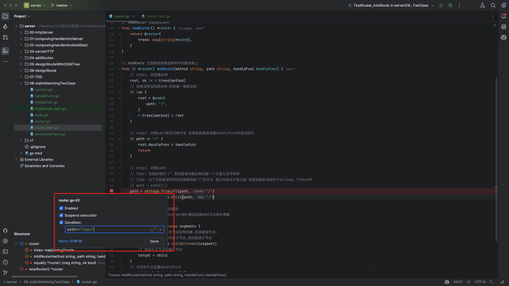

# 10. 路由树-静态匹配测试用例

上节课已经跑通了第1个测试用例,这里再重申一次TDD的步骤:

1. 定义API
2. 定义测试
3. 添加测试用例
4. 实现,并且确保实现能够通过测试用例
5. 重复3-4直到考虑了所有的场景
6. 重复步骤1-5

接下来要做的就是不断添加测试用例.

## PART1. 添加测试用例

### 1.1 添加根节点的测试用例

为什么要单独给根节点添加测试用例?

注意我们的`AddRoute()`方法中有这样一段代码:

```go
// step1. 找到路由树
root, ok := r.trees[method]
// 如果没有找到路由树,则创建一棵路由树
if !ok {
	root = &node{
		path: "/",
	}
	r.trees[method] = root
}
```

可以看到逻辑上对根节点是有特殊处理的.

- 初态工程结构如下:

```
(base) yanglei@yuanhong 08-staticMatchingTestCase % tree ./
./
├── context.go
├── handleFunc.go
├── httpServer.go
├── httpServer_test.go
├── node.go
├── router.go
├── router_test.go
└── serverInterface.go

0 directories, 8 files
```

### 1.1.1 为根节点添加测试用例

`router_test.go`:

```go
package staticMatchingTestCase

import (
	"fmt"
	"github.com/stretchr/testify/assert"
	"net/http"
	"reflect"
	"testing"
)

// TestNode 测试路由树节点
// 由于此处我们要测试的是路由树的结构,因此不需要在测试路由树节点中添加路由处理函数
// 调用AddRoute时写死一个HandleFunc即可
type TestNode struct {
	method string
	path   string
}

// TestRouter_AddRoute 测试路由注册功能的结果是否符合预期
func TestRouter_AddRoute(t *testing.T) {
	// step1. 构造路由树
	testRoutes := []TestNode{
		{
			method: http.MethodGet,
			path:   "/user/home",
		},
		{
			method: http.MethodGet,
			path:   "/",
		},
	}

	r := newRouter()
	mockHandleFunc := func(ctx Context) {}

	for _, testRoute := range testRoutes {
		r.AddRoute(testRoute.method, testRoute.path, mockHandleFunc)
	}

	// step2. 验证路由树 断言二者是否相等
	wantRouter := &router{
		trees: map[string]*node{
			http.MethodGet: &node{
				path: "/",
				children: map[string]*node{
					"user": &node{
						path: "user",
						children: map[string]*node{
							"home": &node{
								path:     "home",
								children: nil,
								// 注意路由是/user/home 因此只有最深层的节点才有handleFunc
								// /user和/ 都是没有handleFunc的
								HandleFunc: mockHandleFunc,
							},
						},
						HandleFunc: nil,
					},
				},
				HandleFunc: mockHandleFunc,
			},
		},
	}

	// HandleFunc类型是方法,方法不可比较,因此只能比较两个路由树的结构是否相等
	// assert.Equal(t, wantRouter, r)

	msg, ok := wantRouter.equal(r)
	assert.True(t, ok, msg)
}

// equal 比较两个路由森林是否相等
// msg: 两个路由森林不相等时的错误信息
// ok: 两个路由森林是否相等
func (r *router) equal(y *router) (msg string, ok bool) {
	// 如果目标路由森林为nil 则不相等
	if y == nil {
		return fmt.Sprintf("目标路由森林为nil"), false
	}

	// 如果两个路由森林中的路由树数量不同 则不相等
	rTreesNum := len(r.trees)
	yTreesNum := len(y.trees)
	if rTreesNum != yTreesNum {
		return fmt.Sprintf("路由森林中的路由树数量不相等,源路由森林有 %d 棵路由树, 目标路由森林有 %d 棵路由树", rTreesNum, yTreesNum), false
	}

	for method, tree := range r.trees {
		dstTree, ok := y.trees[method]

		// 如果目标router中没有对应HTTP方法的路由树 则不相等
		if !ok {
			return fmt.Sprintf("目标 router 中没有HTTP方法 %s的路由树", method), false
		}

		// 比对两棵路由树的结构是否相等
		msg, equal := tree.equal(dstTree)
		if !equal {
			return method + "-" + msg, false
		}
	}
	return "", true
}

// equal 比较两棵路由树是否相等
// msg: 两棵路由树不相等时的错误信息
// ok: 两棵路由树是否相等
func (n *node) equal(y *node) (msg string, ok bool) {
	// 如果目标节点为nil 则不相等
	if y == nil {
		return fmt.Sprintf("目标节点为nil"), false
	}

	// 如果两个节点的path不相等 则不相等
	if n.path != y.path {
		return fmt.Sprintf("两个节点的path不相等,源节点的path为 %s,目标节点的path为 %s", n.path, y.path), false
	}

	// 若两个节点的子节点数量不相等 则不相等
	nChildrenNum := len(n.children)
	yChildrenNum := len(y.children)
	if nChildrenNum != yChildrenNum {
		return fmt.Sprintf("两个节点的子节点数量不相等,源节点的子节点数量为 %d,目标节点的子节点数量为 %d", nChildrenNum, yChildrenNum), false
	}

	// 若两个节点的handleFunc类型不同 则不相等
	nHandler := reflect.ValueOf(n.HandleFunc)
	yHandler := reflect.ValueOf(y.HandleFunc)
	if nHandler != yHandler {
		return fmt.Sprintf("%s节点的handleFunc不相等,源节点的handleFunc为 %v,目标节点的handleFunc为 %v", n.path, nHandler.Type().String(), yHandler.Type().String()), false
	}

	// 比对两个节点的子节点映射是否相等
	for path, child := range n.children {
		dstChild, ok := y.children[path]
		// 如果源节点的子节点中 存在目标节点没有的子节点 则不相等
		if !ok {
			return fmt.Sprintf("目标节点的子节点中没有path为 %s 的子节点", path), false
		}

		// 比对两个子节点是否相等
		msg, equal := child.equal(dstChild)
		if !equal {
			return msg, false
		}
	}

	return "", true
}
```

此处改动了2处:

- 添加了1个测试用例
- `wantRouter`中为根节点添加了HandleFunc

其实稍微想一下就知道,我们的测试用例现在肯定跑不起来,因为我们在`AddRoute()`方法中把`path`的前导`/`给直接删掉了.导致按`/`切割`path`的结果是一个`[]string{""}`.HandleFunc加的位置不对.

### 1.1.2 为根节点添加特殊处理的代码

修这个bug的思路很简单:如果path是`/`,直接添加HandleFunc并返回即可

注意:这里也是通过IDE的Debug功能调试的

Tips:

- 注意Debug时控制台的`Resume Program`按钮是指执行下一次函数的意思.这个在调试时很有用
- Debug时可以点变量值左侧的调用栈看每个函数里当时的情况

`router.go`:

```go
package staticMatchingTestCase

import "strings"

// router 路由森林 用于支持对路由树的操作
type router struct {
	// trees 路由森林 按HTTP动词组织路由树
	// 该map中 key为HTTP动词 value为路由树的根节点
	// 即: 每个HTTP动词对应一棵路由树 指向每棵路由树的根节点
	trees map[string]*node
}

// newRouter 创建路由森林
func newRouter() *router {
	return &router{
		trees: map[string]*node{},
	}
}

// AddRoute 注册路由到路由森林中的路由树上
func (r *router) AddRoute(method string, path string, handleFunc HandleFunc) {
	// step1. 找到路由树
	root, ok := r.trees[method]
	// 如果没有找到路由树,则创建一棵路由树
	if !ok {
		root = &node{
			path: "/",
		}
		r.trees[method] = root
	}

	// step2. 判断path是否为根节点 如果是则直接设置HandleFunc并返回即可
	if path == "/" {
		root.HandleFunc = handleFunc
		return
	}

	// step3. 切割path
	// Tips: 去掉前导的"/" 否则直接切割出来的第一个元素为空字符串
	// Tips: 以下代码是老师写的去掉前导的"/"的方式 我认为表达力有点弱 但是性能应该会好于strings.TrimLeft
	// path = path[1:]
	path = strings.TrimLeft(path, "/")
	segments := strings.Split(path, "/")

	// step3. 为路由树添加路由
	// Tips: 此处我认为用target指代要添加路由的节点更好理解
	target := root
	for _, segment := range segments {
		// 如果路由树中途有节点没有创建,则创建该节点;
		// 如果路由树中途存在子节点,则找到该子节点
		child := target.childOrCreate(segment)
		// 继续为子节点创建子节点
		target = child
	}
	// 为目标节点设置HandleFunc
	target.HandleFunc = handleFunc
}
```

这样就可以通过测试了.

### 1.2 添加前导`/user`节点的测试用例

`router_test.go`:

```go
package staticMatchingTestCase

import (
	"fmt"
	"github.com/stretchr/testify/assert"
	"net/http"
	"reflect"
	"testing"
)

// TestNode 测试路由树节点
// 由于此处我们要测试的是路由树的结构,因此不需要在测试路由树节点中添加路由处理函数
// 调用AddRoute时写死一个HandleFunc即可
type TestNode struct {
	method string
	path   string
}

// TestRouter_AddRoute 测试路由注册功能的结果是否符合预期
func TestRouter_AddRoute(t *testing.T) {
	// step1. 构造路由树
	testRoutes := []TestNode{
		{
			method: http.MethodGet,
			path:   "/",
		},
		{
			method: http.MethodGet,
			path:   "/user",
		},
		{
			method: http.MethodGet,
			path:   "/user/home",
		},
	}

	r := newRouter()
	mockHandleFunc := func(ctx Context) {}

	for _, testRoute := range testRoutes {
		r.AddRoute(testRoute.method, testRoute.path, mockHandleFunc)
	}

	// step2. 验证路由树 断言二者是否相等
	wantRouter := &router{
		trees: map[string]*node{
			http.MethodGet: &node{
				path: "/",
				children: map[string]*node{
					"user": &node{
						path: "user",
						children: map[string]*node{
							"home": &node{
								path:     "home",
								children: nil,
								// 注意路由是/user/home 因此只有最深层的节点才有handleFunc
								// /user和/ 都是没有handleFunc的
								HandleFunc: mockHandleFunc,
							},
						},
						HandleFunc: mockHandleFunc,
					},
				},
				HandleFunc: mockHandleFunc,
			},
		},
	}

	// HandleFunc类型是方法,方法不可比较,因此只能比较两个路由树的结构是否相等
	// assert.Equal(t, wantRouter, r)

	msg, ok := wantRouter.equal(r)
	assert.True(t, ok, msg)
}

// equal 比较两个路由森林是否相等
// msg: 两个路由森林不相等时的错误信息
// ok: 两个路由森林是否相等
func (r *router) equal(y *router) (msg string, ok bool) {
	// 如果目标路由森林为nil 则不相等
	if y == nil {
		return fmt.Sprintf("目标路由森林为nil"), false
	}

	// 如果两个路由森林中的路由树数量不同 则不相等
	rTreesNum := len(r.trees)
	yTreesNum := len(y.trees)
	if rTreesNum != yTreesNum {
		return fmt.Sprintf("路由森林中的路由树数量不相等,源路由森林有 %d 棵路由树, 目标路由森林有 %d 棵路由树", rTreesNum, yTreesNum), false
	}

	for method, tree := range r.trees {
		dstTree, ok := y.trees[method]

		// 如果目标router中没有对应HTTP方法的路由树 则不相等
		if !ok {
			return fmt.Sprintf("目标 router 中没有HTTP方法 %s的路由树", method), false
		}

		// 比对两棵路由树的结构是否相等
		msg, equal := tree.equal(dstTree)
		if !equal {
			return method + "-" + msg, false
		}
	}
	return "", true
}

// equal 比较两棵路由树是否相等
// msg: 两棵路由树不相等时的错误信息
// ok: 两棵路由树是否相等
func (n *node) equal(y *node) (msg string, ok bool) {
	// 如果目标节点为nil 则不相等
	if y == nil {
		return fmt.Sprintf("目标节点为nil"), false
	}

	// 如果两个节点的path不相等 则不相等
	if n.path != y.path {
		return fmt.Sprintf("两个节点的path不相等,源节点的path为 %s,目标节点的path为 %s", n.path, y.path), false
	}

	// 若两个节点的子节点数量不相等 则不相等
	nChildrenNum := len(n.children)
	yChildrenNum := len(y.children)
	if nChildrenNum != yChildrenNum {
		return fmt.Sprintf("两个节点的子节点数量不相等,源节点的子节点数量为 %d,目标节点的子节点数量为 %d", nChildrenNum, yChildrenNum), false
	}

	// 若两个节点的handleFunc类型不同 则不相等
	nHandler := reflect.ValueOf(n.HandleFunc)
	yHandler := reflect.ValueOf(y.HandleFunc)
	if nHandler != yHandler {
		return fmt.Sprintf("%s节点的handleFunc不相等,源节点的handleFunc为 %v,目标节点的handleFunc为 %v", n.path, nHandler.Type().String(), yHandler.Type().String()), false
	}

	// 比对两个节点的子节点映射是否相等
	for path, child := range n.children {
		dstChild, ok := y.children[path]
		// 如果源节点的子节点中 存在目标节点没有的子节点 则不相等
		if !ok {
			return fmt.Sprintf("目标节点的子节点中没有path为 %s 的子节点", path), false
		}

		// 比对两个子节点是否相等
		msg, equal := child.equal(dstChild)
		if !equal {
			return msg, false
		}
	}

	return "", true
}
```

此处改动了2处:

- 添加了1个测试用例
- `wantRouter`中为`user`节点添加了HandleFunc

这次是可以成功通过测试的.

### 1.3 添加`/order/detail`节点的测试用例

该用例是为了测试当路由树中间有不存在的节点(即`order`节点)时,`AddRoute()`方法是否符合预期.

`router_test.go`:

```go
package staticMatchingTestCase

import (
	"fmt"
	"github.com/stretchr/testify/assert"
	"net/http"
	"reflect"
	"testing"
)

// TestNode 测试路由树节点
// 由于此处我们要测试的是路由树的结构,因此不需要在测试路由树节点中添加路由处理函数
// 调用AddRoute时写死一个HandleFunc即可
type TestNode struct {
	method string
	path   string
}

// TestRouter_AddRoute 测试路由注册功能的结果是否符合预期
func TestRouter_AddRoute(t *testing.T) {
	// step1. 构造路由树
	testRoutes := []TestNode{
		{
			method: http.MethodGet,
			path:   "/",
		},
		{
			method: http.MethodGet,
			path:   "/user",
		},
		{
			method: http.MethodGet,
			path:   "/user/home",
		},
		{
			method: http.MethodGet,
			path:   "/order/detail",
		},
	}

	r := newRouter()
	mockHandleFunc := func(ctx Context) {}

	for _, testRoute := range testRoutes {
		r.AddRoute(testRoute.method, testRoute.path, mockHandleFunc)
	}

	// step2. 验证路由树 断言二者是否相等
	wantRouter := &router{
		trees: map[string]*node{
			http.MethodGet: &node{
				path: "/",
				children: map[string]*node{
					"user": &node{
						path: "user",
						children: map[string]*node{
							"home": &node{
								path:     "home",
								children: nil,
								// 注意路由是/user/home 因此只有最深层的节点才有handleFunc
								// /user和/ 都是没有handleFunc的
								HandleFunc: mockHandleFunc,
							},
						},
						HandleFunc: mockHandleFunc,
					},
					"order": &node{
						path: "order",
						children: map[string]*node{
							"detail": &node{
								path:       "detail",
								children:   nil,
								HandleFunc: mockHandleFunc,
							},
						},
						HandleFunc: nil,
					},
				},
				HandleFunc: mockHandleFunc,
			},
		},
	}

	// HandleFunc类型是方法,方法不可比较,因此只能比较两个路由树的结构是否相等
	// assert.Equal(t, wantRouter, r)

	msg, ok := wantRouter.equal(r)
	assert.True(t, ok, msg)
}

// equal 比较两个路由森林是否相等
// msg: 两个路由森林不相等时的错误信息
// ok: 两个路由森林是否相等
func (r *router) equal(y *router) (msg string, ok bool) {
	// 如果目标路由森林为nil 则不相等
	if y == nil {
		return fmt.Sprintf("目标路由森林为nil"), false
	}

	// 如果两个路由森林中的路由树数量不同 则不相等
	rTreesNum := len(r.trees)
	yTreesNum := len(y.trees)
	if rTreesNum != yTreesNum {
		return fmt.Sprintf("路由森林中的路由树数量不相等,源路由森林有 %d 棵路由树, 目标路由森林有 %d 棵路由树", rTreesNum, yTreesNum), false
	}

	for method, tree := range r.trees {
		dstTree, ok := y.trees[method]

		// 如果目标router中没有对应HTTP方法的路由树 则不相等
		if !ok {
			return fmt.Sprintf("目标 router 中没有HTTP方法 %s的路由树", method), false
		}

		// 比对两棵路由树的结构是否相等
		msg, equal := tree.equal(dstTree)
		if !equal {
			return method + "-" + msg, false
		}
	}
	return "", true
}

// equal 比较两棵路由树是否相等
// msg: 两棵路由树不相等时的错误信息
// ok: 两棵路由树是否相等
func (n *node) equal(y *node) (msg string, ok bool) {
	// 如果目标节点为nil 则不相等
	if y == nil {
		return fmt.Sprintf("目标节点为nil"), false
	}

	// 如果两个节点的path不相等 则不相等
	if n.path != y.path {
		return fmt.Sprintf("两个节点的path不相等,源节点的path为 %s,目标节点的path为 %s", n.path, y.path), false
	}

	// 若两个节点的子节点数量不相等 则不相等
	nChildrenNum := len(n.children)
	yChildrenNum := len(y.children)
	if nChildrenNum != yChildrenNum {
		return fmt.Sprintf("两个节点的子节点数量不相等,源节点的子节点数量为 %d,目标节点的子节点数量为 %d", nChildrenNum, yChildrenNum), false
	}

	// 若两个节点的handleFunc类型不同 则不相等
	nHandler := reflect.ValueOf(n.HandleFunc)
	yHandler := reflect.ValueOf(y.HandleFunc)
	if nHandler != yHandler {
		return fmt.Sprintf("%s节点的handleFunc不相等,源节点的handleFunc为 %v,目标节点的handleFunc为 %v", n.path, nHandler.Type().String(), yHandler.Type().String()), false
	}

	// 比对两个节点的子节点映射是否相等
	for path, child := range n.children {
		dstChild, ok := y.children[path]
		// 如果源节点的子节点中 存在目标节点没有的子节点 则不相等
		if !ok {
			return fmt.Sprintf("目标节点的子节点中没有path为 %s 的子节点", path), false
		}

		// 比对两个子节点是否相等
		msg, equal := child.equal(dstChild)
		if !equal {
			return msg, false
		}
	}

	return "", true
}
```

此处改动了2处:

- 添加了1个测试用例
- `wantRouter`中添加了`order`节点,并为该节点设置了子节点`detail`,且为`detail`子节点添加了HandleFunc

这次是可以成功通过测试的.

### 1.4 为其他HTTP动词添加测试用例

此处为POST方法的`/order/create`路由添加测试用例.

`router_test.go`:

```go
package staticMatchingTestCase

import (
	"fmt"
	"github.com/stretchr/testify/assert"
	"net/http"
	"reflect"
	"testing"
)

// TestNode 测试路由树节点
// 由于此处我们要测试的是路由树的结构,因此不需要在测试路由树节点中添加路由处理函数
// 调用AddRoute时写死一个HandleFunc即可
type TestNode struct {
	method string
	path   string
}

// TestRouter_AddRoute 测试路由注册功能的结果是否符合预期
func TestRouter_AddRoute(t *testing.T) {
	// step1. 构造路由树
	testRoutes := []TestNode{
		{
			method: http.MethodGet,
			path:   "/",
		},
		{
			method: http.MethodGet,
			path:   "/user",
		},
		{
			method: http.MethodGet,
			path:   "/user/home",
		},
		{
			method: http.MethodGet,
			path:   "/order/detail",
		},
		{
			method: http.MethodPost,
			path:   "/order/create",
		},
	}

	r := newRouter()
	mockHandleFunc := func(ctx Context) {}

	for _, testRoute := range testRoutes {
		r.AddRoute(testRoute.method, testRoute.path, mockHandleFunc)
	}

	// step2. 验证路由树 断言二者是否相等
	wantRouter := &router{
		trees: map[string]*node{
			// GET方法路由树
			http.MethodGet: &node{
				path: "/",
				children: map[string]*node{
					"user": &node{
						path: "user",
						children: map[string]*node{
							"home": &node{
								path:     "home",
								children: nil,
								// 注意路由是/user/home 因此只有最深层的节点才有handleFunc
								// /user和/ 都是没有handleFunc的
								HandleFunc: mockHandleFunc,
							},
						},
						HandleFunc: mockHandleFunc,
					},
					"order": &node{
						path: "order",
						children: map[string]*node{
							"detail": &node{
								path:       "detail",
								children:   nil,
								HandleFunc: mockHandleFunc,
							},
						},
						HandleFunc: nil,
					},
				},
				HandleFunc: mockHandleFunc,
			},

			// POST方法路由树
			http.MethodPost: &node{
				path: "/",
				children: map[string]*node{
					"order": &node{
						path: "order",
						children: map[string]*node{
							"create": &node{
								path:       "create",
								children:   nil,
								HandleFunc: mockHandleFunc,
							},
						},
						HandleFunc: nil,
					},
				},
				HandleFunc: nil,
			},
		},
	}

	// HandleFunc类型是方法,方法不可比较,因此只能比较两个路由树的结构是否相等
	// assert.Equal(t, wantRouter, r)

	msg, ok := wantRouter.equal(r)
	assert.True(t, ok, msg)
}

// equal 比较两个路由森林是否相等
// msg: 两个路由森林不相等时的错误信息
// ok: 两个路由森林是否相等
func (r *router) equal(y *router) (msg string, ok bool) {
	// 如果目标路由森林为nil 则不相等
	if y == nil {
		return fmt.Sprintf("目标路由森林为nil"), false
	}

	// 如果两个路由森林中的路由树数量不同 则不相等
	rTreesNum := len(r.trees)
	yTreesNum := len(y.trees)
	if rTreesNum != yTreesNum {
		return fmt.Sprintf("路由森林中的路由树数量不相等,源路由森林有 %d 棵路由树, 目标路由森林有 %d 棵路由树", rTreesNum, yTreesNum), false
	}

	for method, tree := range r.trees {
		dstTree, ok := y.trees[method]

		// 如果目标router中没有对应HTTP方法的路由树 则不相等
		if !ok {
			return fmt.Sprintf("目标 router 中没有HTTP方法 %s的路由树", method), false
		}

		// 比对两棵路由树的结构是否相等
		msg, equal := tree.equal(dstTree)
		if !equal {
			return method + "-" + msg, false
		}
	}
	return "", true
}

// equal 比较两棵路由树是否相等
// msg: 两棵路由树不相等时的错误信息
// ok: 两棵路由树是否相等
func (n *node) equal(y *node) (msg string, ok bool) {
	// 如果目标节点为nil 则不相等
	if y == nil {
		return fmt.Sprintf("目标节点为nil"), false
	}

	// 如果两个节点的path不相等 则不相等
	if n.path != y.path {
		return fmt.Sprintf("两个节点的path不相等,源节点的path为 %s,目标节点的path为 %s", n.path, y.path), false
	}

	// 若两个节点的子节点数量不相等 则不相等
	nChildrenNum := len(n.children)
	yChildrenNum := len(y.children)
	if nChildrenNum != yChildrenNum {
		return fmt.Sprintf("两个节点的子节点数量不相等,源节点的子节点数量为 %d,目标节点的子节点数量为 %d", nChildrenNum, yChildrenNum), false
	}

	// 若两个节点的handleFunc类型不同 则不相等
	nHandler := reflect.ValueOf(n.HandleFunc)
	yHandler := reflect.ValueOf(y.HandleFunc)
	if nHandler != yHandler {
		return fmt.Sprintf("%s节点的handleFunc不相等,源节点的handleFunc为 %v,目标节点的handleFunc为 %v", n.path, nHandler.Type().String(), yHandler.Type().String()), false
	}

	// 比对两个节点的子节点映射是否相等
	for path, child := range n.children {
		dstChild, ok := y.children[path]
		// 如果源节点的子节点中 存在目标节点没有的子节点 则不相等
		if !ok {
			return fmt.Sprintf("目标节点的子节点中没有path为 %s 的子节点", path), false
		}

		// 比对两个子节点是否相等
		msg, equal := child.equal(dstChild)
		if !equal {
			return msg, false
		}
	}

	return "", true
}
```

此处改动了3处:

- 添加了1个测试用例
- `wantRouter`中添加了POST方法的路由树
- `wantRouter`中添加了`order`节点,并为该节点添加了子节点`create`,且为`create`子节点添加了HandleFunc

这次是可以成功通过测试的.

### 1.5 再次为POST方法添加测试用例

这个测试用例是为了测试POST方法中路由仅有1段的case.

添加`/login`路由的测试用例:

`router_test.go`:

```go
package staticMatchingTestCase

import (
	"fmt"
	"github.com/stretchr/testify/assert"
	"net/http"
	"reflect"
	"testing"
)

// TestNode 测试路由树节点
// 由于此处我们要测试的是路由树的结构,因此不需要在测试路由树节点中添加路由处理函数
// 调用AddRoute时写死一个HandleFunc即可
type TestNode struct {
	method string
	path   string
}

// TestRouter_AddRoute 测试路由注册功能的结果是否符合预期
func TestRouter_AddRoute(t *testing.T) {
	// step1. 构造路由树
	testRoutes := []TestNode{
		{
			method: http.MethodGet,
			path:   "/",
		},
		{
			method: http.MethodGet,
			path:   "/user",
		},
		{
			method: http.MethodGet,
			path:   "/user/home",
		},
		{
			method: http.MethodGet,
			path:   "/order/detail",
		},
		{
			method: http.MethodPost,
			path:   "/order/create",
		},
		{
			method: http.MethodPost,
			path:   "/login",
		},
	}

	r := newRouter()
	mockHandleFunc := func(ctx Context) {}

	for _, testRoute := range testRoutes {
		r.AddRoute(testRoute.method, testRoute.path, mockHandleFunc)
	}

	// step2. 验证路由树 断言二者是否相等
	wantRouter := &router{
		trees: map[string]*node{
			// GET方法路由树
			http.MethodGet: &node{
				path: "/",
				children: map[string]*node{
					"user": {
						path: "user",
						children: map[string]*node{
							"home": &node{
								path:     "home",
								children: nil,
								// 注意路由是/user/home 因此只有最深层的节点才有handleFunc
								// /user和/ 都是没有handleFunc的
								HandleFunc: mockHandleFunc,
							},
						},
						HandleFunc: mockHandleFunc,
					},
					"order": &node{
						path: "order",
						children: map[string]*node{
							"detail": &node{
								path:       "detail",
								children:   nil,
								HandleFunc: mockHandleFunc,
							},
						},
						HandleFunc: nil,
					},
				},
				HandleFunc: mockHandleFunc,
			},

			// POST方法路由树
			http.MethodPost: {
				path: "/",
				children: map[string]*node{
					"order": &node{
						path: "order",
						children: map[string]*node{
							"create": &node{
								path:       "create",
								children:   nil,
								HandleFunc: mockHandleFunc,
							},
						},
						HandleFunc: nil,
					},
					"login": &node{
						path:       "login",
						children:   nil,
						HandleFunc: mockHandleFunc,
					},
				},
				HandleFunc: nil,
			},
		},
	}

	// HandleFunc类型是方法,方法不可比较,因此只能比较两个路由树的结构是否相等
	// assert.Equal(t, wantRouter, r)

	msg, ok := wantRouter.equal(r)
	assert.True(t, ok, msg)
}

// equal 比较两个路由森林是否相等
// msg: 两个路由森林不相等时的错误信息
// ok: 两个路由森林是否相等
func (r *router) equal(y *router) (msg string, ok bool) {
	// 如果目标路由森林为nil 则不相等
	if y == nil {
		return fmt.Sprintf("目标路由森林为nil"), false
	}

	// 如果两个路由森林中的路由树数量不同 则不相等
	rTreesNum := len(r.trees)
	yTreesNum := len(y.trees)
	if rTreesNum != yTreesNum {
		return fmt.Sprintf("路由森林中的路由树数量不相等,源路由森林有 %d 棵路由树, 目标路由森林有 %d 棵路由树", rTreesNum, yTreesNum), false
	}

	for method, tree := range r.trees {
		dstTree, ok := y.trees[method]

		// 如果目标router中没有对应HTTP方法的路由树 则不相等
		if !ok {
			return fmt.Sprintf("目标 router 中没有HTTP方法 %s的路由树", method), false
		}

		// 比对两棵路由树的结构是否相等
		msg, equal := tree.equal(dstTree)
		if !equal {
			return method + "-" + msg, false
		}
	}
	return "", true
}

// equal 比较两棵路由树是否相等
// msg: 两棵路由树不相等时的错误信息
// ok: 两棵路由树是否相等
func (n *node) equal(y *node) (msg string, ok bool) {
	// 如果目标节点为nil 则不相等
	if y == nil {
		return fmt.Sprintf("目标节点为nil"), false
	}

	// 如果两个节点的path不相等 则不相等
	if n.path != y.path {
		return fmt.Sprintf("两个节点的path不相等,源节点的path为 %s,目标节点的path为 %s", n.path, y.path), false
	}

	// 若两个节点的子节点数量不相等 则不相等
	nChildrenNum := len(n.children)
	yChildrenNum := len(y.children)
	if nChildrenNum != yChildrenNum {
		return fmt.Sprintf("两个节点的子节点数量不相等,源节点的子节点数量为 %d,目标节点的子节点数量为 %d", nChildrenNum, yChildrenNum), false
	}

	// 若两个节点的handleFunc类型不同 则不相等
	nHandler := reflect.ValueOf(n.HandleFunc)
	yHandler := reflect.ValueOf(y.HandleFunc)
	if nHandler != yHandler {
		return fmt.Sprintf("%s节点的handleFunc不相等,源节点的handleFunc为 %v,目标节点的handleFunc为 %v", n.path, nHandler.Type().String(), yHandler.Type().String()), false
	}

	// 比对两个节点的子节点映射是否相等
	for path, child := range n.children {
		dstChild, ok := y.children[path]
		// 如果源节点的子节点中 存在目标节点没有的子节点 则不相等
		if !ok {
			return fmt.Sprintf("目标节点的子节点中没有path为 %s 的子节点", path), false
		}

		// 比对两个子节点是否相等
		msg, equal := child.equal(dstChild)
		if !equal {
			return msg, false
		}
	}

	return "", true
}
```

此处改动了2处:

- 添加了1个测试用例
- `wantRouter`中的POST路由树上添加了`login`节点,且为该节点添加了HandleFunc

这次是可以成功通过测试的.

## PART2. 全静态路由的非法用例

初态工程结构如下:

```
(base) yanglei@yuanhong 09-illegalTestCase % tree ./
./
├── context.go
├── handleFunc.go
├── httpServer.go
├── httpServer_test.go
├── node.go
├── router.go
├── router_test.go
└── serverInterface.go

0 directories, 8 files
```

### 2.1 字面量为空字符串的路由

#### 2.1.1 添加对path为空字符串的限制

这里只需要在`AddRoute()`方法中限制`path`不能为空字符串即可:

`router.go`:

```go
package illegalTestCase

import "strings"

// router 路由森林 用于支持对路由树的操作
type router struct {
	// trees 路由森林 按HTTP动词组织路由树
	// 该map中 key为HTTP动词 value为路由树的根节点
	// 即: 每个HTTP动词对应一棵路由树 指向每棵路由树的根节点
	trees map[string]*node
}

// newRouter 创建路由森林
func newRouter() *router {
	return &router{
		trees: map[string]*node{},
	}
}

// AddRoute 注册路由到路由森林中的路由树上
// 其中path为路由的路径.该路径:
// 1. 不得为空字符串
// 2. 必须以"/"开头
// 3. 不能以"/"结尾
// 4. 不能包含连续的"/"
func (r *router) AddRoute(method string, path string, handleFunc HandleFunc) {
	// step1. 检测路由是否合规

	// 1.1 检测路由是否为空字符串
	if path == "" {
		panic("web: 路由不能为空字符串")
	}

	// step2. 找到路由树
	root, ok := r.trees[method]
	// 如果没有找到路由树,则创建一棵路由树
	if !ok {
		root = &node{
			path: "/",
		}
		r.trees[method] = root
	}

	// step3. 判断path是否为根节点 如果是则直接设置HandleFunc并返回即可
	if path == "/" {
		root.HandleFunc = handleFunc
		return
	}

	// step4. 切割path
	// Tips: 去掉前导的"/" 否则直接切割出来的第一个元素为空字符串
	// Tips: 以下代码是老师写的去掉前导的"/"的方式 我认为表达力有点弱 但是性能应该会好于strings.TrimLeft
	// Tips: 以下代码会有问题,因为假如前导字符不是"/" 则不该被去掉
	// path = path[1:]
	path = strings.TrimLeft(path, "/")
	segments := strings.Split(path, "/")

	// step3. 为路由树添加路由
	// Tips: 此处我认为用target指代要添加路由的节点更好理解
	target := root
	for _, segment := range segments {
		// 如果路由树中途有节点没有创建,则创建该节点;
		// 如果路由树中途存在子节点,则找到该子节点
		child := target.childOrCreate(segment)
		// 继续为子节点创建子节点
		target = child
	}
	// 为目标节点设置HandleFunc
	target.HandleFunc = handleFunc
}
```

#### 2.1.2 添加对应的测试用例

测试用例如下:

`router_test.go`:

```go
// TestRouter_AddRoute_Illegal_Case 测试路由注册功能的非法用例
func TestRouter_AddRoute_Illegal_Case(t *testing.T) {
	r := newRouter()
	mockHandleFunc := func(ctx Context) {}

	// step1. 断言路由注册功能的非法用例
	// 1.1 测试路由为空字符串
	assert.Panicsf(t, func() {
		r.AddRoute(http.MethodGet, "", mockHandleFunc)
	}, "web: 路由不能为空字符串")
}
```

注意这时我们测试的是触发panic的用例,因此要使用`assert.Panics()`进行断言

注意

- 这时我们测试的是触发panic的用例,因此要使用`assert.Panics()`进行断言
- 文件还是`router_test.go`,只是我觉得再在`TestRouter_AddRoute()`函数上加测试用例就太乱了,而且本小节的目标就是对各种非法路由(或者可以说边缘case)做测试,所以我单独又写了一个测试函数.这里为了避免笔记看上去太乱了,所以只记录了新写的这个测试函数.

### 2.2 不是以`/`为前导字符的路由

从PART1的测试情况来看,似乎一切良好.但其实我们忽略了一个case:**如果路由不是以`/`前导的怎么办?**比如注册的路由为`login`,而不是`/login`的情况

注意:断点调试时,IDE上点(注意是拿鼠标点的不是拿代码打的)好断点之后,右键可以为断点设置条件,当符合条件时断点才生效.



注意:

这里因为我当时切割path时用的`strings.TrimLeft(path, "/")`,所以没触发这个case.

看起来似乎一切正常,甚至超出预期:我们还支持了以"前导字符不为`/`"的路由形式.此时再思考一个问题:**我们设计的框架究竟应不应该支持这种路由?**

我个人认为**不应该支持**.因为这样使用你的框架去写代码的人,他写出来的代码,可读性反而会变差.举个例子:

- 如果路由是`/login`,那么很容易从注册路由时的代码看出其路由的全貌
- 如果路由是`login`,那么阅读他的代码的人,也很自然的会去联想:
	- 这个`login`前边是不是还有什么前缀?
	- 会不会有一些类似namespace的隔离机制将"前导字符为`/`的路由"与"前导字符不为`/`的路由"分隔开?
	- "前导字符为`/`的路由"与"前导字符不为`/`的路由"有什么区别?

可以想象到,如果我们设计成支持"前导字符不为`/`的路由",反而做了一件费力不讨好的事情.

#### 2.2.1 对不是以`/`为前导字符的路由进行限制

这里只需要在`AddRoute()`方法中限制`path`必须以`/`开头即可

`router.go`:

```go
package illegalTestCase

import "strings"

// router 路由森林 用于支持对路由树的操作
type router struct {
	// trees 路由森林 按HTTP动词组织路由树
	// 该map中 key为HTTP动词 value为路由树的根节点
	// 即: 每个HTTP动词对应一棵路由树 指向每棵路由树的根节点
	trees map[string]*node
}

// newRouter 创建路由森林
func newRouter() *router {
	return &router{
		trees: map[string]*node{},
	}
}

// AddRoute 注册路由到路由森林中的路由树上
// 其中path为路由的路径.该路径:
// 1. 不得为空字符串
// 2. 必须以"/"开头
// 3. 不能以"/"结尾
// 4. 不能包含连续的"/"
func (r *router) AddRoute(method string, path string, handleFunc HandleFunc) {
	// step1. 检测路由是否合规

	// 1.1 检测路由是否为空字符串
	if path == "" {
		panic("web: 路由不能为空字符串")
	}

	// 1.2 检测路由是否以"/"开头
	if path[0] != '/' {
		panic("web: 路由必须以 '/' 开头")
	}

	// step2. 找到路由树
	root, ok := r.trees[method]
	// 如果没有找到路由树,则创建一棵路由树
	if !ok {
		root = &node{
			path: "/",
		}
		r.trees[method] = root
	}

	// step3. 判断path是否为根节点 如果是则直接设置HandleFunc并返回即可
	if path == "/" {
		root.HandleFunc = handleFunc
		return
	}

	// step4. 切割path
	// Tips: 去掉前导的"/" 否则直接切割出来的第一个元素为空字符串
	// Tips: 以下代码是老师写的去掉前导的"/"的方式 我认为表达力有点弱 但是性能应该会好于strings.TrimLeft
	// Tips: 以下代码会有问题,因为假如前导字符不是"/" 则不该被去掉
	// path = path[1:]
	path = strings.TrimLeft(path, "/")
	segments := strings.Split(path, "/")

	// step3. 为路由树添加路由
	// Tips: 此处我认为用target指代要添加路由的节点更好理解
	target := root
	for _, segment := range segments {
		// 如果路由树中途有节点没有创建,则创建该节点;
		// 如果路由树中途存在子节点,则找到该子节点
		child := target.childOrCreate(segment)
		// 继续为子节点创建子节点
		target = child
	}
	// 为目标节点设置HandleFunc
	target.HandleFunc = handleFunc
}
```

#### 2.2.2 添加对应的测试用例

`router_test.go`:

```go
// TestRouter_AddRoute_Illegal_Case 测试路由注册功能的非法用例
func TestRouter_AddRoute_Illegal_Case(t *testing.T) {
	r := newRouter()
	mockHandleFunc := func(ctx Context) {}

	// step1. 断言路由注册功能的非法用例
	// 1.1 测试路由为空字符串
	assert.Panicsf(t, func() {
		r.AddRoute(http.MethodGet, "", mockHandleFunc)
	}, "web: 路由不能为空字符串")

	// 1.2 测试路由不以"/"开头
	assert.Panicsf(t, func() {
		r.AddRoute(http.MethodGet, "login", mockHandleFunc)
	}, "web: 路由必须以 '/' 开头")
}
```

### 2.3 以`/`结尾的路由

#### 2.3.1 对以`/`结尾的路由进行限制

这里只需要在`AddRoute()`方法中限制`path`不能以`/`结尾即可

`router.go`:

```go
package illegalTestCase

import "strings"

// router 路由森林 用于支持对路由树的操作
type router struct {
	// trees 路由森林 按HTTP动词组织路由树
	// 该map中 key为HTTP动词 value为路由树的根节点
	// 即: 每个HTTP动词对应一棵路由树 指向每棵路由树的根节点
	trees map[string]*node
}

// newRouter 创建路由森林
func newRouter() *router {
	return &router{
		trees: map[string]*node{},
	}
}

// AddRoute 注册路由到路由森林中的路由树上
// 其中path为路由的路径.该路径:
// 1. 不得为空字符串
// 2. 必须以"/"开头
// 3. 不能以"/"结尾
// 4. 不能包含连续的"/"
func (r *router) AddRoute(method string, path string, handleFunc HandleFunc) {
	// step1. 检测路由是否合规

	// 1.1 检测路由是否为空字符串
	if path == "" {
		panic("web: 路由不能为空字符串")
	}

	// 1.2 检测路由是否以"/"开头
	if path[0] != '/' {
		panic("web: 路由必须以 '/' 开头")
	}

	// 1.3 检测路由是否以"/"结尾
	// Tips: 这个逻辑判断放在根节点的处理后边确实是可以省点代码 但是我认为那样不太好理解
	// Tips: 我认为正常的处理流程是:先判断入参是否合规,再进行后续的逻辑处理.仅当入参合规时,才进行后续的逻辑处理
	// Tips: 因此我把这部分逻辑判断放在根节点的处理前边
	if path != "/" && path[len(path)-1] == '/' {
		panic("web: 路由不能以 '/' 结尾")
	}

	// step2. 找到路由树
	root, ok := r.trees[method]
	// 如果没有找到路由树,则创建一棵路由树
	if !ok {
		root = &node{
			path: "/",
		}
		r.trees[method] = root
	}

	// step3. 判断path是否为根节点 如果是则直接设置HandleFunc并返回即可
	if path == "/" {
		root.HandleFunc = handleFunc
		return
	}

	// step4. 切割path
	// Tips: 去掉前导的"/" 否则直接切割出来的第一个元素为空字符串
	// Tips: 以下代码是老师写的去掉前导的"/"的方式 我认为表达力有点弱 但是性能应该会好于strings.TrimLeft
	// Tips: 以下代码会有问题,因为假如前导字符不是"/" 则不该被去掉
	// path = path[1:]
	path = strings.TrimLeft(path, "/")
	segments := strings.Split(path, "/")

	// step3. 为路由树添加路由
	// Tips: 此处我认为用target指代要添加路由的节点更好理解
	target := root
	for _, segment := range segments {
		// 如果路由树中途有节点没有创建,则创建该节点;
		// 如果路由树中途存在子节点,则找到该子节点
		child := target.childOrCreate(segment)
		// 继续为子节点创建子节点
		target = child
	}
	// 为目标节点设置HandleFunc
	target.HandleFunc = handleFunc
}
```

#### 2.3.2 添加对应的测试用例

`router_test.go`:

```go
// TestRouter_AddRoute_Illegal_Case 测试路由注册功能的非法用例
func TestRouter_AddRoute_Illegal_Case(t *testing.T) {
	r := newRouter()
	mockHandleFunc := func(ctx Context) {}

	// step1. 断言路由注册功能的非法用例
	// 1.1 测试路由为空字符串
	assert.Panicsf(t, func() {
		r.AddRoute(http.MethodGet, "", mockHandleFunc)
	}, "web: 路由不能为空字符串")

	// 1.2 测试路由不以"/"开头
	assert.Panicsf(t, func() {
		r.AddRoute(http.MethodGet, "login", mockHandleFunc)
	}, "web: 路由必须以 '/' 开头")

	// 1.3 测试路由以"/"结尾
	assert.Panicsf(t, func() {
		r.AddRoute(http.MethodGet, "/login/", mockHandleFunc)
	}, "web: 路由不能以 '/' 结尾")
}
```

### 2.4 包含连续的`/`路由

#### 2.4.1 对包含连续的`/`路由进行限制

这里老师的检测方式很巧妙:直接判断按`/`分割`path`后的字符串切片中,是否包含空字符串即可.有空字符串就说明`path`中包含连续的`/`.

TODO:这里这一周的课程结束后要去试一下我想象中的先检测后进逻辑的方案

`router.go`:

```go
package illegalTestCase

import "strings"

// router 路由森林 用于支持对路由树的操作
type router struct {
	// trees 路由森林 按HTTP动词组织路由树
	// 该map中 key为HTTP动词 value为路由树的根节点
	// 即: 每个HTTP动词对应一棵路由树 指向每棵路由树的根节点
	trees map[string]*node
}

// newRouter 创建路由森林
func newRouter() *router {
	return &router{
		trees: map[string]*node{},
	}
}

// AddRoute 注册路由到路由森林中的路由树上
// 其中path为路由的路径.该路径:
// 1. 不得为空字符串
// 2. 必须以"/"开头
// 3. 不能以"/"结尾
// 4. 不能包含连续的"/"
func (r *router) AddRoute(method string, path string, handleFunc HandleFunc) {
	// step1. 检测路由是否合规

	// 1.1 检测路由是否为空字符串
	if path == "" {
		panic("web: 路由不能为空字符串")
	}

	// 1.2 检测路由是否以"/"开头
	if path[0] != '/' {
		panic("web: 路由必须以 '/' 开头")
	}

	// 1.3 检测路由是否以"/"结尾
	// Tips: 这个逻辑判断放在根节点的处理后边确实是可以省点代码 但是我认为那样不太好理解
	// Tips: 我认为正常的处理流程是:先判断入参是否合规,再进行后续的逻辑处理.仅当入参合规时,才进行后续的逻辑处理
	// Tips: 因此我把这部分逻辑判断放在根节点的处理前边
	if path != "/" && path[len(path)-1] == '/' {
		panic("web: 路由不能以 '/' 结尾")
	}

	// step2. 找到路由树
	root, ok := r.trees[method]
	// 如果没有找到路由树,则创建一棵路由树
	if !ok {
		root = &node{
			path: "/",
		}
		r.trees[method] = root
	}

	// step3. 判断path是否为根节点 如果是则直接设置HandleFunc并返回即可
	if path == "/" {
		root.HandleFunc = handleFunc
		return
	}

	// step4. 切割path
	// Tips: 去掉前导的"/" 否则直接切割出来的第一个元素为空字符串
	// Tips: 以下代码是老师写的去掉前导的"/"的方式 我认为表达力有点弱 但是性能应该会好于strings.TrimLeft
	// Tips: 以下代码会有问题,因为假如前导字符不是"/" 则不该被去掉
	// path = path[1:]
	path = strings.TrimLeft(path, "/")
	segments := strings.Split(path, "/")

	// step3. 为路由树添加路由
	// Tips: 此处我认为用target指代要添加路由的节点更好理解
	target := root
	for _, segment := range segments {
		// 若切割后的路由段为空字符串,则说明路由中有连续的"/"
		if segment == "" {
			panic("web: 路由中不得包含连续的'/'")
		}
		
		// 如果路由树中途有节点没有创建,则创建该节点;
		// 如果路由树中途存在子节点,则找到该子节点
		child := target.childOrCreate(segment)
		// 继续为子节点创建子节点
		target = child
	}
	// 为目标节点设置HandleFunc
	target.HandleFunc = handleFunc
}
```

#### 2.4.2 添加对应的测试用例

`router_test.go`:

```go
// TestRouter_AddRoute_Illegal_Case 测试路由注册功能的非法用例
func TestRouter_AddRoute_Illegal_Case(t *testing.T) {
	r := newRouter()
	mockHandleFunc := func(ctx Context) {}

	// step1. 断言路由注册功能的非法用例
	// 1.1 测试路由为空字符串
	assert.Panicsf(t, func() {
		r.AddRoute(http.MethodGet, "", mockHandleFunc)
	}, "web: 路由不能为空字符串")

	// 1.2 测试路由不以"/"开头
	assert.Panicsf(t, func() {
		r.AddRoute(http.MethodGet, "login", mockHandleFunc)
	}, "web: 路由必须以 '/' 开头")

	// 1.3 测试路由以"/"结尾
	assert.Panicsf(t, func() {
		r.AddRoute(http.MethodGet, "/login/", mockHandleFunc)
	}, "web: 路由不能以 '/' 结尾")

	// 1.4 测试路由中包含连续的"/"
	assert.Panicsf(t, func() {
		r.AddRoute(http.MethodGet, "/login///", mockHandleFunc)
	}, "web: 路由中不得包含连续的'/'")
}
```

### 2.5 路由的重复注册问题

路由重复注册:即对一个已经存在于路由树中的路由进行再次注册.

这里我们的设计是:**不允许使用者注册一个已经存在于路由树中的路由**

判断的依据也很简单:找到目标节点之后,检测该节点是否存在HandleFunc即可.

#### 2.5.1 根节点的重复注册问题

##### a. 测试用例

`router_test.go`:

```go
// TestRouter_AddRoute_Illegal_Case 测试路由注册功能的非法用例
func TestRouter_AddRoute_Illegal_Case(t *testing.T) {
	r := newRouter()
	mockHandleFunc := func(ctx Context) {}
	// 为测试路由冲突 先注册路由
	r.AddRoute(http.MethodGet, "/", mockHandleFunc)

	// step1. 断言路由注册功能的非法用例
	// 1.1 测试路由为空字符串
	assert.Panicsf(t, func() {
		r.AddRoute(http.MethodGet, "", mockHandleFunc)
	}, "web: 路由不能为空字符串")

	// 1.2 测试路由不以"/"开头
	assert.Panicsf(t, func() {
		r.AddRoute(http.MethodGet, "login", mockHandleFunc)
	}, "web: 路由必须以 '/' 开头")

	// 1.3 测试路由以"/"结尾
	assert.Panicsf(t, func() {
		r.AddRoute(http.MethodGet, "/login/", mockHandleFunc)
	}, "web: 路由不能以 '/' 结尾")

	// 1.4 测试路由中包含连续的"/"
	assert.Panicsf(t, func() {
		r.AddRoute(http.MethodGet, "/login///", mockHandleFunc)
	}, "web: 路由中不得包含连续的'/'")

	// 1.5 测试路由重复注册
	assert.Panicsf(t, func() {
		r.AddRoute(http.MethodGet, "/", mockHandleFunc)
	}, "web: 路由冲突,重复注册路由 [/] ")
}
```

##### b. 添加对根节点的路由重复注册限制

`router.go`:

```go
package illegalTestCase

import "strings"

// router 路由森林 用于支持对路由树的操作
type router struct {
	// trees 路由森林 按HTTP动词组织路由树
	// 该map中 key为HTTP动词 value为路由树的根节点
	// 即: 每个HTTP动词对应一棵路由树 指向每棵路由树的根节点
	trees map[string]*node
}

// newRouter 创建路由森林
func newRouter() *router {
	return &router{
		trees: map[string]*node{},
	}
}

// AddRoute 注册路由到路由森林中的路由树上
// 其中path为路由的路径.该路径:
// 1. 不得为空字符串
// 2. 必须以"/"开头
// 3. 不能以"/"结尾
// 4. 不能包含连续的"/"
func (r *router) AddRoute(method string, path string, handleFunc HandleFunc) {
	// step1. 检测路由是否合规

	// 1.1 检测路由是否为空字符串
	if path == "" {
		panic("web: 路由不能为空字符串")
	}

	// 1.2 检测路由是否以"/"开头
	if path[0] != '/' {
		panic("web: 路由必须以 '/' 开头")
	}

	// 1.3 检测路由是否以"/"结尾
	// Tips: 这个逻辑判断放在根节点的处理后边确实是可以省点代码 但是我认为那样不太好理解
	// Tips: 我认为正常的处理流程是:先判断入参是否合规,再进行后续的逻辑处理.仅当入参合规时,才进行后续的逻辑处理
	// Tips: 因此我把这部分逻辑判断放在根节点的处理前边
	if path != "/" && path[len(path)-1] == '/' {
		panic("web: 路由不能以 '/' 结尾")
	}

	// step2. 找到路由树
	root, ok := r.trees[method]
	// 如果没有找到路由树,则创建一棵路由树
	if !ok {
		root = &node{
			path: "/",
		}
		r.trees[method] = root
	}

	// step3. 判断path是否为根节点 如果是则直接设置HandleFunc并返回即可
	if path == "/" {
		if root.HandleFunc != nil {
			panic("web: 路由冲突,重复注册路由 [/] ")
		}
		root.HandleFunc = handleFunc
		return
	}

	// step4. 切割path
	// Tips: 去掉前导的"/" 否则直接切割出来的第一个元素为空字符串
	// Tips: 以下代码是老师写的去掉前导的"/"的方式 我认为表达力有点弱 但是性能应该会好于strings.TrimLeft
	// Tips: 以下代码会有问题,因为假如前导字符不是"/" 则不该被去掉
	// path = path[1:]
	path = strings.TrimLeft(path, "/")
	segments := strings.Split(path, "/")

	// step3. 为路由树添加路由
	// Tips: 此处我认为用target指代要添加路由的节点更好理解
	target := root
	for _, segment := range segments {
		// 若切割后的路由段为空字符串,则说明路由中有连续的"/"
		if segment == "" {
			panic("web: 路由中不得包含连续的'/'")
		}

		// 如果路由树中途有节点没有创建,则创建该节点;
		// 如果路由树中途存在子节点,则找到该子节点
		child := target.childOrCreate(segment)
		// 继续为子节点创建子节点
		target = child
	}
	// 为目标节点设置HandleFunc
	target.HandleFunc = handleFunc
}
```

#### 2.5.2 普通节点的重复注册问题

##### a. 测试用例

`router_test.go`:

```go
// TestRouter_AddRoute_Illegal_Case 测试路由注册功能的非法用例
func TestRouter_AddRoute_Illegal_Case(t *testing.T) {
	r := newRouter()
	mockHandleFunc := func(ctx Context) {}
	// 为测试路由冲突 先注册路由
	r.AddRoute(http.MethodGet, "/", mockHandleFunc)
	r.AddRoute(http.MethodGet, "/user", mockHandleFunc)

	// step1. 断言路由注册功能的非法用例
	// 1.1 测试路由为空字符串
	assert.Panicsf(t, func() {
		r.AddRoute(http.MethodGet, "", mockHandleFunc)
	}, "web: 路由不能为空字符串")

	// 1.2 测试路由不以"/"开头
	assert.Panicsf(t, func() {
		r.AddRoute(http.MethodGet, "login", mockHandleFunc)
	}, "web: 路由必须以 '/' 开头")

	// 1.3 测试路由以"/"结尾
	assert.Panicsf(t, func() {
		r.AddRoute(http.MethodGet, "/login/", mockHandleFunc)
	}, "web: 路由不能以 '/' 结尾")

	// 1.4 测试路由中包含连续的"/"
	assert.Panicsf(t, func() {
		r.AddRoute(http.MethodGet, "/login///", mockHandleFunc)
	}, "web: 路由中不得包含连续的'/'")

	// 1.5 测试路由重复注册
	// a. 根节点重复注册
	assert.Panicsf(t, func() {
		r.AddRoute(http.MethodGet, "/", mockHandleFunc)
	}, "web: 路由冲突,重复注册路由 [/] ")

	// b. 普通节点重复注册
	assert.Panicsf(t, func() {
		r.AddRoute(http.MethodGet, "/user", mockHandleFunc)
	}, "web: 路由冲突,重复注册路由 [/user] ")
}
```

##### b. 添加对普通节点的路由重复注册限制

`router.go`:

```go
package illegalTestCase

import (
	"fmt"
	"strings"
)

// router 路由森林 用于支持对路由树的操作
type router struct {
	// trees 路由森林 按HTTP动词组织路由树
	// 该map中 key为HTTP动词 value为路由树的根节点
	// 即: 每个HTTP动词对应一棵路由树 指向每棵路由树的根节点
	trees map[string]*node
}

// newRouter 创建路由森林
func newRouter() *router {
	return &router{
		trees: map[string]*node{},
	}
}

// AddRoute 注册路由到路由森林中的路由树上
// 其中path为路由的路径.该路径:
// 1. 不得为空字符串
// 2. 必须以"/"开头
// 3. 不能以"/"结尾
// 4. 不能包含连续的"/"
func (r *router) AddRoute(method string, path string, handleFunc HandleFunc) {
	// step1. 检测路由是否合规

	// 1.1 检测路由是否为空字符串
	if path == "" {
		panic("web: 路由不能为空字符串")
	}

	// 1.2 检测路由是否以"/"开头
	if path[0] != '/' {
		panic("web: 路由必须以 '/' 开头")
	}

	// 1.3 检测路由是否以"/"结尾
	// Tips: 这个逻辑判断放在根节点的处理后边确实是可以省点代码 但是我认为那样不太好理解
	// Tips: 我认为正常的处理流程是:先判断入参是否合规,再进行后续的逻辑处理.仅当入参合规时,才进行后续的逻辑处理
	// Tips: 因此我把这部分逻辑判断放在根节点的处理前边
	if path != "/" && path[len(path)-1] == '/' {
		panic("web: 路由不能以 '/' 结尾")
	}

	// step2. 找到路由树
	root, ok := r.trees[method]
	// 如果没有找到路由树,则创建一棵路由树
	if !ok {
		root = &node{
			path: "/",
		}
		r.trees[method] = root
	}

	// step3. 判断path是否为根节点 如果是则直接设置HandleFunc并返回即可
	if path == "/" {
		// 判断根节点是否路由冲突
		if root.HandleFunc != nil {
			panic("web: 路由冲突,重复注册路由 [/] ")
		}
		root.HandleFunc = handleFunc
		return
	}

	// step4. 切割path
	// Tips: 去掉前导的"/" 否则直接切割出来的第一个元素为空字符串
	// Tips: 以下代码是老师写的去掉前导的"/"的方式 我认为表达力有点弱 但是性能应该会好于strings.TrimLeft
	// Tips: 以下代码会有问题,因为假如前导字符不是"/" 则不该被去掉
	// path = path[1:]
	path = strings.TrimLeft(path, "/")
	segments := strings.Split(path, "/")

	// step3. 为路由树添加路由
	// Tips: 此处我认为用target指代要添加路由的节点更好理解
	target := root
	for _, segment := range segments {
		// 若切割后的路由段为空字符串,则说明路由中有连续的"/"
		if segment == "" {
			panic("web: 路由中不得包含连续的'/'")
		}

		// 如果路由树中途有节点没有创建,则创建该节点;
		// 如果路由树中途存在子节点,则找到该子节点
		child := target.childOrCreate(segment)
		// 继续为子节点创建子节点
		target = child
	}

	// 判断普通节点是否路由冲突
	if target.HandleFunc != nil {
		panic(fmt.Sprintf("web: 路由冲突,重复注册路由 [%s] ", path))
	}

	// 为目标节点设置HandleFunc
	target.HandleFunc = handleFunc
}
```

## PART3. 问题:`AddRoute()`方法的`method`参数需要校验吗?

这个其实不需要校验,**因为调用`AddRoute()`方法的代码都是咱自己写的代码.而非框架使用者写的**.

为了确保这一点,需要将`AddRoute()`方法改为`addRoute()`方法.

`router.go`:

```go
package illegalTestCase

import (
	"fmt"
	"strings"
)

// router 路由森林 用于支持对路由树的操作
type router struct {
	// trees 路由森林 按HTTP动词组织路由树
	// 该map中 key为HTTP动词 value为路由树的根节点
	// 即: 每个HTTP动词对应一棵路由树 指向每棵路由树的根节点
	trees map[string]*node
}

// newRouter 创建路由森林
func newRouter() *router {
	return &router{
		trees: map[string]*node{},
	}
}

// AddRoute 注册路由到路由森林中的路由树上
// 其中path为路由的路径.该路径:
// 1. 不得为空字符串
// 2. 必须以"/"开头
// 3. 不能以"/"结尾
// 4. 不能包含连续的"/"
func (r *router) addRoute(method string, path string, handleFunc HandleFunc) {
	// step1. 检测路由是否合规

	// 1.1 检测路由是否为空字符串
	if path == "" {
		panic("web: 路由不能为空字符串")
	}

	// 1.2 检测路由是否以"/"开头
	if path[0] != '/' {
		panic("web: 路由必须以 '/' 开头")
	}

	// 1.3 检测路由是否以"/"结尾
	// Tips: 这个逻辑判断放在根节点的处理后边确实是可以省点代码 但是我认为那样不太好理解
	// Tips: 我认为正常的处理流程是:先判断入参是否合规,再进行后续的逻辑处理.仅当入参合规时,才进行后续的逻辑处理
	// Tips: 因此我把这部分逻辑判断放在根节点的处理前边
	if path != "/" && path[len(path)-1] == '/' {
		panic("web: 路由不能以 '/' 结尾")
	}

	// step2. 找到路由树
	root, ok := r.trees[method]
	// 如果没有找到路由树,则创建一棵路由树
	if !ok {
		root = &node{
			path: "/",
		}
		r.trees[method] = root
	}

	// step3. 判断path是否为根节点 如果是则直接设置HandleFunc并返回即可
	if path == "/" {
		// 判断根节点是否路由冲突
		if root.HandleFunc != nil {
			panic("web: 路由冲突,重复注册路由 [/] ")
		}
		root.HandleFunc = handleFunc
		return
	}

	// step4. 切割path
	// Tips: 去掉前导的"/" 否则直接切割出来的第一个元素为空字符串
	// Tips: 以下代码是老师写的去掉前导的"/"的方式 我认为表达力有点弱 但是性能应该会好于strings.TrimLeft
	// Tips: 以下代码会有问题,因为假如前导字符不是"/" 则不该被去掉
	// path = path[1:]
	path = strings.TrimLeft(path, "/")
	segments := strings.Split(path, "/")

	// step3. 为路由树添加路由
	// Tips: 此处我认为用target指代要添加路由的节点更好理解
	target := root
	for _, segment := range segments {
		// 若切割后的路由段为空字符串,则说明路由中有连续的"/"
		if segment == "" {
			panic("web: 路由中不得包含连续的'/'")
		}

		// 如果路由树中途有节点没有创建,则创建该节点;
		// 如果路由树中途存在子节点,则找到该子节点
		child := target.childOrCreate(segment)
		// 继续为子节点创建子节点
		target = child
	}

	// 判断普通节点是否路由冲突
	if target.HandleFunc != nil {
		panic(fmt.Sprintf("web: 路由冲突,重复注册路由 [%s] ", path))
	}

	// 为目标节点设置HandleFunc
	target.HandleFunc = handleFunc
}
```

也将`Server`接口的注册路由方法改为私有即可:

`serverInterface.go`:

```go
package illegalTestCase

import "net/http"

// Server WEB服务器接口
type Server interface {
	// Handler 组合http.Handler接口
	http.Handler

	// Start 启动WEB服务器
	Start(addr string) error

	// addRoute 注册路由
	addRoute(method string, path string, handleFunc HandleFunc)
}
```

最后再改所有调用了`AddRoute()`的地方就可以了(`httpServer.go`和`router_test.go`,此处就不贴代码了,自己`command + r`一下就行了).

## PART4. 问题:`addRoute()`方法的`handleFunc`参数需要校验吗?

不需要.因为正常的使用者都不会传个nil进来的.按照我们现在的设计,他传个nil进来,就相当于没有注册这个路由.再者来讲,从使用者的视角上来看,`path`字段确实容易写错,但是`handleFunc`基本上正常使用的情况下都不会写错的.因此没必要校验.