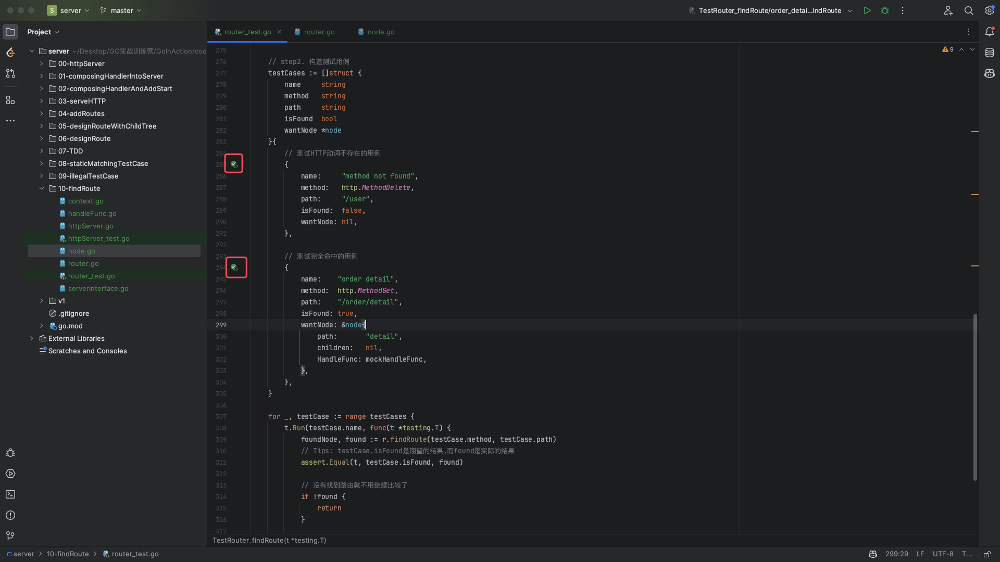
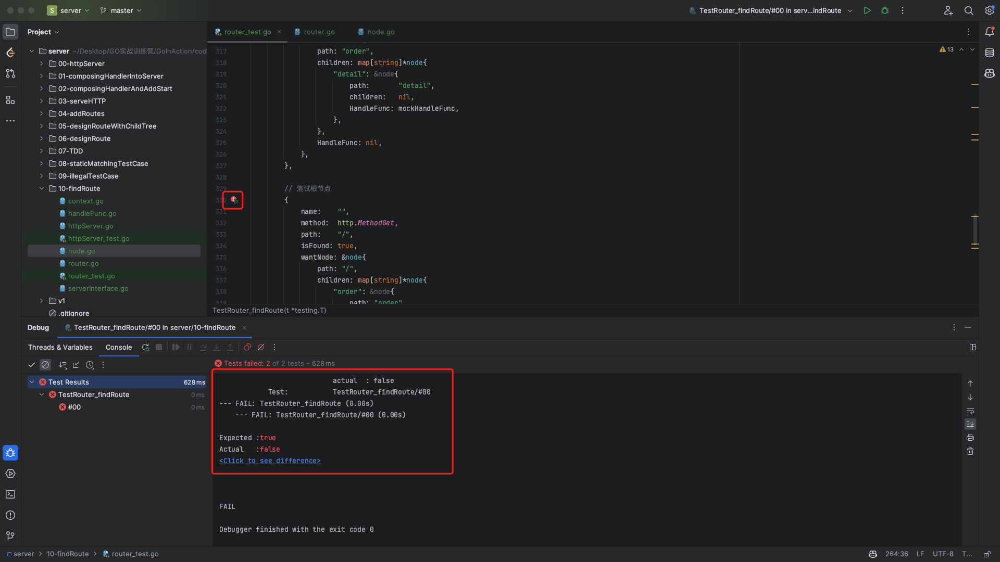

# 11. 路由树-静态匹配之路由查找

## PART1. 定义查找路由的方法

所谓查找路由,就是根据给定的HTTP动词和uri,在路由树中查找对应的节点.

`router.go`:

```go
// findRoute 根据给定的HTTP方法和路由路径,在路由森林中查找对应的节点
func (r *router) findRoute(method string, path string) (*node, bool) {
	// 沿着树深度遍历
}
```

注:此处也没有把全部`router.go`的代码放进来,因为太乱了,只放了和本小节有关的部分

## PART2. 定义测试用例

### 2.1 在测试函数中注册路由

这一部分和注册路由的测试用例代码完全相同

`router_test.go`:

```go
// TestNode 测试路由树节点
// 由于此处我们要测试的是路由树的结构,因此不需要在测试路由树节点中添加路由处理函数
// 调用addRoute时写死一个HandleFunc即可
type TestNode struct {
	method string
	path   string
}

// TestRouter_findRoute 测试路由查找功能
func TestRouter_findRoute(t *testing.T) {
	// step1. 构造路由树
	testRoutes := []TestNode{}

	r := newRouter()
	mockHandleFunc := func(ctx Context) {}

	for _, testRoute := range testRoutes {
		r.addRoute(testRoute.method, testRoute.path, mockHandleFunc)
	}
}
```

### 2.2 构造测试用例

#### 2.2.1 定义测试用例的类型

这里我们需要通过这个类型知道如下信息:

- 在给定的HTTP动词和uri的前提下,是否在路由树中找到了节点?
- 在给定的HTTP动词和uri的前提下,找到的节点和预定义的节点是否相同?

`router_test.go`:

```go
// TestCaseNode 测试用例
type TestCaseNode struct {
	// name 子测试用例的名称
	name string
	// method HTTP动词
	method string
	// path 路由路径
	path string
	// isFound 是否找到路由
	isFound bool
	// wantNode 期望的路由节点
	wantNode *node
}
```

#### 2.2.2 定义测试的过程

- step1. 判断是否在路由树中找到节点
- step2. 判断找到的节点和预定义的节点是否相同
	- 这里需要注意的是,和之前写`addRoute()`方法的测试用例相同,不能用`assert.Equal()`方法直接比对两个`node`结构体的实例,因为`HandleFunc`不可比

`router_test.go`:

```go
// TestNode 测试路由树节点
// 由于此处我们要测试的是路由树的结构,因此不需要在测试路由树节点中添加路由处理函数
// 调用addRoute时写死一个HandleFunc即可
type TestNode struct {
	method string
	path   string
}

// TestCaseNode 测试用例
type TestCaseNode struct {
	// name 子测试用例的名称
	name string
	// method HTTP动词
	method string
	// path 路由路径
	path string
	// isFound 是否找到路由
	isFound bool
	// wantNode 期望的路由节点
	wantNode *node
}

// TestRouter_findRoute 测试路由查找功能
func TestRouter_findRoute(t *testing.T) {
	// step1. 构造路由树
	testRoutes := []TestNode{}

	r := newRouter()
	mockHandleFunc := func(ctx Context) {}

	for _, testRoute := range testRoutes {
		r.addRoute(testRoute.method, testRoute.path, mockHandleFunc)
	}

	// step2. 构造测试用例
	testCases := []TestCaseNode{}

	for _, testCase := range testCases {
		t.Run(testCase.name, func(t *testing.T) {
			foundNode, found := r.findRoute(testCase.method, testCase.path)
			// Tips: testCase.isFound是期望的结果,而found是实际的结果
			assert.Equal(t, testCase.isFound, found)

			// 没有找到路由就不用继续比较了
			if !found {
				return
			}

			// 此处和之前的测试一样 不能直接用assert.Equal()比较 因为HandleFunc不可比
			// 所以要用封装的node.equal()方法比较
			msg, found := testCase.wantNode.equal(foundNode)
			assert.True(t, found, msg)
		})
	}
}
```

#### 2.2.3 构造测试用例

所谓构造测试用例,就是要考虑`findRoute()`方法会遇到什么场景(或者也可以说遇到什么边缘条件):

- HTTP动词不存在
- 完全命中
- 命中了但找到的node中,handler是nil
- 根节点
- 没有找到path

## PART3. 以TDD的方式开发`findRoute()`方法

### 3.1 HTTP动词不存在的情况

#### 3.1.1 实现

这个case比较简单,当给定的HTTP动词不存在时,直接返回`nil, false`即可:

`router.go`:

```go
// findRoute 根据给定的HTTP方法和路由路径,在路由森林中查找对应的节点
func (r *router) findRoute(method string, path string) (*node, bool) {
	_, ok := r.trees[method]
	// 给定的HTTP动词在路由森林中不存在对应的路由树,则直接返回false
	if !ok {
		return nil, false
	}

	panic("implement me")
}
```

#### 3.1.2 测试

`router_test.go`:

```go
// TestRouter_findRoute 测试路由查找功能
func TestRouter_findRoute(t *testing.T) {
	// step1. 构造路由树
	testRoutes := []TestNode{
		// GET方法路由树
		TestNode{
			method: http.MethodGet,
			path:   "/user",
		},
	}

	r := newRouter()
	mockHandleFunc := func(ctx Context) {}

	for _, testRoute := range testRoutes {
		r.addRoute(testRoute.method, testRoute.path, mockHandleFunc)
	}

	// step2. 构造测试用例
	testCases := []struct {
		name     string
		method   string
		path     string
		isFound  bool
		wantNode *node
	}{
		// 测试HTTP动词不存在的用例
		{
			name:     "method not found",
			method:   http.MethodDelete,
			path:     "/user",
			isFound:  false,
			wantNode: nil,
		},
	}

	for _, testCase := range testCases {
		t.Run(testCase.name, func(t *testing.T) {
			foundNode, found := r.findRoute(testCase.method, testCase.path)
			// Tips: testCase.isFound是期望的结果,而found是实际的结果
			assert.Equal(t, testCase.isFound, found)

			// 没有找到路由就不用继续比较了
			if !found {
				return
			}

			// 此处和之前的测试一样 不能直接用assert.Equal()比较 因为HandleFunc不可比
			// 所以要用封装的node.equal()方法比较
			msg, found := testCase.wantNode.equal(foundNode)
			assert.True(t, found, msg)
		})
	}
}
```

注:这里把`testCases`的类型改成了匿名结构体,不然没法用IDE的单个测试功能.单个测试功能如下图示:



### 3.2 完全命中的情况

#### 3.2.1 实现

- step1. 切割path
	- 切割`path`时注意前导`/`和后置`/`
- step2. 从根节点开始按"层次"(切割`path`后的字符串切片其实每个元素就是"一层")找子节点,找到了则继续深入一层
- step3. 没找到就返回`nil, false`即可

`router.go`:

```go
// findRoute 根据给定的HTTP方法和路由路径,在路由森林中查找对应的节点
func (r *router) findRoute(method string, path string) (*node, bool) {
	root, ok := r.trees[method]
	// 给定的HTTP动词在路由森林中不存在对应的路由树,则直接返回false
	if !ok {
		return nil, false
	}

	// 给定的HTTP动词在路由森林中存在对应的路由树,则在该路由树中查找对应的节点
	// 去掉前导和后置的"/"
	path = strings.Trim(path, "/")
	segments := strings.Split(path, "/")

	// Tips: 同样的 这里我认为用target作为变量名表现力更强
	target := root

	for _, segment := range segments {
		child, found := target.childOf(segment)
		// 如果在当前节点的子节点映射中没有找到对应的子节点,则直接返回
		if !found {
			return nil, false
		}
		// 如果在当前节点的子节点映射中找到了对应的子节点,则继续在该子节点中查找
		target = child
	}

	// 如果找到了对应的节点,则返回该节点
	// Tips: 此处有2种设计 一种是用标量表示是否找到了子节点
	// Tips: 另一种是 return target, target.HandleFunc != nil
	// Tips: 这种返回就表示找到了子节点且子节点必然有对应的业务处理函数
	// 此处我倾向用第1种设计 因为方法名叫findRoute,表示是否找到节点的意思.而非表示是否找到了一个有对应的业务处理函数的节点
	return target, true
}
```

`node.go`:(此处只写新增的方法)

```go
// childOf 根据给定的path在当前节点的子节点映射中查找对应的子节点
func (n *node) childOf(path string) (child *node, found bool) {
	if n.children == nil {
		return nil, false
	}
	child, found = n.children[path]
	return child, found
}
```

#### 3.2.2 测试

`router_test.go`:

```go
// TestRouter_findRoute 测试路由查找功能
func TestRouter_findRoute(t *testing.T) {
	// step1. 构造路由树
	testRoutes := []TestNode{
		// GET方法路由树
		TestNode{
			method: http.MethodGet,
			path:   "/order/detail",
		},
	}

	r := newRouter()
	mockHandleFunc := func(ctx Context) {}

	for _, testRoute := range testRoutes {
		r.addRoute(testRoute.method, testRoute.path, mockHandleFunc)
	}

	// step2. 构造测试用例
	testCases := []struct {
		name     string
		method   string
		path     string
		isFound  bool
		wantNode *node
	}{
		// 测试HTTP动词不存在的用例
		{
			name:     "method not found",
			method:   http.MethodDelete,
			path:     "/user",
			isFound:  false,
			wantNode: nil,
		},

		// 测试完全命中的用例
		{
			name:    "order detail",
			method:  http.MethodGet,
			path:    "/order/detail",
			isFound: true,
			wantNode: &node{
				path:       "detail",
				children:   nil,
				HandleFunc: mockHandleFunc,
			},
		},
	}

	for _, testCase := range testCases {
		t.Run(testCase.name, func(t *testing.T) {
			foundNode, found := r.findRoute(testCase.method, testCase.path)
			// Tips: testCase.isFound是期望的结果,而found是实际的结果
			assert.Equal(t, testCase.isFound, found)

			// 没有找到路由就不用继续比较了
			if !found {
				return
			}

			// 此处和之前的测试一样 不能直接用assert.Equal()比较 因为HandleFunc不可比
			// 所以要用封装的node.equal()方法比较
			msg, found := testCase.wantNode.equal(foundNode)
			assert.True(t, found, msg)
		})
	}
}
```

### 3.3 命中了,但找到的node中,handler是nil的情况

这个case只需要加一个测试用例即可,因为按照我们设计的`findRoute()`,在返回时并没有关注`HandleFunc`是否为nil

`router_test.go`:

```go
// TestRouter_findRoute 测试路由查找功能
func TestRouter_findRoute(t *testing.T) {
	// step1. 构造路由树
	testRoutes := []TestNode{
		// GET方法路由树
		TestNode{
			method: http.MethodGet,
			path:   "/order/detail",
		},
	}

	r := newRouter()
	mockHandleFunc := func(ctx Context) {}

	for _, testRoute := range testRoutes {
		r.addRoute(testRoute.method, testRoute.path, mockHandleFunc)
	}

	// step2. 构造测试用例
	testCases := []struct {
		name     string
		method   string
		path     string
		isFound  bool
		wantNode *node
	}{
		// 测试HTTP动词不存在的用例
		{
			name:     "method not found",
			method:   http.MethodDelete,
			path:     "/user",
			isFound:  false,
			wantNode: nil,
		},

		// 测试完全命中的用例
		{
			name:    "order detail",
			method:  http.MethodGet,
			path:    "/order/detail",
			isFound: true,
			wantNode: &node{
				path:       "detail",
				children:   nil,
				HandleFunc: mockHandleFunc,
			},
		},

		// 测试命中了节点但节点的HandleFunc为nil的情况
		{
			name:    "order",
			method:  http.MethodGet,
			path:    "/order",
			isFound: true,
			wantNode: &node{
				path: "order",
				children: map[string]*node{
					"detail": &node{
						path:       "detail",
						children:   nil,
						HandleFunc: mockHandleFunc,
					},
				},
				HandleFunc: nil,
			},
		},
	}

	for _, testCase := range testCases {
		t.Run(testCase.name, func(t *testing.T) {
			foundNode, found := r.findRoute(testCase.method, testCase.path)
			// Tips: testCase.isFound是期望的结果,而found是实际的结果
			assert.Equal(t, testCase.isFound, found)

			// 没有找到路由就不用继续比较了
			if !found {
				return
			}

			// 此处和之前的测试一样 不能直接用assert.Equal()比较 因为HandleFunc不可比
			// 所以要用封装的node.equal()方法比较
			msg, found := testCase.wantNode.equal(foundNode)
			assert.True(t, found, msg)
		})
	}
}
```

### 3.4 根节点

#### 3.4.1 测试

`router_test.go`:

```go
// TestRouter_findRoute 测试路由查找功能
func TestRouter_findRoute(t *testing.T) {
	// step1. 构造路由树
	testRoutes := []TestNode{
		// GET方法路由树
		TestNode{
			method: http.MethodGet,
			path:   "/order/detail",
		},
		TestNode{
			method: http.MethodGet,
			path:   "/",
		},
	}

	r := newRouter()
	mockHandleFunc := func(ctx Context) {}

	for _, testRoute := range testRoutes {
		r.addRoute(testRoute.method, testRoute.path, mockHandleFunc)
	}

	// step2. 构造测试用例
	testCases := []struct {
		name     string
		method   string
		path     string
		isFound  bool
		wantNode *node
	}{
		// 测试HTTP动词不存在的用例
		{
			name:     "method not found",
			method:   http.MethodDelete,
			path:     "/user",
			isFound:  false,
			wantNode: nil,
		},

		// 测试完全命中的用例
		{
			name:    "order detail",
			method:  http.MethodGet,
			path:    "/order/detail",
			isFound: true,
			wantNode: &node{
				path:       "detail",
				children:   nil,
				HandleFunc: mockHandleFunc,
			},
		},

		// 测试命中了节点但节点的HandleFunc为nil的情况
		{
			name:    "order",
			method:  http.MethodGet,
			path:    "/order",
			isFound: true,
			wantNode: &node{
				path: "order",
				children: map[string]*node{
					"detail": &node{
						path:       "detail",
						children:   nil,
						HandleFunc: mockHandleFunc,
					},
				},
				HandleFunc: nil,
			},
		},

		// 测试根节点
		{
			name:    "",
			method:  http.MethodGet,
			path:    "/",
			isFound: true,
			wantNode: &node{
				path: "/",
				children: map[string]*node{
					"order": &node{
						path: "order",
						children: map[string]*node{
							"detail": &node{
								path:       "detail",
								children:   nil,
								HandleFunc: mockHandleFunc,
							},
						},
						HandleFunc: nil,
					},
				},
				HandleFunc: mockHandleFunc,
			},
		},
	}

	for _, testCase := range testCases {
		t.Run(testCase.name, func(t *testing.T) {
			foundNode, found := r.findRoute(testCase.method, testCase.path)
			// Tips: testCase.isFound是期望的结果,而found是实际的结果
			assert.Equal(t, testCase.isFound, found)

			// 没有找到路由就不用继续比较了
			if !found {
				return
			}

			// 此处和之前的测试一样 不能直接用assert.Equal()比较 因为HandleFunc不可比
			// 所以要用封装的node.equal()方法比较
			msg, found := testCase.wantNode.equal(foundNode)
			assert.True(t, found, msg)
		})
	}
}
```



#### 3.4.2 修bug


可以看到,过滤掉`/`之后,切割`path`的结果不符合预期.

修复思路:对根节点做特殊处理

`router.go`:

```go
// findRoute 根据给定的HTTP方法和路由路径,在路由森林中查找对应的节点
func (r *router) findRoute(method string, path string) (*node, bool) {
	root, ok := r.trees[method]
	// 给定的HTTP动词在路由森林中不存在对应的路由树,则直接返回false
	if !ok {
		return nil, false
	}

	// 对根节点做特殊处理
	if path == "/" {
		return root, true
	}

	// 给定的HTTP动词在路由森林中存在对应的路由树,则在该路由树中查找对应的节点
	// 去掉前导和后置的"/"
	path = strings.Trim(path, "/")
	segments := strings.Split(path, "/")

	// Tips: 同样的 这里我认为用target作为变量名表现力更强
	target := root

	for _, segment := range segments {
		child, found := target.childOf(segment)
		// 如果在当前节点的子节点映射中没有找到对应的子节点,则直接返回
		if !found {
			return nil, false
		}
		// 如果在当前节点的子节点映射中找到了对应的子节点,则继续在该子节点中查找
		target = child
	}

	// 如果找到了对应的节点,则返回该节点
	// Tips: 此处有2种设计 一种是用标量表示是否找到了子节点
	// Tips: 另一种是 return target, target.HandleFunc != nil
	// Tips: 这种返回就表示找到了子节点且子节点必然有对应的业务处理函数
	// 此处我倾向用第1种设计 因为方法名叫findRoute,表示是否找到节点的意思.而非表示是否找到了一个有对应的业务处理函数的节点
	return target, true
}
```

### 3.5 没有找到path

这里也是先加测试用例,发现能通过,就可以了.

`router_test.go`

```go
// TestRouter_findRoute 测试路由查找功能
func TestRouter_findRoute(t *testing.T) {
	// step1. 构造路由树
	testRoutes := []TestNode{
		// GET方法路由树
		TestNode{
			method: http.MethodGet,
			path:   "/order/detail",
		},
		TestNode{
			method: http.MethodGet,
			path:   "/",
		},
	}

	r := newRouter()
	mockHandleFunc := func(ctx Context) {}

	for _, testRoute := range testRoutes {
		r.addRoute(testRoute.method, testRoute.path, mockHandleFunc)
	}

	// step2. 构造测试用例
	testCases := []struct {
		name     string
		method   string
		path     string
		isFound  bool
		wantNode *node
	}{
		// 测试HTTP动词不存在的用例
		{
			name:     "method not found",
			method:   http.MethodDelete,
			path:     "/user",
			isFound:  false,
			wantNode: nil,
		},

		// 测试完全命中的用例
		{
			name:    "order detail",
			method:  http.MethodGet,
			path:    "/order/detail",
			isFound: true,
			wantNode: &node{
				path:       "detail",
				children:   nil,
				HandleFunc: mockHandleFunc,
			},
		},

		// 测试命中了节点但节点的HandleFunc为nil的情况
		{
			name:    "order",
			method:  http.MethodGet,
			path:    "/order",
			isFound: true,
			wantNode: &node{
				path: "order",
				children: map[string]*node{
					"detail": &node{
						path:       "detail",
						children:   nil,
						HandleFunc: mockHandleFunc,
					},
				},
				HandleFunc: nil,
			},
		},

		// 测试根节点
		{
			name:    "",
			method:  http.MethodGet,
			path:    "/",
			isFound: true,
			wantNode: &node{
				path: "/",
				children: map[string]*node{
					"order": &node{
						path: "order",
						children: map[string]*node{
							"detail": &node{
								path:       "detail",
								children:   nil,
								HandleFunc: mockHandleFunc,
							},
						},
						HandleFunc: nil,
					},
				},
				HandleFunc: mockHandleFunc,
			},
		},

		// 测试路由不存在的用例
		{
			name:     "path not found",
			method:   http.MethodGet,
			path:     "/user",
			isFound:  false,
			wantNode: nil,
		},
	}

	for _, testCase := range testCases {
		t.Run(testCase.name, func(t *testing.T) {
			foundNode, found := r.findRoute(testCase.method, testCase.path)
			// Tips: testCase.isFound是期望的结果,而found是实际的结果
			assert.Equal(t, testCase.isFound, found)

			// 没有找到路由就不用继续比较了
			if !found {
				return
			}

			// 此处和之前的测试一样 不能直接用assert.Equal()比较 因为HandleFunc不可比
			// 所以要用封装的node.equal()方法比较
			msg, found := testCase.wantNode.equal(foundNode)
			assert.True(t, found, msg)
		})
	}
}
```

## 附录

TODO:要去看v2代码中的用例,然后再拿回来跑