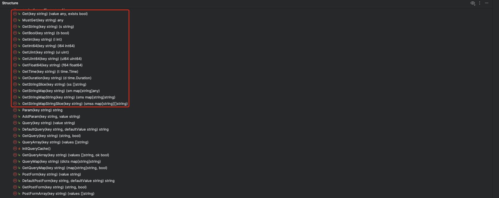
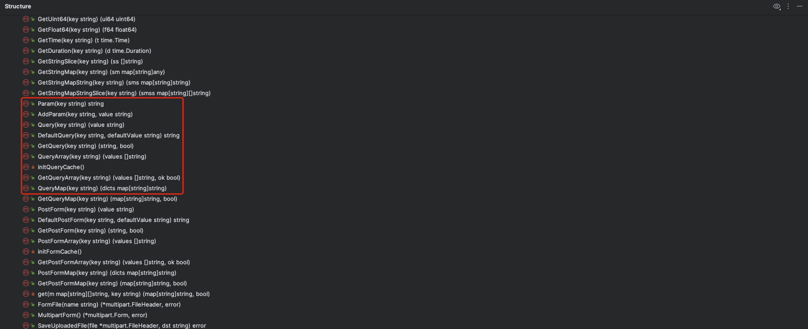
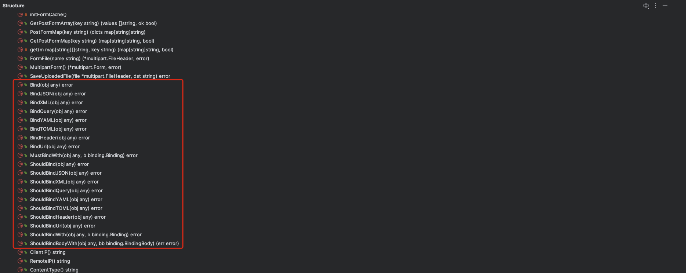
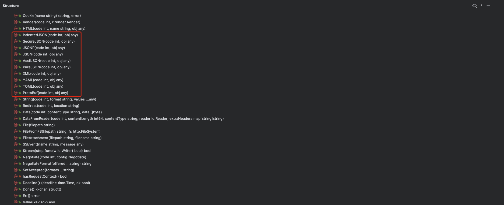
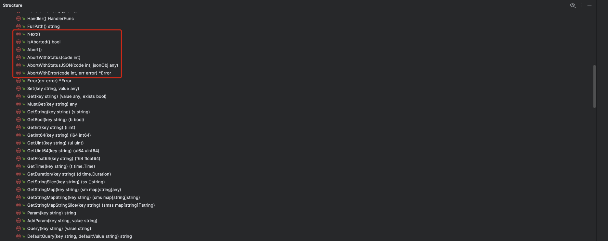
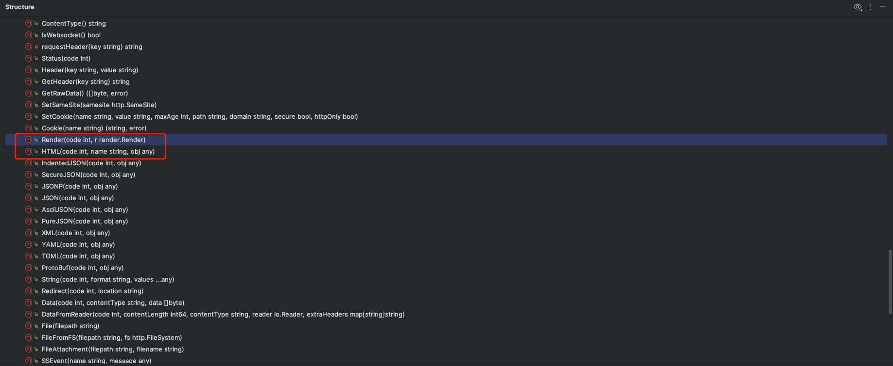

# 03. Context-Gin Context设计分析

## PART1. Gin Context设计

[`gin.Context`](https://github.com/gin-gonic/gin/blob/a481ee2897af1e368de5c919fbeb21b89aa26fc7/context.go#L51)也是放了一些和输入输出有关的字段.

```go
type Context struct {
	writermem responseWriter
	Request   *http.Request
	Writer    ResponseWriter

	Params   Params
	handlers HandlersChain
	index    int8
	fullPath string

	engine       *Engine
	params       *Params
	skippedNodes *[]skippedNode

	mu sync.RWMutex

	Keys map[string]any

	Errors errorMsgs

	Accepted []string

	queryCache url.Values

	formCache url.Values

	// SameSite allows a server to define a cookie attribute making it impossible for
	// the browser to send this cookie along with cross-site requests.
	sameSite http.SameSite
}
```

- `Context.Writer`:(其类型为[`gin.ResponseWriter`接口](https://github.com/gin-gonic/gin/blob/a481ee2897af1e368de5c919fbeb21b89aa26fc7/response_writer.go#L20),实际上是[`gin.responseWriter`类型](https://github.com/gin-gonic/gin/blob/a481ee2897af1e368de5c919fbeb21b89aa26fc7/response_writer.go#L46))封装了原生的`http.ResponseWriter`,但是使用了原生的`http.Request`.
- `Context.handlers`:责任链
- `Context.engine`:实现了HTTP Server
- `Context.formCache`:表单数据的缓存
- `Context.queryCache`:url参数的缓存
	- 这种缓存避免了重复读取和解析的开销
- `Context.sameSite`:其类型为[原生的`http.SameSite`类型](https://github.com/golang/go/blob/1cc19e5ba0a008df7baeb78e076e43f9d8e0abf2/src/net/http/cookie.go#L49),该字段的作用见附录.
	- 有一种观点认为,关于cookie的设置,既不应该在Context层面上设置,也不应该在Server层面上设置,而是应该让用户自行在输出cookie时设置.换言之,中间件不需要提供这个设置

```go
type SameSite int

const (
	SameSiteDefaultMode SameSite = iota + 1
	SameSiteLaxMode
	SameSiteStrictMode
	SameSiteNoneMode
)
```

## PART2. Gin 处理输入

### 2.1 从指定的key中读取数据的方法



`gin.Context`中根据Key读取指定数据的方法

### 2.2 从不同部位读取数据的方法



`gin.Context`中从不同部位读取数据的方法

### 2.3 将输入转化为一个具象的结构体的方法



`gin.Context`中将输入(整个body)转化为一个具体的对象的方法

## PART3. Gin 处理输出

### 3.1 返回具体格式响应的方法



`gin.Context`中返回具体格式响应的方法

### 3.2 控制Handler调度的方法

`gin.Context`还控制了Handler的调度(想想第一周讲过的gin中的责任链),因此`gin.Context`中还有中断或继续后续Handler执行的方法



### 3.3 渲染页面的方法



`gin.Context`中渲染页面的方法

## 附录

### 1. cookie的sameSite属性的作用

`SameSite`属性用于控制您的网站如何将cookie设置为与跨站点请求一起发送.它可以帮助减少CSRF(跨站请求伪造)攻击的风险,并且可以用于您的网站的cookie防御策略的一部分.`SameSite`属性可以有以下值:

- `Strict`:这个值会阻止cookie跟随跨站点请求被发送.这意味着如果用户在另一个网站上点击导向您网站的链接,cookie将不会被发送,这可能会阻止用户从外部网站登录或使用您网站的功能
- `Lax`:类似于`Strict`,但是当用户从另一个网站导航到您的网站时,例如通过点击一个链接,cookie会被发送.这提供了一个折中的方式,既提供了一定级别的CSRF保护,同时又允许一些跨站点请求,例如从其他网站的链接点击
- `None`:这个值会允许cookie在所有跨站点请求中发送.如果设置为`None`,必须同时将`Secure`属性设置为`true`,这样cookie只会通过安全的HTTPS连接发送

默认情况下,如果没有明确设置`SameSite`属性,大多数现代浏览器会将其视为`Lax`.这是为了提高网络的整体安全性,但开发者需要了解这一点,因为它可能会影响跨站点登录和集成的行为