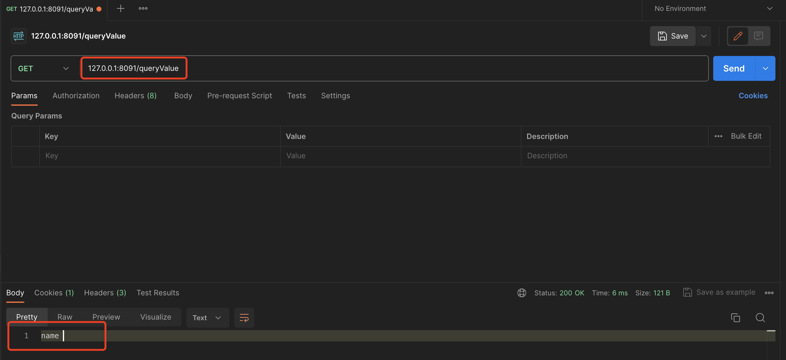
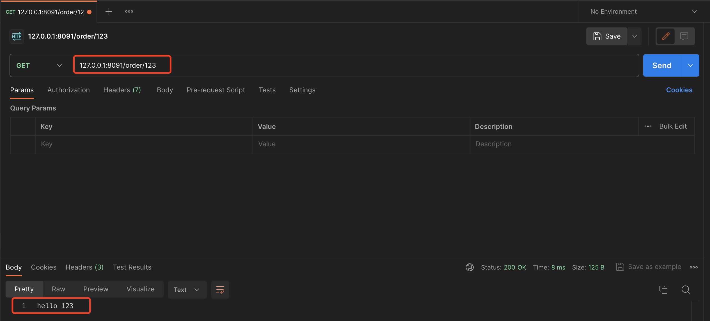
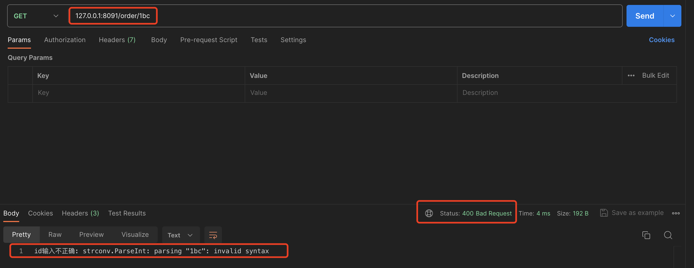

# 08. Context-处理输入之查询参数、路径参数和StringValue

## PART1. 处理查询参数

本部分工程结构如下:

```
(base) yanglei@bogon 04-queryValue % tree ./
./
├── context.go
├── go.mod
├── go.sum
├── handleFunc.go
├── httpServer.go
├── httpServer_test.go
├── matchNode.go
├── node.go
├── router.go
├── router_test.go
└── serverInterface.go

0 directories, 11 files
```

查询参数:即**就是指在URL问号之后的部分**.

例如:`http://localhost:8081/form?name=xiaoming&age=18`.那么查询参数即为:

- `name=xiaoming`
- `age=18`

在之前处理表单处理的课程中我们可知,调用`http.Request.ParseForm()`方法,可以找到这部分参数值.

乍一看这个需求实现起来还是比较简单的:

```go
// QueryValue 获取查询字符串中给定键的值
func (c *Context) QueryValue(key string) (value string, err error) {
	return c.Req.URL.Query().Get(key), nil
}
```

### 1.1 问题1:多次调用是否会重复解析?

[`http.Request.URL.Query()`](https://github.com/golang/go/blob/master/src/net/url/url.go#L1121)方法调用了[`url.ParseQuery()`](https://github.com/golang/go/blob/master/src/net/url/url.go#L933)函数,而[`url.ParseQuery()`](https://github.com/golang/go/blob/master/src/net/url/url.go#L933)函数又调用了[`url.parseQuery()`](https://github.com/golang/go/blob/master/src/net/url/url.go#L939)函数.实际上真正实现解析查询参数的正是这个[`url.parseQuery()`](https://github.com/golang/go/blob/master/src/net/url/url.go#L939)函数.**换言之,我们每一次调用`http.Ruquest.URL.Query()`方法,都要重新解析一次.因此我们要考虑把查询参数缓存起来**.

```go
package queryValue

import (
	"encoding/json"
	"errors"
	"net/http"
	"net/url"
)

// Context HandleFunc的上下文
type Context struct {
	// Req 请求
	Req *http.Request
	// Resp 响应
	Resp http.ResponseWriter
	// PathParams 路径参数名值对
	PathParams map[string]string
	// QueryValues 查询参数名值对
	queryValues url.Values
}

// QueryValue 获取查询字符串中给定键的值
func (c *Context) QueryValue(key string) (value string, err error) {
	if c.queryValues == nil {
		c.queryValues = c.Req.URL.Query()
	}

	return c.queryValues.Get(key), nil
}
```

注:

1. 此处删除了和本节课无关的代码
2. 这里的设计类似GIN框架,引入了一个查询参数缓存.**这个缓存是不存在所谓的缓存失效或缓存不一致问题的,因为对于Web框架而言,请求收到之后,请求参数就是确切无疑不会再变的**

### 1.2 问题2:无法区分给定的key到底是不存在,还是存在但值为空?

但是这个实现有一个问题:无法区分给定的key到底是不存在,还是存在但值为空

举例说明:

```go
package main

import (
	"fmt"
	"net/http"
)

func main() {
	http.HandleFunc("/queryValue", queryValue)
	http.ListenAndServe(":8091", nil)
}

func queryValue(w http.ResponseWriter, r *http.Request) {
	// 获取查询字符串中的name参数
	name := r.URL.Query().Get("name")
	fmt.Fprintf(w, "name %s", name)
}
```

请求URL为`127.0.0.1:8091/queryValue`时,结果如下:



请求URL为`127.0.0.1:8091/queryValue?name=`时,结果如下:


再次提醒,[`url.Values`](https://github.com/golang/go/blob/master/src/net/url/url.go#L886)类型的本质是`map[string][]string`.因此只需要对我们的`Context.queryValues`做一个判断取值是否成功的操作,即可判断出到底是key到底是不存在,还是存在但值为空.

```go
package queryValue

import (
	"encoding/json"
	"errors"
	"net/http"
	"net/url"
)

// Context HandleFunc的上下文
type Context struct {
	// Req 请求
	Req *http.Request
	// Resp 响应
	Resp http.ResponseWriter
	// PathParams 路径参数名值对
	PathParams map[string]string
	// QueryValues 查询参数名值对
	queryValues url.Values
}

// QueryValue 获取查询字符串中给定键的值
func (c *Context) QueryValue(key string) (value string, err error) {
	if c.queryValues == nil {
		c.queryValues = c.Req.URL.Query()
	}

	values, ok := c.queryValues[key]
	if !ok {
		return "", errors.New("web绑定错误: 查询参数中不存在键: " + key)
	}

	return values[0], nil
}
```

这里可能会有人问:为什么访问这个map之前不需要判空?

这是因为在[`url.ParseQuery()`](https://github.com/golang/go/blob/master/src/net/url/url.go#L934)函数中,已经对返回值进行了初始化,因此上述代码中拿到的`c.queryValues`必然不为空,就算没有任何查询参数,其值也是一个**长度为0的`map[string][]string`**.

如果再严格一些,可以再加一个对`c.queryValues`长度是否为0的判断,以便判断是否存在查询参数:

```go
package queryValue

import (
	"encoding/json"
	"errors"
	"net/http"
	"net/url"
)

// Context HandleFunc的上下文
type Context struct {
	// Req 请求
	Req *http.Request
	// Resp 响应
	Resp http.ResponseWriter
	// PathParams 路径参数名值对
	PathParams map[string]string
	// QueryValues 查询参数名值对
	queryValues url.Values
}

// QueryValue 获取查询字符串中给定键的值
func (c *Context) QueryValue(key string) (value string, err error) {
	if c.queryValues == nil {
		c.queryValues = c.Req.URL.Query()
	}

	if len(c.queryValues) == 0 {
		return "", errors.New("web绑定错误: 无任何查询参数")
	}

	values, ok := c.queryValues[key]
	if !ok {
		return "", errors.New("web绑定错误: 查询参数中不存在键: " + key)
	}

	return values[0], nil
}
```

### 1.3 问题3:是否需要提供返回其他数据类型的API?

对于查询参数的读取,也面临着和读取表单参数一样的问题:是否需要提供返回其他数据类型的API?

例如:

```go
package queryValue

import (
	"encoding/json"
	"errors"
	"net/http"
	"net/url"
	"strconv"
)

// Context HandleFunc的上下文
type Context struct {
	// Req 请求
	Req *http.Request
	// Resp 响应
	Resp http.ResponseWriter
	// PathParams 路径参数名值对
	PathParams map[string]string
	// QueryValues 查询参数名值对
	queryValues url.Values
}

// QueryValue 获取查询字符串中给定键的值
func (c *Context) QueryValue(key string) (value string, err error) {
	if c.queryValues == nil {
		c.queryValues = c.Req.URL.Query()
	}

	if len(c.queryValues) == 0 {
		return "", errors.New("web绑定错误: 无任何查询参数")
	}

	values, ok := c.queryValues[key]
	if !ok {
		return "", errors.New("web绑定错误: 查询参数中不存在键: " + key)
	}

	return values[0], nil
}

// QueryValueAsInt64 获取查询字符串中给定键的值并返回其int64表示
func (c *Context) QueryValueAsInt64(key string) (intValue int64, err error) {
	value, err := c.QueryValue(key)
	if err != nil {
		return 0, err
	}
	return strconv.ParseInt(value, 10, 64)
}
```

同样问题:如果需要提供,那就还要提供很多其他数据类型的API.

这里的答案同样是不需要的.后续我们统一解决这个问题.

## PART2. 处理路径参数

本章工程结构如下:

```
(base) yanglei@bogon 05-pathValue % tree ./
./
├── context.go
├── go.mod
├── go.sum
├── handleFunc.go
├── httpServer.go
├── httpServer_test.go
├── matchNode.go
├── node.go
├── router.go
├── router_test.go
└── serverInterface.go

0 directories, 11 files
```

这里基本上和前面的表单、查询参数没太大的区别

```go
package pathValue

import (
	"encoding/json"
	"errors"
	"net/http"
	"net/url"
)

// Context HandleFunc的上下文
type Context struct {
	// Req 请求
	Req *http.Request
	// Resp 响应
	Resp http.ResponseWriter
	// PathParams 路径参数名值对
	PathParams map[string]string
	// QueryValues 查询参数名值对
	queryValues url.Values
}

// PathValue 获取路径参数中给定键的值
func (c *Context) PathValue(key string) (value string, err error) {
	if c.PathParams == nil {
		return "", errors.New("web绑定错误: 无任何路径参数")
	}

	value, ok := c.PathParams[key]
	if !ok {
		return "", errors.New("web绑定错误: 路径参数中不存在键: " + key)
	}

	return value, nil
}
```

注:

1. 此处删除了和本节课无关的代码

### 2.1 问题1:是否需要提供返回其他数据类型的API?

对于路径参数的读取,也面临着和查询参数、读取表单参数一样的问题:是否需要提供返回其他数据类型的API?

例如:

```go
package pathValue

import (
	"encoding/json"
	"errors"
	"net/http"
	"net/url"
	"strconv"
)

// Context HandleFunc的上下文
type Context struct {
	// Req 请求
	Req *http.Request
	// Resp 响应
	Resp http.ResponseWriter
	// PathParams 路径参数名值对
	PathParams map[string]string
	// QueryValues 查询参数名值对
	queryValues url.Values
}

// PathValue 获取路径参数中给定键的值
func (c *Context) PathValue(key string) (value string, err error) {
	if c.PathParams == nil {
		return "", errors.New("web绑定错误: 无任何路径参数")
	}

	value, ok := c.PathParams[key]
	if !ok {
		return "", errors.New("web绑定错误: 路径参数中不存在键: " + key)
	}

	return value, nil
}

// PathValueAsInt64 获取路径参数中给定键的值并返回其int64表示
func (c *Context) PathValueAsInt64(key string) (intValue int64, err error) {
	value, err := c.PathValue(key)
	if err != nil {
		return 0, err
	}

	return strconv.ParseInt(value, 10, 64)
}
```

## PART3. 返回不同数据类型的输入

本章工程结构如下:

```
(base) yanglei@bogon 06-stringValue % tree ./
./
├── context.go
├── go.mod
├── go.sum
├── handleFunc.go
├── httpServer.go
├── httpServer_test.go
├── matchNode.go
├── node.go
├── router.go
├── router_test.go
└── serverInterface.go

0 directories, 11 files
```

### 3.1 定义用于接收来自`Context`输入的类型

新建文件`stringValue.go`:

```go
package stringValue

// StringValue 用于承载来自各部分输入的值 并提供统一的类型转换API
type StringValue struct {
	// value 承载来自各部分输入的值 以字符串表示
	value string
	// err 用于承载处理各部分输入时的错误信息
	err error
}
```

整体的思路就是:**`Context`中处理各部分输入的方法,不再返回`(string, err)`,而是返回一个`StringValue`类型的实例(注意不是指针,因为我们认为这个实例不需要被修改).后续所有类型转换的方法,均在`StringValue`类型上实现.换言之,`StringValue`类型的职责为:将各部分输入的值转换为对应的类型**.

### 3.2 修改`Context`中处理各部分输入的方法的返回值

此处各方法不再返回`(string, err)`,而是返回一个`StringValue`类型的实例.

#### 3.2.1 `Context.FormValue()`方法

```go
package stringValue

import (
	"encoding/json"
	"errors"
	"net/http"
	"net/url"
	"strconv"
)

// Context HandleFunc的上下文
type Context struct {
	// Req 请求
	Req *http.Request
	// Resp 响应
	Resp http.ResponseWriter
	// PathParams 路径参数名值对
	PathParams map[string]string
	// QueryValues 查询参数名值对
	queryValues url.Values
}

// FormValue 获取表单中给定键的值
func (c *Context) FormValue(key string) (stringValue StringValue) {
	err := c.Req.ParseForm()
	if err != nil {
		return StringValue{err: err}
	}

	return StringValue{value: c.Req.FormValue(key)}
}
```

### 3.2.2 `Context.QueryValue()`方法

```go
package stringValue

import (
	"encoding/json"
	"errors"
	"net/http"
	"net/url"
	"strconv"
)

// Context HandleFunc的上下文
type Context struct {
	// Req 请求
	Req *http.Request
	// Resp 响应
	Resp http.ResponseWriter
	// PathParams 路径参数名值对
	PathParams map[string]string
	// QueryValues 查询参数名值对
	queryValues url.Values
}

// QueryValue 获取查询字符串中给定键的值
func (c *Context) QueryValue(key string) (stringValue StringValue) {
	if c.queryValues == nil {
		c.queryValues = c.Req.URL.Query()
	}

	if len(c.queryValues) == 0 {
		return StringValue{err: errors.New("web绑定错误: 无任何查询参数")}
	}

	values, ok := c.queryValues[key]
	if !ok {
		return StringValue{err: errors.New("web绑定错误: 查询参数中不存在键: " + key)}
	}

	return StringValue{value: values[0]}
}
```

### 3.2.3 `Context.PathValue()`方法

```go
package stringValue

import (
	"encoding/json"
	"errors"
	"net/http"
	"net/url"
)

// Context HandleFunc的上下文
type Context struct {
	// Req 请求
	Req *http.Request
	// Resp 响应
	Resp http.ResponseWriter
	// PathParams 路径参数名值对
	PathParams map[string]string
	// QueryValues 查询参数名值对
	queryValues url.Values
}

// PathValue 获取路径参数中给定键的值
func (c *Context) PathValue(key string) (stringValue StringValue) {
	if c.PathParams == nil {
		return StringValue{err: errors.New("web绑定错误: 无任何路径参数")}
	}

	value, ok := c.PathParams[key]
	if !ok {
		return StringValue{err: errors.New("web绑定错误: 路径参数中不存在键: " + key)}
	}

	return StringValue{value: value}
}
```

### 3.3 新增将输入参数转换为对应类型表达的方法

#### 3.3.1 `StringValue.AsInt64()`

```go
package stringValue

import "strconv"

// StringValue 用于承载来自各部分输入的值 并提供统一的类型转换API
type StringValue struct {
	// value 承载来自各部分输入的值 以字符串表示
	value string
	// err 用于承载处理各部分输入时的错误信息
	err error
}

// AsInt64 将承载的值转换为int64类型
func (s StringValue) AsInt64() (value int64, err error) {
	if s.err != nil {
		return 0, s.err
	}

	return strconv.ParseInt(s.value, 10, 64)
}
```

#### 3.3.2 `StringValue.AsUint64()`

```go
package stringValue

import "strconv"

// StringValue 用于承载来自各部分输入的值 并提供统一的类型转换API
type StringValue struct {
	// value 承载来自各部分输入的值 以字符串表示
	value string
	// err 用于承载处理各部分输入时的错误信息
	err error
}

// AsUint64 将承载的值转换为uint64类型
func (s StringValue) AsUint64() (value uint64, err error) {
	if s.err != nil {
		return 0, s.err
	}

	return strconv.ParseUint(s.value, 10, 64)
}
```

### 3.3.3 `StringValue.AsFloat64()`

```go
package stringValue

import "strconv"

// StringValue 用于承载来自各部分输入的值 并提供统一的类型转换API
type StringValue struct {
	// value 承载来自各部分输入的值 以字符串表示
	value string
	// err 用于承载处理各部分输入时的错误信息
	err error
}

// AsFloat64 将承载的值转换为float64类型表示
func (s StringValue) AsFloat64() (value float64, err error) {
	if s.err != nil {
		return 0, s.err
	}

	return strconv.ParseFloat(s.value, 64)
}
```

### 3.4 在handleFunc中使用

新建文件`context_test.go`:

```go
package stringValue

import (
	"fmt"
	"testing"
)

func TestContext_PathValue(t *testing.T) {
	s := &HTTPServer{router: newRouter()}

	handleFunc := func(ctx *Context) {
		// 获取路径参数
		id, err := ctx.PathValue("id").AsInt64()
		if err != nil {
			ctx.Resp.WriteHeader(400)
			ctx.Resp.Write([]byte("id输入不正确: " + err.Error()))
			return
		}

		ctx.Resp.Write([]byte(fmt.Sprintf("hello %d", id)))
	}

	s.GET("/order/:id", handleFunc)
	_ = s.Start(":8091")
}
```

尝试请求:





这样设计的好处在于这一行代码:`ctx.PathValue("id").AsInt64()`

这种链式调用,有2个优点:

- 对于框架使用者而言,是非常方便的
- 对于框架设计者而言,每个类的职责非常清晰,保持`Context`的简约

这种设计思路来源于GO原生的`database/sql`包中的[`sql.Row`](https://github.com/golang/go/blob/master/src/database/sql/sql.go#L3431)结构体.可以看到[`sql.Row.Scan()`](https://github.com/golang/go/blob/master/src/database/sql/sql.go#L3443)方法,思路和我们设计`StringValue`时的将输入参数转换为对应类型表达的方法是相同的.

**同时,由于返回的都是结构体,因此可以保证在大多数的情况下,不会发生内存逃逸**