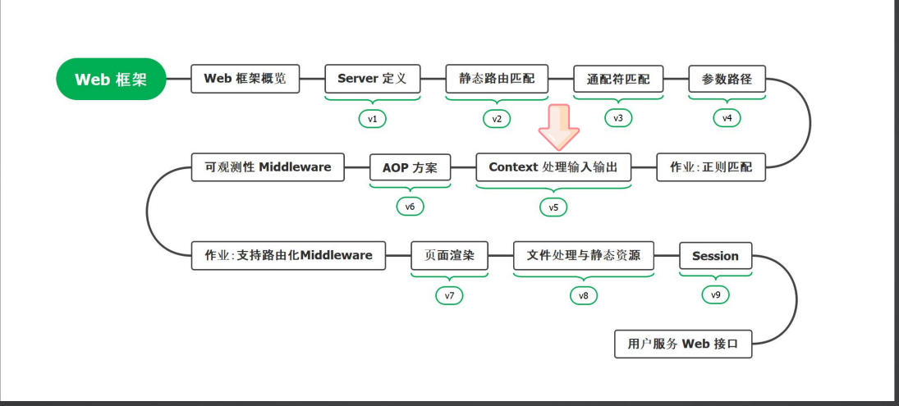

# 5.01 Context-简介



## PART1. HTTP语法简介

先来看一个最基本的HTTP HandleFunc示例:

```go
package main

import (
	"fmt"
	"net/http"
)

func main() {
	http.HandleFunc("/", helloHandler)
	http.ListenAndServe(":8080", nil)
}

func helloHandler(w http.ResponseWriter, r *http.Request) {
	fmt.Fprintf(w, "Hello, world!")
}
```

### 1.1 为什么有`http.Request`但是没有`http.Response`?

上文demo中的[`http.ResponseWriter`](https://github.com/golang/go/blob/master/src/net/http/server.go#L94),是一个接口.真正在运行时,这个`w`参数的类型是[`http.response`](https://github.com/golang/go/blob/master/src/net/http/server.go#L422),很明显这是一个私有的结构体,我们从外边是拿不到的.

接口[`http.ResponseWriter`](https://github.com/golang/go/blob/master/src/net/http/server.go#L94)实际上只有3个方法,看起来还是比较简单的:

```go
type ResponseWriter interface {
	Header() Header

	Write([]byte) (int, error)

	// WriteHeader 该方法用于写HTTP响应码
	WriteHeader(statusCode int)
}
```

### 1.2 `http.Request`

复杂的是[`http.Request`](https://github.com/golang/go/blob/master/src/net/http/request.go#L111),其方法如下两图示:


这些不用背,靠IDE的代码提示就行了.核心原则:**API不需要背的**.

#### 1.2.1 `http.Request.Body`属性

```go
package main

import (
	"fmt"
	"io"
	"net/http"
)

func main() {
	http.HandleFunc("/readBodyOnce", readBodyOnce)
	http.ListenAndServe(":8091", nil)
}

func readBodyOnce(w http.ResponseWriter, r *http.Request) {
	// 先读取一次body
	body, err := io.ReadAll(r.Body)
	if err != nil {
		fmt.Fprintf(w, "read body failed: %v", err)
		return
	}
	fmt.Fprintf(w, "read body: %s\n", string(body))

	// 再读取一次body
	body, err = io.ReadAll(r.Body)
	if err != nil {
		fmt.Fprintf(w, "read body one more time got error: %v", err)
		return
	}
	fmt.Fprintf(w, "read body one more time: [%s] and read body length %d \n", string(body), len(body))
}
```


注:此处老师上课说GET方法没有`http.Request.Body`,但实际上通过POSTMAN测试可以读取到,具体原因见附录.

通过这个demo我们可以看到:**`http.Request.Body`是只能读取1次的**.

[`http.Request.Body`](https://github.com/golang/go/blob/master/src/net/http/request.go#L186)的类型为[`io.ReadCloser`接口](https://github.com/golang/go/blob/master/src/io/io.go#L137):

该接口组合了`io.Reader`接口和`io.Closer`接口.

```go
// ReadCloser is the interface that groups the basic Read and Close methods.
type ReadCloser interface {
	Reader
	// Closer 表示一个可关闭的资源
	Closer
}
```

在运行时,这个`http.Request.Body`的类型是[`http.body`](https://github.com/golang/go/blob/master/src/net/http/transfer.go#L803)(这个类型也是`io.Reader`接口的实现).真正实现读取是`http.body.Read()`方法.

这里多提一句,实际上完成读取的是`http.body.src.Read()`方法,而`http.body.src`真正的类型是`io.LimitedReader`,而`io.LimitedReader.R`的真正类型是`bufio.Reader`,这也就是为什么`http.Request.Body`只能被读取1次的原因.因为`bufio.Reader`的缓冲区中的数据一旦被读取,它就不会再存储在缓冲区中了,这意味着数据被消费了.

这种设计比较像JAVA中的`InputStream`和`OutputStream`.意思就是,你可以从中源源不断地读取,但你不能重复读取.

#### 1.2.2 `http.Request.GetBody`属性

```go
package main

import (
	"fmt"
	"net/http"
)

func main() {
	http.HandleFunc("/getBodyIsNil", getBodyIsNil)
	http.ListenAndServe(":8091", nil)
}

func getBodyIsNil(w http.ResponseWriter, r *http.Request) {
	if r.GetBody == nil {
		fmt.Fprintf(w, "GetBody is nil\n")
	} else {
		fmt.Fprintf(w, "GetBody is not nil\n")
	}
}
```


[`http.Request.GetBody`](https://github.com/golang/go/blob/master/src/net/http/request.go#L194)属性:**原则上可以多次读取**,但是在原生的`http.Request`中,其值恒为nil.所以有一些web框架在收到请求之后,第一件事就是给`http.Request.GetBody`赋值.注意其类型为`func() (io.ReadCloser, error)`.

因此在使用`http.Request.GetBody`之前,最好像demo中那样,先做一个判空,确保其在不为空的前提下再使用.

通常的使用就是将`http.Request.Body`中的内容读取出来之后,使用闭包写入到`http.Request.GetBody`中.

#### 1.2.3 `http.Request.URL.Query()`方法

```go
package main

import (
	"fmt"
	"net/http"
)

func main() {
	http.HandleFunc("/queryParams", queryParams)
	http.ListenAndServe(":8091", nil)
}

func queryParams(w http.ResponseWriter, r *http.Request) {
	values := r.URL.Query()
	fmt.Fprintf(w, "query is: %v\n", values)
}
```


注意,[`http.Request.URL.Query()`方法](https://github.com/golang/go/blob/master/src/net/url/url.go#L1121)的返回值类型为[`url.Values`](https://github.com/golang/go/blob/master/src/net/url/url.go#L886).

注意`url.Values`的类型,其key为string,value为[]string,而非string.

再注意`url.Values.Get()`方法:

```go
func (v Values) Get(key string) string {
	if v == nil {
		return ""
	}
	vs := v[key]
	if len(vs) == 0 {
		return ""
	}
	return vs[0]
}
```

**注意方法中的`return vs[0]`,只是拿了同名参数的第1个值**.

还需要注意,所有的参数值都被解释为了string,所以还需要自己解析为其他类型.

#### 1.2.4 `http.Request.Header`属性

```go
package main

import (
	"fmt"
	"net/http"
)

func main() {
	http.HandleFunc("/header", header)
	http.ListenAndServe(":8091", nil)
}

func header(w http.ResponseWriter, r *http.Request) {
	fmt.Fprintf(w, "header is: %v\n", r.Header)
}
```


Header大体上分为2类,**一类是HTTP预定义的,另一类是自己定义的**.

GO会自动将Header的名字转换为**标准名字**,即大小写调整.

标准名字:每一个单词的首字母大写,单词与单词之间用`-`连接.

由[`CanonicalHeaderKey()`](https://github.com/golang/go/blob/master/src/net/http/header.go#L240)函数完成将请求头中的字段名转换为标准名称.

**通常用`X`开头来表明一个请求头字段是自定义的**,例如`X-My-Company-Your=header`

注意[`http.Request.Header`](https://github.com/golang/go/blob/master/src/net/http/header.go#L24)的类型,可以看到和`url.Values`的类型其实是相同的,都是`map[string][]string`.

所以实际上`url.Values`和`http.Request.Header`是可以互相转换的,只不过实操上很少这么干而已.

#### 1.2.4 `http.Request.Form`属性

```go
package main

import (
	"fmt"
	"net/http"
)

func main() {
	http.HandleFunc("/form", form)
	http.ListenAndServe(":8091", nil)
}

func form(w http.ResponseWriter, r *http.Request) {
	fmt.Fprintf(w, "Before ParseForm: %v\n", r.Form)
	err := r.ParseForm()
	if err != nil {
		fmt.Fprintf(w, "ParseForm err: %v\n", err)
		return
	}
	fmt.Fprintf(w, "After ParseForm: %v\n", r.Form)
}
```


[`http.Request.Form`](https://github.com/golang/go/blob/master/src/net/http/request.go#L249)的类型同样为[`url.Values`](https://github.com/golang/go/blob/master/src/net/url/url.go#L886).

从demo中可以看到,使用`http.Request.Form`之前,需要先调用`http.Request.ParseForm()`方法.否则`http.Request.Form`值为nil.

另外,如果是表单提交,记得指定请求头中的`Content-Type`为`application/x-www-form-urlencoded`.

## 附录

[GET请求发送Body](https://github.com/yuzima/gate-of-babylon/blob/master/http/get_with_body.md)