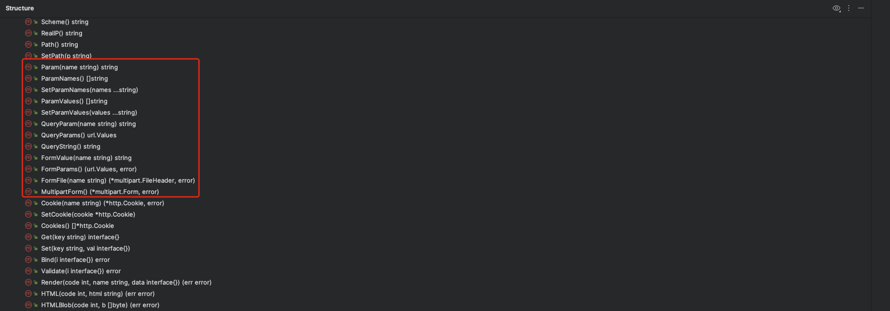
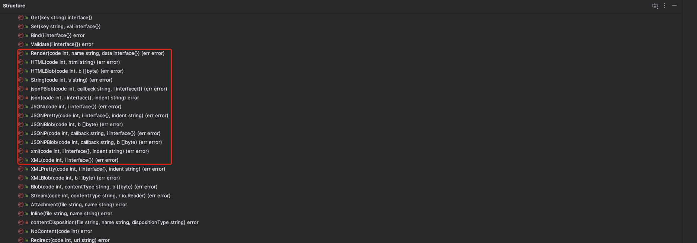
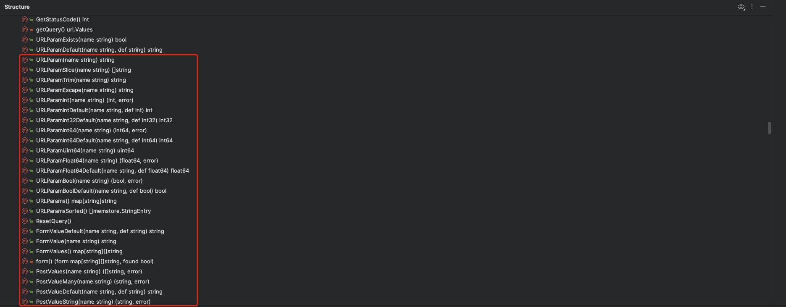
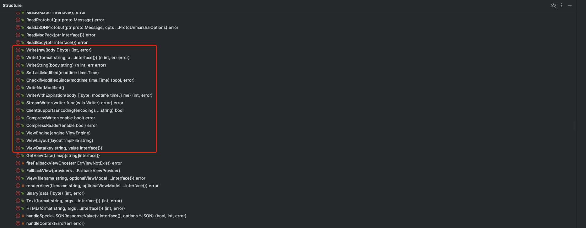

# 5.04 Context-Echo和Iris的Context设计分析

## PART1. Echo Context设计分析

### 1.1 Echo Context的设计

Echo的[`Context`](https://github.com/labstack/echo/blob/584cb85a6b749846ac26a8cd151244ab281f2abc/context.go#L19)被设计为接口,这一点和Beego、Gin都不太一样,但实际上,它只有1个实现[`context`](https://github.com/labstack/echo/blob/584cb85a6b749846ac26a8cd151244ab281f2abc/context.go#L200).

这意味着其他人也可以提供`Context`接口的不同实现,但实际上也并没有什么人去实现它.

从方法定义上来看,Echo的`context`和Beego、Gin的都差不多,也是维护来自各部分的输入和输出.

```go
context struct {
	request  *http.Request
	response *Response
	path     string
	pnames   []string
	pvalues  []string
	query    url.Values
	handler  HandlerFunc
	store    Map
	echo     *Echo
	logger   Logger
	lock     sync.RWMutex
}
```

可以看到,和Gin的`Context`设计一样,Echo的`Context`也是自行封装了一个[Response](https://github.com/labstack/echo/blob/master/response.go#L13),但是使用了原生的`http.Request`.

- `context.logger`:这意味着Echo把日志输出定义在了context级别上.有一种观点认为日志输出应该定义在Server上,而非Context上
- `context.lock`:有一种观点认为Context没有必要实现线程安全.因为正常情况下1个请求打到Server端,就应该只有1个Context去处理这个请求(因为Server端的基本模型是每收到1个请求,就有1个goroutine去处理这个请求,因此应该只有1个Context).如果在中间件使用者定义的HandleFunc内部,中间件使用者自己又启动了一些goroutine,那么应该让中间件使用者自己去在他创建的这些goroutine之间确保这个Context的线程安全,而非由中间件研发者替他对Context的线程安全做出保证

### 1.2 Echo 处理输入



`echo.context`中从不同部位读取指定数据的方法

### 1.3 Echo 处理输出



`echo.context`中处理各种格式输出的方法.包括渲染页面的方法(`context.Render`)

## PART2. Iris Context设计分析

### 2.1 Iris Context的设计

Iris的[`Context`](https://github.com/kataras/iris/blob/55357a125b16a8057496f4040b8b9ab0089d72d9/context/context.go#L91)也是设计为接口,也是有一个默认的实现[`Context`](https://github.com/kataras/iris/blob/v12/context/context.go#L1057)结构体.

这意味着其他人也可以提供`Context`接口的不同实现,但实际上也并没有什么人去实现它.

从抽象层级上来讲,确实这种设计比Beego和Gin的抽象层级更高.但在这个场景下的前提是:真的需要`Context`接口的多个实现.很明显这个场景下是没这个需求的.

注:截止编写笔记的日期(2023.11.15),Iris不再是这种设计,而是直接使用[`Context`](https://github.com/kataras/iris/blob/main/context/context.go#L131)结构体,该结构体实现了多个接口.

### 2.2 Iris 处理输入



`context.Context`中处理各部分输入的方法

### 2.3 Iris 处理输出



`context.Context`中处理各种格式输出的方法