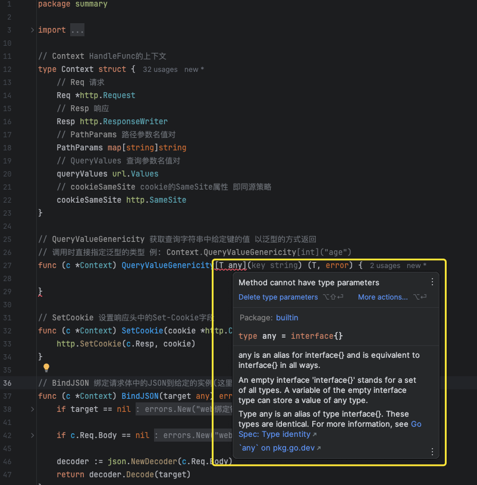
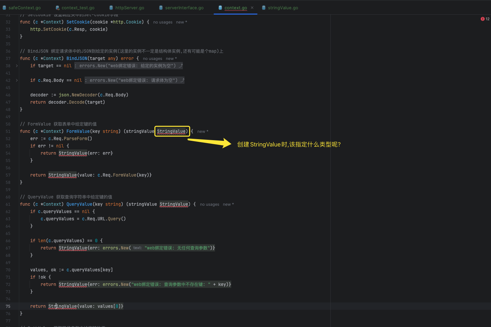

# 5.10 Context-总结与面试要点

本节课工程结构如下:

```
(base) yanglei@yuanhong 10-summary % tree ./
./
├── context.go
├── context_test.go
├── go.mod
├── go.sum
├── handleFunc.go
├── httpServer.go
├── httpServer_test.go
├── matchNode.go
├── node.go
├── router.go
├── router_test.go
├── serverInterface.go
└── stringValue.go

0 directories, 13 files
```

## PART1. Context是线程安全的吗？

显然不是.但是Context不需要被设计成线程安全的理由,和路由树不需要被设计成线程安全的理由不太一样.

路由树不需要被设计成线程安全,是因为按照我们的设计,当完成路由注册这个过程之后,WEB服务器才会被启动.相当于以WEB服务器启动这一事件为标记,在这个时刻之前,路由树被单线程写入;在这个时刻之后,路由树被多个goroutine读取.这意味着对于路由树而言,并没有并发读写的场景,因此根本不需要被设计成线程安全.

Context不需要保证线程安全,是因为按照我们的预期,这个Context只会被使用者在1个HandleFunc中使用,**且不应该被多个goroutine操作**(因为通常而言你并不会遇到很多个goroutine同时向`http.ResponseWriter`中写入的场景).

对于绝大多数人来说,他们不需要一个线程安全的Context.退一万步讲,如果真的需要一个线程安全的Context,那么**提供一个装饰器**,让用户使用前手动创建一个装饰器即可:

`safeContext.go`:

```go
package summary

import (
	"encoding/json"
	"errors"
	"net/http"
	"strconv"
	"sync"
)

// SafeContext 使用装饰器模式 为 Context 添加了一个互斥锁
// 实现了 Context 的线程安全
type SafeContext struct {
	Context Context
	Lock    sync.Mutex
}

// SetCookie 设置响应头中的Set-Cookie字段
func (s *SafeContext) SetCookie(cookie *http.Cookie) {
	s.Lock.Lock()
	defer s.Lock.Unlock()

	http.SetCookie(s.Context.Resp, cookie)
}

// BindJSON 绑定请求体中的JSON到给定的实例(这里的实例不一定是结构体实例,还有可能是个map)上
func (s *SafeContext) BindJSON(target any) error {
	s.Lock.Lock()
	defer s.Lock.Unlock()

	if target == nil {
		return errors.New("web绑定错误: 给定的实例为空")
	}

	if s.Context.Req.Body == nil {
		return errors.New("web绑定错误: 请求体为空")
	}

	decoder := json.NewDecoder(s.Context.Req.Body)
	return decoder.Decode(target)
}

// FormValue 获取表单中给定键的值
func (s *SafeContext) FormValue(key string) (stringValue StringValue) {
	s.Lock.Lock()
	defer s.Lock.Unlock()

	err := s.Context.Req.ParseForm()
	if err != nil {
		return StringValue{err: err}
	}

	return StringValue{value: s.Context.Req.FormValue(key)}
}

// QueryValue 获取查询字符串中给定键的值
func (s *SafeContext) QueryValue(key string) (stringValue StringValue) {
	s.Lock.Lock()
	defer s.Lock.Unlock()

	if s.Context.queryValues == nil {
		s.Context.queryValues = s.Context.Req.URL.Query()
	}

	if len(s.Context.queryValues) == 0 {
		return StringValue{err: errors.New("web绑定错误: 无任何查询参数")}
	}

	values, ok := s.Context.queryValues[key]
	if !ok {
		return StringValue{err: errors.New("web绑定错误: 查询参数中不存在键: " + key)}
	}

	return StringValue{value: values[0]}
}

// PathValue 获取路径参数中给定键的值
func (s *SafeContext) PathValue(key string) (stringValue StringValue) {
	s.Lock.Lock()
	defer s.Lock.Unlock()

	if s.Context.PathParams == nil {
		return StringValue{err: errors.New("web绑定错误: 无任何路径参数")}
	}

	value, ok := s.Context.PathParams[key]
	if !ok {
		return StringValue{err: errors.New("web绑定错误: 路径参数中不存在键: " + key)}
	}

	return StringValue{value: value}
}

// RespJSON 以JSON格式输出相应
func (s *SafeContext) RespJSON(status int, obj any) (err error) {
	s.Lock.Lock()
	defer s.Lock.Unlock()

	data, err := json.Marshal(obj)
	if err != nil {
		return err
	}

	s.Context.Resp.Header().Set("Content-Type", "application/json")
	s.Context.Resp.Header().Set("Content-Length", strconv.Itoa(len(data)))
	// Tips: 在写入响应状态码之前设置响应头 因为一旦调用了WriteHeader方法
	// Tips: 随后对响应头的任何修改都不会生效 因为响应头已经发送给客户端了
	s.Context.Resp.WriteHeader(status)

	n, err := s.Context.Resp.Write(data)
	if n != len(data) {
		return errors.New("web绑定错误: 写入响应体不完整")
	}

	return err
}

// RespJSONOK 以JSON格式输出一个状态码为200的响应
func (s *SafeContext) RespJSONOK(obj any) (err error) {
	s.Lock.Lock()
	defer s.Lock.Unlock()
	
	return s.Context.RespJSON(http.StatusOK, obj)
}
```

使用时手动创建即可:

`context_test.go`:

```go
package summary

import (
	"sync"
	"testing"
)

func TestContext_SafeContext(t *testing.T) {
	s := &HTTPServer{router: newRouter()}

	handleFunc := func(ctx *Context) {
		safeContext := &SafeContext{
			Context: *ctx,
			Lock:    sync.Mutex{},
		}

		type User struct {
			Name string `json:"name"`
		}

		// 获取路径参数
		id := safeContext.PathValue("name")

		user := &User{Name: id.value}

		safeContext.RespJSON(202, user)
	}

	s.GET("/user/:name", handleFunc)
	_ = s.Start(":8091")
}
```

当然,站在框架设计者的角度来看,是不需要提供一个线程安全的Context的.

但是,这种装饰器的思路是很有用的.比如你新接触了一个框架,你预期他会给你一个线程安全的结构体,但是他没有做到线程安全.那么也可以用这种思路去封装他提供给你的、非线程安全的结构体.

## PART2. Context为什么不设计为接口?

目前来看,看不出来设计为接口的必要性.

**Echo框架将Context设计为接口,但是只有一个实现**,就足以说明设计为接口有点过度设计的感觉.

即便Iris将Context设计为接口,且允许用户提供自定义实现,但是**看起来也不是那么有用**(因为没人提供自定义实现).

讲到这里,多提一嘴,之所以我们在设计HTTPServer时,设计了Server接口,是为了方便[设计HTTPSServer](https://github.com/rayallen20/GoInAction/blob/master/note/%E7%AC%AC1%E5%91%A8-Web%E6%A1%86%E6%9E%B6%E4%B9%8B%20Server%E4%B8%8E%E8%B7%AF%E7%94%B1%E6%A0%91%20/PART2.%20Server/6.%20Server%E8%AF%A6%E8%A7%A3%E4%B8%8E%E9%9D%A2%E8%AF%95%E8%A6%81%E7%82%B9.md#432-%E6%94%AF%E6%8C%81https)

## PART3. Context能不能用泛型?

我们已经在好几个地方用过泛型了(其实我在之前并没有用过,临场现补的.没用过的可以参考[我整理的泛型初步笔记](https://github.com/rayallen20/GoInAction/blob/master/note/%E7%AC%AC0%E5%91%A8-%E9%99%84%E5%BD%95/PART1.%20%E6%B3%9B%E5%9E%8B/1.%20%E6%B3%9B%E5%9E%8B.md)).在Context中,似乎也有使用泛型的场景.例如处理表单数据、查询参数、路径参数

一个比较常见的想法是:将`Context.QueryValue()`这种处理各部分输入的方法设计为泛型,这样直接可以返回用户所需的类型,如下:

```go
package summary

import (
	"encoding/json"
	"errors"
	"net/http"
	"net/url"
	"strconv"
)

// Context HandleFunc的上下文
type Context struct {
	// Req 请求
	Req *http.Request
	// Resp 响应
	Resp http.ResponseWriter
	// PathParams 路径参数名值对
	PathParams map[string]string
	// QueryValues 查询参数名值对
	queryValues url.Values
	// cookieSameSite cookie的SameSite属性 即同源策略
	cookieSameSite http.SameSite
}

// QueryValueGenericity 获取查询字符串中给定键的值 以泛型的方式返回
// 调用时直接指定泛型的类型 例: Context.QueryValueGenericity[int]("age")
func (c *Context) QueryValueGenericity[T any](key string) (T, error) {

}
```

理想很丰满现实很骨感,直接编译错误:



**因为结构体方法不允许使用类型参数**.

那么又有点子王想到,将StringValue做成泛型,实现如下:

```go
package summary

import "strconv"

// StringValue 用于承载来自各部分输入的值 并提供统一的类型转换API
type StringValue[T any] struct {
	// value 承载来自各部分输入的值 以字符串表示
	value string
	// err 用于承载处理各部分输入时的错误信息
	err error
}

// AsInt64 将承载的值转换为int64类型表示
func (s StringValue[T]) AsInt64() (t T, err error) {
	if s.err != nil {
		return any(0), s.err
	}

	value, err := strconv.ParseInt(s.value, 10, 64)
	if err != nil {
		return any(0), err
	}
	
	return any(value), nil
}

// AsUint64 将承载的值转换为uint64类型表示
func (s StringValue[T]) AsUint64() (t T, err error) {
	if s.err != nil {
		return any(0), s.err
	}

	value, err := strconv.ParseUint(s.value, 10, 64)
	if err != nil {
		return any(0), err
	}

	return any(value), nil
}

// AsFloat64 将承载的值转换为float64类型表示
func (s StringValue[T]) AsFloat64() (t T, err error) {
	if s.err != nil {
		return any(0), s.err
	}

	value, err := strconv.ParseFloat(s.value, 64)
	if err != nil {
		return any(0), err
	}

	return any(value), nil
}
```

那么我们考虑一下,在Context中创建StringValue时,该如何指定这个T的类型呢?将T指定为什么类型才是正确的呢?



答案是根本不知道.所以将StringValue做成泛型的方案也GG了.

## PART4. 面试要点

### 4.1 能否重复读取HTTP协议的Body内容(即`http.Request.Body`能否被重复读取)?

原生API是不可以的.但是我们可以通过封装来允许重复读取.核心步骤是我们将`http.Request.Body`读取出来之后放到一个地方,后续都从这个地方读取即可.

### 4.2 能否修改HTTP协议的响应?

原生API也是不可以的.但是可以用我们的RespData这种机制,在最后再把数据刷新到网络中,在刷新之前,都可以修改

这里所谓的原生API,指的是`http.ResponseWriter.Write()`方法.很明显这个方法写完了就将响应体刷到前端去了,写完之后改不了.后边引入RespData(现在还没讲了)机制,就可以实现在刷到前端之前都是可以修改的.

### 4.3 Form 和 PostForm 的区别?

[`http.Request.Form`与`http.Request.PostForm`的区别](https://github.com/rayallen20/GoInAction/blob/master/note/%E7%AC%AC2%E5%91%A8-Web%E6%A1%86%E6%9E%B6%E4%B9%8BContext%E4%B8%8EAOP%E6%96%B9%E6%A1%88/PART1.%20Context/7.%20Context-%E5%A4%84%E7%90%86%E8%BE%93%E5%85%A5%E4%B9%8B%E8%A1%A8%E5%8D%95%E8%BE%93%E5%85%A5.md#part1-httprequestform%E4%B8%8Ehttprequestpostform%E7%9A%84%E5%8C%BA%E5%88%AB)

正常的情况下你的API优先使用`http.Request.Form`就不太可能出错

### 4.4 Web框架是怎么支持路径参数的?

Web框架在发现匹配上了某个路径参数之后,将这段路径记录下来作为路径参数的值.这个值默认是string类型,用户自己可以转化为不同的类型

[查找路由时写入路径参数](https://github.com/rayallen20/GoInAction/blob/master/code/week1/server/v4/router.go#L143)

### 4.5 v5版本的实现

最终v5版本的实现如下(GoInAction/code/week2/context/v5):

```
(base) yanglei@bogon v5 % tree ./
./
├── context.go
├── context_test.go
├── go.mod
├── go.sum
├── handleFunc.go
├── httpServer.go
├── httpServer_test.go
├── matchNode.go
├── node.go
├── router.go
├── router_test.go
├── safeContext.go
├── serverInterface.go
└── stringValue.go

0 directories, 14 files
```