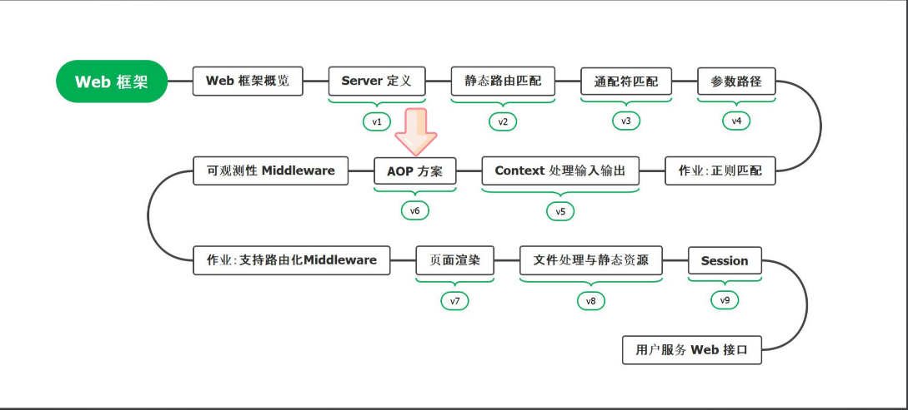

# 11. AOP简介与不同框架设计概览



## PART1. 什么是AOP?

AOP:Aspect Oriented Programming,面向切面编程.核心在于将横向关注点从业务中剥离出来.

横向关注点:**与业务基本无关,但每个业务(或者说每个HandleFunc)又必须要处理的**.常见的有几类:

- **可观测性**:logging、metric和tracing
- **安全相关**:登录、鉴权与权限控制
- **错误处理**:例如错误页面支持
- **可用性保证**:熔断、限流和降级等

基本上WEB框架都会设计自己的AOP方案

## PART2. Beego的AOP方案设计

Beego早期的时候设计了完善的回调机制,大体上有3类:

### 2.1 MiddleWare

Beego中的[`web.MiddleWare`](https://github.com/beego/beego/blob/develop/server/web/server.go#L77),其类型为`func(http.Handler) http.Handler`,入参和返回值均为**GO原生的**[`http.Handler`](https://github.com/golang/go/blob/master/src/net/http/server.go#L86).注意是GO原生的`http.Handler`,不是Beego框架的`web.HTTPServer`

由于它的入参和返回值均为**GO原生的**`http.Handler`接口,而非Beego框架的[`web.HTTPServer`](https://github.com/beego/beego/blob/develop/server/web/server.go#L50).这导致MiddleWare基本脱离了Beego的控制.这意味着在MiddleWare中无法对Beego框架的`web.HTTPServer`进行二次封装或修改其中的字段值.换言之,使用MiddleWare就意味着使用者**基本脱离了Beego的控制**,也就是说这种场景下使用者绕过了Beego,直接和GO原生的`net/http`包交互了.

Beego的[`web.HTTPServer`](https://github.com/beego/beego/blob/develop/server/web/server.go#L50)本身就是一个`http.Handler`接口的实现.而使用MiddleWare就意味着用户需要自己再实现一遍GO原生的`http.Handler`接口,这个过程相当于用户自己定义了一个Beego的`web.HTTPServer`,然后通过MiddleWare将用户自己实现的`web.HTTPServer`与Beego的`web.HTTPServer`结合在一起.

注:因为Beego的[`web.HTTPServer`](https://github.com/beego/beego/blob/develop/server/web/server.go#L50)组合了Beego的[`web.ControllerRegister`](https://github.com/beego/beego/blob/develop/server/web/router.go#L160),而`web.ControllerRegister`又实现了GO原生的[`http.Handler`](https://github.com/golang/go/blob/master/src/net/http/server.go#L86)接口.因此说Beego的[`web.HTTPServer`](https://github.com/beego/beego/blob/develop/server/web/server.go#L50)本身就是一个Handler.

正常来讲,Beggo的HTTPServer都是最后一个,作为next传入到`web.MiddleWare`的入参中.然后`web.MiddleWare`再返回一个自己实现的`http.Handler`.这里听不懂没关系,我也没听懂,后边实现了就知道了.

### 2.2 Filter

[`web.FilterFunc`](https://github.com/beego/beego/blob/develop/server/web/filter.go#L31)允许用户注册**不同阶段运行的Filter**.这些Filter都是单向的,不是环绕式的.

实际上这个类型就是[`web.HandleFunc`](https://github.com/beego/beego/blob/master/server/web/router.go#L638)的别名.

所谓[不同阶段](https://github.com/beego/beego/blob/master/server/web/router.go#L38),指的是:

```go

// default filter execution points
const (
	// 处理静态资源之前执行的filter
	BeforeStatic = iota
	// 执行路由匹配之前执行的filter
	BeforeRouter
	// 执行业务逻辑(HandleFunc)之前执行的filter
	BeforeExec
	// 执行业务逻辑(HandleFunc)之后执行的filter
	AfterExec
	// 路由结束之后执行的filter
	FinishRouter
)
```

所谓单向的,是指你可以注册多个Filter,但是这些Filter只会在某个具体的时间点(或者可以说是具体的阶段)上执行.而这个具体的阶段一旦执行完成,就不会再往回了.你可以认为`BeforeStatic->BeforeRouter->BeforeExec->AfterExec->FinishRouter`是一路走下来的,不会回头的.因此说Filter是单向的

### 2.3 FilterChain

[`web.FilterChain`](https://github.com/beego/beego/blob/master/server/web/filter.go#L26)可以看做是一种可利用Beego内部数据的MiddleWare.**它将`Filter`组织成链**,每一个`Filter`都要考虑调用下一个`Filter`,否则就会终端执行.同时,这些`Filter`也失去了指定阶段运行的能力.

```go
// FilterChain is different from pure FilterFunc
// when you use this, you must invoke next(ctx) inside the FilterFunc which is returned
// And all those FilterChain will be invoked before other FilterFunc
type FilterChain func(next FilterFunc) FilterFunc
```

可以看到,其入参和返回值类型均为[`web.FilterFunc`](https://github.com/beego/beego/blob/develop/server/web/filter.go#L31)

### 2.4 Beego中AOP方案的案例

#### 2.4.1 APISecretAuth

[`apiauth.APISecretAuth()`](https://github.com/beego/beego/blob/master/server/web/filter/apiauth/apiauth.go#L87)函数用于检查能否将一个AppID转化为一个AppSecret,完成鉴权的过程

#### 2.4.2 FilterChain

[`opentracing.FilterChain()`](https://github.com/beego/beego/blob/master/server/web/filter/opentracing/filter.go#L34)用于在链路追踪的实现过程中,初始化span并为span设定一些值

AOP是最为简单,最为方便扩展的.所以作为一个中间件设计者,**并不是提供越多实现越好**,更好的做法是只提供绝大多数用户会用得到,且各个不同实现用起来都没什么区别的实现.

## PART3. GIN的AOP方案设计

### 3.1 HandlersChain

GIN的设计稍微不同.在Beego中,`FilterChain`是通过主动调用`web.FilterFunc()`的方式,实现从一个`web.FilterFunc()`执行到另一个`web.FilterFunc()`的.相当于每一个`web.FilterFunc()`自由决定要不要调用下一个`web.FilterFunc()`.

GIN采用的是**半集中式设计**,由`Context`负责调度.但实际上也是`HandlerFunc`在自己的函数体内主动调用下一个`HandlerFunc`

[`gin.Context.handlers`](https://github.com/gin-gonic/gin/blob/master/context.go#L57)的类型为[`gin.HandlersChain`](https://github.com/gin-gonic/gin/blob/master/gin.go#L51)

注意,`gin.HandlersChain`的实现如下:

```go
type HandlersChain []HandlerFunc
```

可以看到`gin.HandlersChain`是一个slice;而Beego中的`web.FilterChain`是一个单一的函数.这是两者实现之间的区别.

在GIN中,`gin.HandlersChain`被定义在了`Context`抽象层级上,而`Context`中定义了[`gin.Context.Next()`](https://github.com/gin-gonic/gin/blob/master/context.go#L171)(控制执行下一个HandlerFunc)方法和[`gin.Context.Abort()`](https://github.com/gin-gonic/gin/blob/master/context.go#L188)(控制终端后续的HandlerFunc)等方法.这些方法用于控制`Context.handlers`中,HandlerFunc是否执行.

之所以说GIN的AOP方案是半集中式的,是因为虽然是`HandlersChain`中的每个`HandlerFunc`在自己的函数体内主动调用下一个`HandlerFunc`,但是是否执行下一个`HandlerFunc`,需要靠`Context.Next()`和`Context.Abort()`(本质上是`Context.index`)来控制的.

完全的集中式是由一个中央管理器之类的统一调度各种Filter或者Handler是否执行,在中间件设计里面不常用.因为每个路由可能都有其自己要执行或不执行的Handler.

### 3.2 GIN中AOP方案的案例

#### 3.2.1 metric实现

在[`ginmetrics.Monitor.monitorInterceptor()`](https://github.com/penglongli/gin-metrics/blob/b66ef4a3274e50cfc651a5639ee4a66bcbf5d0b8/ginmetrics/middleware.go#L103)方法的实现中可以看到这一行:`ctx.Next()`.这也就是上文所说的**每个`HandlerFunc`在自己的函数体内主动调用下一个`HandlerFunc`**.

#### 3.2.2 tracing实现

在[`ginhttp.Middleware()`](https://github.com/opentracing-contrib/go-gin/blob/1499e56cc90644a5cb0f94ead2904ba284e46f6a/ginhttp/server.go#L67)函数中也能看到`c.Next()`这种调用方式.

## PART4. Echo的AOP方案设计

### 4.1 MiddlewareFunc

Echo的[`echo.MiddlewareFunc`](https://github.com/labstack/echo/blob/master/echo.go#L124)其实现如下:

```go
// MiddlewareFunc defines a function to process middleware.
MiddlewareFunc func(next HandlerFunc) HandlerFunc
```

可以看到和Beego的FilterChain基本相同,也是依赖于`echo.MiddlewareFunc`返回的`echo.HandlerFunc`主动调用下一个`echo.HandlerFunc`.

### 4.2 Echo中AOP方案的案例

#### 4.2.1 CSRF防护

[`middleware.CSRFWithConfig()`](https://github.com/labstack/echo/blob/584cb85a6b749846ac26a8cd151244ab281f2abc/middleware/csrf.go#L97)函数中,也可以看到`next(c)`这种代码,思路上也是**每个`HandlerFunc`在自己的函数体内主动调用下一个`HandlerFunc`**

## PART5. Iris的AOP方案设计

### 5.1 router.WrapperFunc

Iris的AOP设计方案与Beego的方案本质上没有区别,只是换了个名字,以及构造方式上有差别.

Iris中的[`router.WrapperFunc`](https://github.com/kataras/iris/blob/main/core/router/router_wrapper.go#L9)本质上和Beego的Filter是相同的.

[`router.makeWrapperFunc()`](https://github.com/kataras/iris/blob/583bd3eb6b4e9342c6ab897a1f3047fbf89a0207/core/router/router_wrapper.go#L11)函数负责构造WrapperFunc链.构造方式上来讲,核心思路也是**每个`WrapperFunc`在自己的函数体内主动调用下一个`WrapperFunc`**:

```go
func makeWrapperFunc(original WrapperFunc, wrapperFunc WrapperFunc) WrapperFunc {
	if wrapperFunc == nil {
		return original
	}

	if original != nil {
		// wrap into one function, from bottom to top, end to begin.
		nextWrapper := wrapperFunc
		prevWrapper := original
		wrapperFunc = func(w http.ResponseWriter, r *http.Request, next http.HandlerFunc) {
			// 下一个WrapperFunc不为空则手动调用下一个
			if next != nil {
				nexthttpFunc := http.HandlerFunc(func(_w http.ResponseWriter, _r *http.Request) {
					prevWrapper(_w, _r, next)
				})
				nextWrapper(w, r, nexthttpFunc)
			}
		}
	}

	return wrapperFunc
}
```

## PART6. 总结

可以看到,除了GIN之外,Beego、Echo、Iris都是一样的.


有一种观点认为,GIN的那种将责任链放在Context上的设计是不如Beego、Echo、Iris的.猜测GIN的设计是为了在请求粒度上控制责任链中的每个Handler是否执行.但是正常情况下可能并不太需要在请求粒度上控制,通常而言在路由粒度上控制责任链中的每个Handler是否执行即可.

换言之,通常而言,2个请求命中了同一个路由,那么对于这个路由而言,它要执行的Handler就是相同的.而GIN可以做到的是:2个请求命中同一个路由,但这2个请求分别要执行的Handler是不同的.

个人经验上来讲,这个控制粒度精确到路由级别已经是足够用了.

我们后续实现的控制粒度在Server上,而作业需要改写为控制粒度在路由级别.