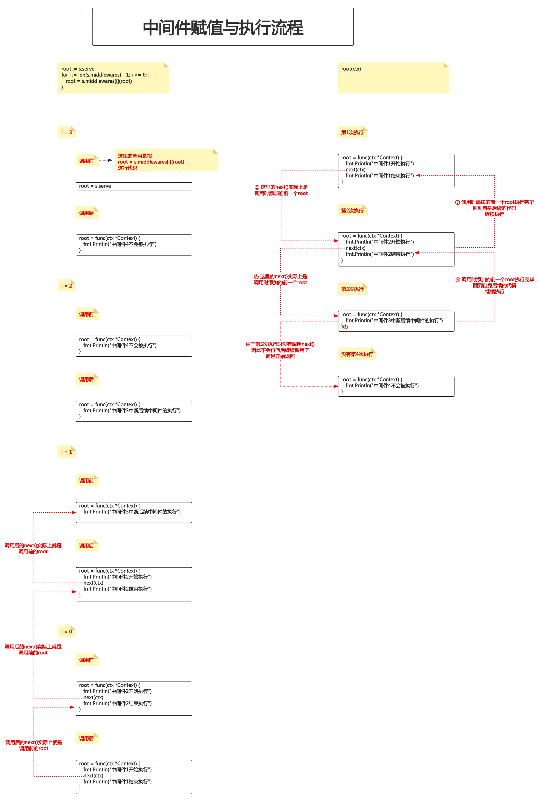
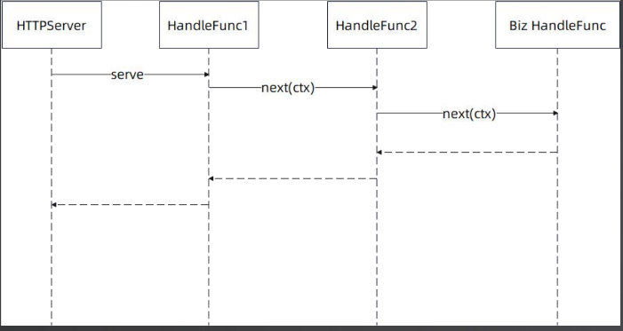
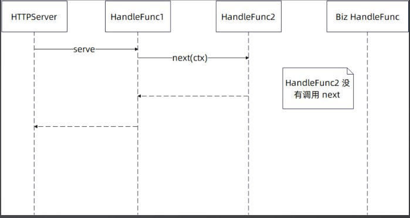

# 12. AOP设计方案-Middleware

本节课工程结构如下:

```
(base) yanglei@bogon 01-middleware % tree ./
./
├── context.go
├── context_test.go
├── go.mod
├── go.sum
├── handleFunc.go
├── httpServer.go
├── httpServer_test.go
├── matchNode.go
├── node.go
├── router.go
├── router_test.go
├── safeContext.go
├── serverInterface.go
└── stringValue.go

0 directories, 14 files
```

## PART1. 定义Middleware

### 1.1 非集中式的设计方案

非集中式的设计方案,就是将调用下一个Middleware的能力交由每一个Middleware,由Middleware本身根据一些逻辑决定是否执行下一个Middleware

#### 1.1.1 函数式的洋葱模式方案

这里我们也将我们的中间件类型命名为Middleware.它的定义也是入参和返回值的类型均为`HandleFunc`:

`middleware.go`:

```go
package middleware

// Middleware 中间件 用来包装 HandleFunc 返回一个新的 HandleFunc
// 这种入参和返回值均为一个函数的设计 是函数式编程 通过这种方式 可以将多个中间件串联起来
// 函数式的洋葱模式 或者叫 函数式的责任链模式
type Middleware func(next HandleFunc) HandleFunc
```

在GO中广泛采用这种方案

#### 1.1.2 非函数式的设计方案

`middleware.go`:

```go
package middleware

// Middleware 中间件接口
type Middleware interface {
	// Invoke 包装 HandleFunc 返回一个新的 HandleFunc
	Invoke(next HandleFunc) HandleFunc
}
```

或者使用拦截器模式:

`middleware.go`:

```go
package middleware

// Interceptor 拦截器接口
type Interceptor interface {
	// Before 前置拦截器(在请求处理之前执行)
	Before(ctx *Context)
	// After 后置拦截器(在请求处理之后执行)
	After(ctx *Context)
	// Surround 环绕拦截器(在请求处理前后执行)
	Surround(ctx *Context)
}
```

在JAVA中广泛采用这种方案

### 1.2 集中式的设计方案

这种方案类似GIN的设计:

`middleware.go`:

```go
package middleware

// HandleChan 中间件链
type HandleChan []HandleFunc
```

或者可以将其设计为一个结构体,但本质上集中式的设计方案会导致中间件链的执行比较死板,无法决定中间件链中的某个(某几个)中间件针对指定的路由是否执行:

`middleware.go`:

```go
package middleware

// HandlerChan 中间件链
type HandlerChan struct {
	// handlers 用于保存中间件链的切片
	handlers []HandleFunc
}

// Run 顺序执行中间件链上的每一个中间件
func (h HandlerChan) Run(ctx *Context) {
	for _, handler := range h.handlers {
		handler(ctx)
	}
}
```

或者也可以做一些比较简单的控制:

`middleware.go`:

```go
package middleware

// HandleFuncNext 用于演示可控制是否执行下一个中间件的中间件函数
type HandleFuncNext func(ctx *Context) (next bool)

// HandlerChan 中间件链
type HandlerChan struct {
	// handlers 用于保存中间件链的切片
	handlers []HandleFuncNext
}

// Run 顺序执行中间件链上的每一个中间件 直到某个中间件指定不再执行下一个中间件
func (h HandlerChan) Run(ctx *Context) {
	for _, handler := range h.handlers {
		next := handler(ctx)
		if !next {
			return
		}
	}
}
```

在JAVA中广泛采用这种方案

这里多提一嘴,AOP方案在不同的框架,不同的语言中有不同的叫法,比如:Middleware/Handler/Chain/Filter/FilterChain.Interceptor/Wrapper

## PART2. 调用Middleware

这里我们在Server级别上调用Middleware,作业是需要实现router级别的Middleware

`httpServer.go`:

```go
// HTTPServer HTTP服务器
type HTTPServer struct {
	router

	// 中间件切片 表示HTTPServer需要按顺序执行的的中间件链
	middlewares []Middleware
}

// ServeHTTP WEB框架入口
func (s *HTTPServer) ServeHTTP(w http.ResponseWriter, r *http.Request) {
	// 构建上下文
	ctx := &Context{
		Req:  r,
		Resp: w,
	}

	// 执行中间件链
	root := s.serve
	for i := len(s.middlewares) - 1; i >= 0; i-- {
		root = s.middlewares[i](root)
	}

	// 查找路由树并执行命中的业务逻辑
	root(ctx)
}
```

注:这里我第一次写时,是有疑问的:为什么`root`(也就是`s.serve`)可以作为`Middleware()`的入参?这个疑问见附录

## PART3. 测试

这里先不解释为什么从后往前遍历,先写一个测试用例,结合测试用例来讲解这个实现:

`middleware_test.go`:

```go
package middleware

import (
	"fmt"
	"net/http"
	"testing"
)

// Test_Middleware 测试中间件的工作顺序
func Test_Middleware(t *testing.T) {
	s := NewHTTPServer()

	s.middlewares = []Middleware{
		Middleware1,
		Middleware2,
		Middleware3,
		Middleware4,
	}

	s.ServeHTTP(nil, &http.Request{})
}

func Middleware1(next HandleFunc) HandleFunc {
	return func(ctx *Context) {
		fmt.Println("中间件1开始执行")
		next(ctx)
		fmt.Println("中间件1结束执行")
	}
}

func Middleware2(next HandleFunc) HandleFunc {
	return func(ctx *Context) {
		fmt.Println("中间件2开始执行")
		next(ctx)
		fmt.Println("中间件2结束执行")
	}
}

func Middleware3(next HandleFunc) HandleFunc {
	return func(ctx *Context) {
		fmt.Println("中间件3中断后续中间件的执行")
	}
}

func Middleware4(next HandleFunc) HandleFunc {
	return func(ctx *Context) {
		fmt.Println("中间件4不会被执行")
	}
}
```

执行结果如下:

```
GOROOT=/usr/local/go #gosetup
GOPATH=/Users/yanglei/Desktop/myGoPath #gosetup
/usr/local/go/bin/go test -c -o /Users/yanglei/Library/Caches/JetBrains/GoLand2023.2/tmp/GoLand/___Test_Middleware_in_middleware.test middleware #gosetup
/usr/local/go/bin/go tool test2json -t /Users/yanglei/Library/Caches/JetBrains/GoLand2023.2/tmp/GoLand/___Test_Middleware_in_middleware.test -test.v -test.paniconexit0 -test.run ^\QTest_Middleware\E$
=== RUN   Test_Middleware
中间件1开始执行
中间件2开始执行
中间件3中断后续中间件的执行
中间件2结束执行
中间件1结束执行
--- PASS: Test_Middleware (0.00s)
PASS

Process finished with the exit code 0
```

赋值与执行流程如下图示:



从执行的流程中可以看出,实际上中间件的执行过程和递归非常类似.只是递归的场景下,压栈/出栈的是同一个函数;而中间件的执行过程中,每一次压栈/出栈的函数是不同的.

但本质上,都是靠栈顶的函数返回,来触发下一个函数的出栈(下一个函数需要等待栈顶函数返回才能执行后续代码进而完成出栈),反复此过程直到所有的函数都出栈.

正常执行时序图如下:



某个中间件中没有调用`next()`,那么执行流程就被打断了,时序图如下:



**所以实际上,从后往前遍历的过程,类似于压栈,先入后出**.

## PART4. 面试要点

### 4.1 什么是AOP?

AOP就是**面向切面编程**,用于解决横向关注点问题,如可观测性问题、安全问题等

在AOP中经常使用到洋葱模式和责任链模式

### 4.2 什么是洋葱模式?

形状如同洋葱,拥有一个核心,这个核心一般就是业务逻辑.而后在这个核心的外边层层包裹,每一层其实就是一个Middleware.一般用洋葱模式来**无侵入式**地增强核心功能,或者解决AOP问题

**无侵入式的设计方案很能体现一个人对问题的理解能力和对问题的抽象能力以及编程功底,甚至你可以认为:但凡是侵入的解决方案总是不好的,无侵入式的方案总是好的**.只有在逼不得已的情况下才采用侵入式设计方案,这里说的逼不得已通常是指为了提升性能.

因为无侵入式的设计方案,需要一层层的函数调用,相比于直接把这些中间件的代码写入到业务处理函数中,性能是要慢的,因为要发起方法调用

### 4.3 什么是责任链模式?

不同的HandleFunc组成一条链,链条上的每一环(每一个元素)都有自己的功能.一方面可以用责任链模式将复杂逻辑分成链条上的不同步骤,另一方面也可以灵活地在链条上添加新的HandleFunc

通常我们提到责任链时,指的是单向的责任链,最终调用到业务处理函数.但实际上本节课程中我们实现的"还能往回走"的(也就是执行测试用例时看到的`中间件2结束执行`和`中间件1结束执行`)方案,也是责任链模式

这里多提一嘴,责任链还有网状结构,大致实现如下:

```go
package middleware

import "sync"

// Net 责任链的网状结构
type Net struct {
	// handlers 用于保存责任链的切片 注意切片中的每一个元素都是一条责任链
	handlers []ConcurrentHandleFunc
}

// Run 执行责任网上的每一个责任链
func (n Net) Run(ctx *Context) {
	wg := sync.WaitGroup{}
	for _, handler := range n.handlers {
		h := handler
		if h.concurrent {
			wg.Add(1)
			go func() {
				h.Run(ctx)
				wg.Done()
			}()
		} else {
			h.Run(ctx)
		}
	}
	wg.Wait()
}

// ConcurrentHandleFunc 允许并发执行责任链上的每一个中间件
type ConcurrentHandleFunc struct {
	// concurrent 标识是否允许并发执行的标量
	concurrent bool
	// handlers 用于保存中间件链的切片
	handlers []*ConcurrentHandleFunc
}

// Run 执行责任链上的每一个中间件 通过并发标识决定是否允许并发执行
func (c ConcurrentHandleFunc) Run(ctx *Context) {
	for _, handler := range c.handlers {
		h := handler
		if h.concurrent {
			go h.Run(ctx)
		} else {
			h.Run(ctx)
		}
	}
}
```

### 4.4 如何实现?

最简单的方案就是我们课程上讲的这种函数式方案,还有一种是集中调度的模式

最终v6版本的实现如下(GoInAction/code/week2/aop/v6):

```
(base) yanglei@yuanhong v6 % tree ./
./
├── context.go
├── context_test.go
├── go.mod
├── go.sum
├── handleFunc.go
├── httpServer.go
├── httpServer_test.go
├── matchNode.go
├── middleware.go
├── middleware_test.go
├── node.go
├── router.go
├── router_test.go
├── safeContext.go
├── serverInterface.go
└── stringValue.go

0 directories, 16 files
```

## 附录

### 1. 方法值

在Go语言中,方法值是一种特殊的语法,它允许你**引用一个特定对象的方法作为一个值**.当你这么做时,你得到的是一个**绑定了特定接收者的函数**(注意你得到的是一个**函数**).换言之,方法值是一个已经将方法的接收者(通常是一个结构体的实例)固定下来的**函数**.

例如,假设你有一个结构体`HTTPServer`和一个方法`serve`:

```go
type HTTPServer struct {
    // ...
}

func (s *HTTPServer) serve(ctx *Context) {
    // ...
}
```

当你创建一个方法值时,你实际上是将`s.serve`作为一个**函数**来引用,而这个函数会自动接收`s`作为它的接收者.

来看如下代码:

```go
var s *HTTPServer
serveFunc := s.serve
```

在上面的代码中,变量`serveFunc`现在就是一个函数,可以像使用其他函数一样使用它,不需要再指定接收者`s`:

```go
var ctx *Context
// ...
// 这实际上调用的是 s.serve(ctx)
serveFunc(ctx)
```

在这个调用中,`s`是隐含的,你不需要显式传递它作为参数.

方法值的这种特性使得你可以非常方便地**将方法传递给期望函数的地方,而不需要额外创建一个匿名函数或闭包来绑定方法的接收者**.这在处理事件处理器、回调或者中间件等概念时特别有用.

### 2. 为什么`root`可以作为`Middleware()`的入参?

在Go语言中,你可以在一个方法和一个具有相同签名的函数类型之间进行转换,但这需要满足一定的条件.而在代码`s.middlewares[i](root)`中,是没有类型转换问题的.因为变量`root`在这行代码中,是作为一个`HandleFunc`类型被传递的.而且变量`root`被赋值为`s.serve`,这是一个**方法值**.

在Go中,当你引用一个特定的方法时,你实际上是创建了一个绑定了接收者的**函数值**.

假设你有一个方法:

```go
func (s *HTTPServer) serve(ctx *Context) {
    // serve 方法的实现
}
```

然后这样引用它:

```go
root := s.serve
```

**这里实际上创建了一个类型为`func(ctx *Context)`的函数**.这个函数是`HTTPServer.serve`方法的一个绑定实例,绑定到了`s`这个具体的`HTTPServer`实例上.这就是为什么你可以将`s.serve`赋值给一个变量或者将其作为参数传递的原因:因为你传递的并不是方法本身,而是传递了一个**方法值(再次强调,方法值就是绑定了特定接收者的函数,本质上还是函数)**,而这个方法值绑定了一个特定的接收者.

所以在这行代码`s.middlewares[i](root)`中,`root`(`s.serve`)被隐式转换为一个函数,这个函数匹配`HandleFunc`类型.

TODO:这里如果要确定是否有隐式转换,需要将GO编译成汇编,再从汇编反编译成GO,才能确认.但是这个我不会弄,如果有大佬麻烦搞完之后提个pr的,感激不尽.