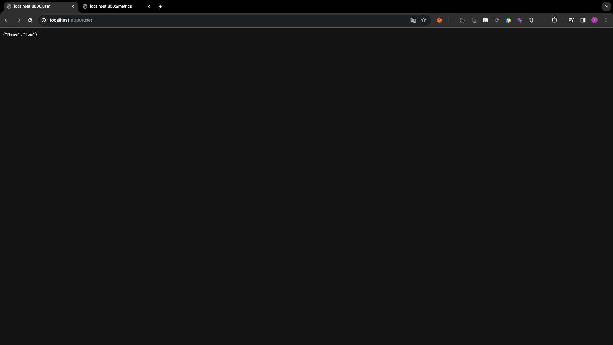
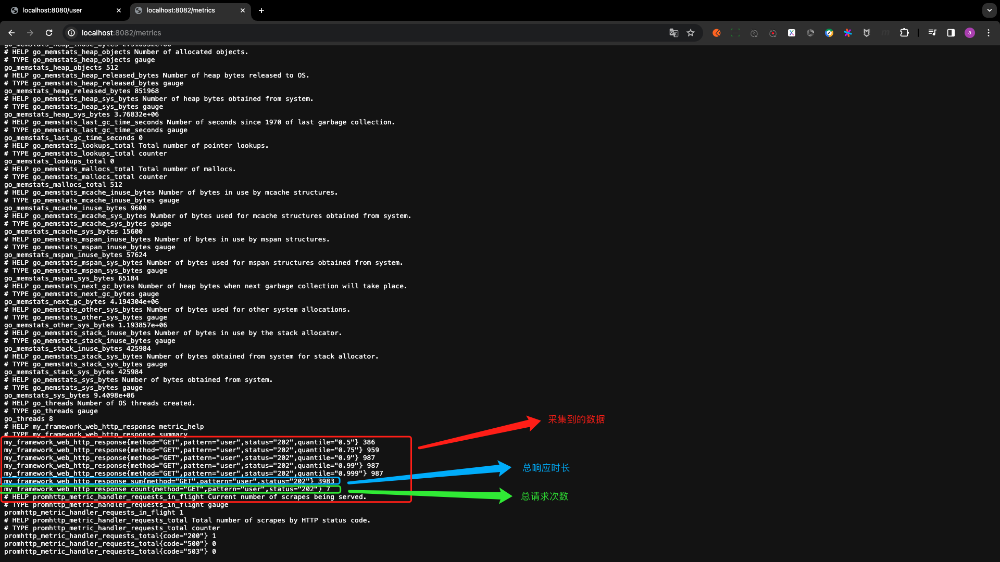

# 06. Middleware-Prometheus

本节课工程结构如下:

```
(base) yanglei@yuanhong 04-prometheus % tree ./
./
├── context.go
├── context_test.go
├── go.mod
├── go.sum
├── handleFunc.go
├── httpServer.go
├── httpServer_test.go
├── matchNode.go
├── middleware.go
├── middleware_test.go
├── middlewares
│   ├── access_log
│   │   ├── accessLog.go
│   │   ├── accessLog_test.go
│   │   └── middlewareBuilder.go
│   └── open_telemetry
│       ├── docker-compose.yaml
│       ├── middlewareBuilder.go
│       └── middleware_test.go
├── node.go
├── option.go
├── router.go
├── router_test.go
├── safeContext.go
├── serverInterface.go
└── stringValue.go

3 directories, 23 files
```

## PART1. middlewareBuilder

按照惯例,和之前写`access_log`和`open_telemetry`一样,写prometheus的中间件也是从`middlewareBuilder`开始的

`middlewares/prometheus/middlewareBuilder.go`:

```go
package prometheus

import "web"

// MiddlewareBuilder prometheus中间件构建器
type MiddlewareBuilder struct {
}

// Build 构建中间件
func (m *MiddlewareBuilder) Build() web.Middleware {
	return func(next web.HandleFunc) web.HandleFunc {
		return func(ctx *web.Context) {
			next(ctx)
		}
	}
}
```

### 1.1 创建vector

`middlewares/prometheus/middlewareBuilder.go`:

```go
package prometheus

import (
	"github.com/prometheus/client_golang/prometheus"
	"web"
)

// MiddlewareBuilder prometheus中间件构建器
type MiddlewareBuilder struct {
	Namespace string // Namespace APP名称
	Subsystem string // Subsystem 子系统/模块名称
	Name      string // Name 指标名称
	Help      string // Help 指标的描述信息
}

// Build 构建中间件
func (m *MiddlewareBuilder) Build() web.Middleware {
	labels := []string{
		"pattern", // pattern 命中的路由
		"method",  // method 请求方法
		"status",  // status 响应状态码
	}

	vector := prometheus.NewSummaryVec(prometheus.SummaryOpts{
		Namespace: m.Namespace,
		Subsystem: m.Subsystem,
		Name:      m.Name,
		Help:      m.Help,
	}, labels)
	
	// 注册指标
	prometheus.MustRegister(vector)
	
	return func(next web.HandleFunc) web.HandleFunc {
		return func(ctx *web.Context) {
			next(ctx)
		}
	}
}
```

这里不要忘记注册指标

### 1.2 记录指标

很明显,我们要上报指标,首先得有指标才能上报.想要有指标,那么一定是在HandleFunc执行完毕之后,才能拿到指标的数据(例如响应时长).

`middlewares/prometheus/middlewareBuilder.go`:

```go
package prometheus

import (
	"github.com/prometheus/client_golang/prometheus"
	"strconv"
	"time"
	"web"
)

// MiddlewareBuilder prometheus中间件构建器
type MiddlewareBuilder struct {
	Namespace string // Namespace APP名称
	Subsystem string // Subsystem 子系统/模块名称
	Name      string // Name 指标名称
	Help      string // Help 指标的描述信息
}

// Build 构建中间件
func (m *MiddlewareBuilder) Build() web.Middleware {
	labels := []string{
		"pattern", // pattern 命中的路由
		"method",  // method 请求方法
		"status",  // status 响应状态码
	}

	vector := prometheus.NewSummaryVec(prometheus.SummaryOpts{
		Namespace: m.Namespace,
		Subsystem: m.Subsystem,
		Name:      m.Name,
		Help:      m.Help,
	}, labels)
	
	// 注册指标
	prometheus.MustRegister(vector)

	return func(next web.HandleFunc) web.HandleFunc {
		return func(ctx *web.Context) {
			startTime := time.Now()

			// 为防止后续的中间件和HandleFunc中发生panic导致指标不记录
			// 故在此处将指标记录的代码放在defer中
			defer func() {
				// 响应时长
				duration := time.Since(startTime).Milliseconds()
				
				vector.WithLabelValues(
					// 命中的路由
					ctx.MatchRoute,
					// 请求方法
					ctx.Req.Method,
					// 响应状态码
					strconv.Itoa(ctx.RespStatusCode),
				).Observe(float64(duration))
			}()

			next(ctx)
		}
	}
}
```

这里由于需要等到HandleFunc执行完毕,响应从中间件链上回来的时候,才能拿到各种指标(响应时长、命中的路由、请求方法、响应状态码),因此为了防止在中间件链上发生panic导致无法记录指标,因此我们将记录指标的代码放在`defer`中执行

注意:这里`defer`中的代码也可以放在一个goroutine中以异步的方式执行,这样就可以不阻塞主线程了.可能有人会问:那如果中间件责任链上发生了panic或者突然宕机了,那么异步采集的指标不就丢失了吗?

其实这是一个伪命题.**因为你正常的业务都panic了或者突然宕机,你不可能把关注点放在一个指标是否采集成功这件事上,正常人想的都是突然宕机或者发生了意料之外的panic,我的业务是否还安好**.

TODO:试一下异步的goroutine方案

### 1.3 设置百分比和误差

`middlewares/prometheus/middlewareBuilder.go`:

```go
package prometheus

import (
	"github.com/prometheus/client_golang/prometheus"
	"strconv"
	"time"
	"web"
)

// MiddlewareBuilder prometheus中间件构建器
type MiddlewareBuilder struct {
	Namespace string // Namespace APP名称
	Subsystem string // Subsystem 子系统/模块名称
	Name      string // Name 指标名称
	Help      string // Help 指标的描述信息
}

// Build 构建中间件
func (m *MiddlewareBuilder) Build() web.Middleware {
	labels := []string{
		"pattern", // pattern 命中的路由
		"method",  // method 请求方法
		"status",  // status 响应状态码
	}

	vector := prometheus.NewSummaryVec(prometheus.SummaryOpts{
		Namespace: m.Namespace,
		Subsystem: m.Subsystem,
		Name:      m.Name,
		Help:      m.Help,
		// 采样率 即百分比和误差
		Objectives: map[float64]float64{
			0.5:  0.01,
			0.75: 0.01,
			0.90: 0.005,
			// 99线
			0.99: 0.001,
			// 999线
			0.999: 0.0001,
		},
	}, labels)
	
	// 注册指标
	prometheus.MustRegister(vector)

	return func(next web.HandleFunc) web.HandleFunc {
		return func(ctx *web.Context) {
			startTime := time.Now()

			// 为防止后续的中间件和HandleFunc中发生panic导致指标不记录
			// 故在此处将指标记录的代码放在defer中
			defer func() {
				// 响应时长
				duration := time.Since(startTime).Milliseconds()

				vector.WithLabelValues(
					// 命中的路由
					ctx.MatchRoute,
					// 请求方法
					ctx.Req.Method,
					// 响应状态码
					strconv.Itoa(ctx.RespStatusCode),
				).Observe(float64(duration))
			}()

			next(ctx)
		}
	}
}
```

关于误差的描述可以[参见此处](https://github.com/rayallen20/GoInAction/blob/master/note/%E7%AC%AC2%E5%91%A8-Web%E6%A1%86%E6%9E%B6%E4%B9%8BContext%E4%B8%8EAOP%E6%96%B9%E6%A1%88/PART3.%20Middleware/17.%20Prometheus%E8%AF%A6%E8%A7%A3.md#24-summary)

## PART2. 编写测试用例

### 2.1 创建Server和Middleware

`middlewares/prometheus/middleware_test.go`:

```go
package prometheus

import (
	"math/rand"
	"net/http"
	"testing"
	"time"
	"web"
)

// Test_MiddlewareBuilder 测试MiddlewareBuilder
func Test_MiddlewareBuilder(t *testing.T) {
	// 创建中间件构建器
	builder := &MiddlewareBuilder{
		// Tips: 此处的Namespace、Subsystem、Name、Help的值均不可以出现-
		Namespace: "my_framework",
		Subsystem: "web",
		Name:      "http_response",
		Help:      "metric_help",
	}

	// 创建中间件Option
	options := web.ServerWithMiddleware(builder.Build())

	// 创建服务器
	server := web.NewHTTPServer(options)

	// 创建HandleFunc
	handleFunc := func(ctx *web.Context) {
		// 随机sleep 1-1001ms 模拟请求时长
		randomValue := rand.Intn(1000) + 1
		time.Sleep(time.Duration(randomValue) * time.Millisecond)

		ctx.RespJSON(http.StatusAccepted, &User{Name: "Tom"})
	}

	// 注册路由并启动服务器
	server.GET("/user", handleFunc)
	server.Start(":8080")
}

type User struct {
	Name string
}
```

这部分代码都比较常规,之前都写过很多遍了,不解释.

### 2.2 暴露指标

`middlewares/prometheus/middleware_test.go`:

```go
package prometheus

import (
	"github.com/prometheus/client_golang/prometheus/promhttp"
	"math/rand"
	"net/http"
	"testing"
	"time"
	"web"
)

// Test_MiddlewareBuilder 测试MiddlewareBuilder
func Test_MiddlewareBuilder(t *testing.T) {
	// 创建中间件构建器
	builder := &MiddlewareBuilder{
		// Tips: 此处的Namespace、Subsystem、Name、Help的值均不可以出现-
		Namespace: "my_framework",
		Subsystem: "web",
		Name:      "http_response",
		Help:      "metric_help",
	}

	// 创建中间件Option
	options := web.ServerWithMiddleware(builder.Build())

	// 创建服务器
	server := web.NewHTTPServer(options)

	// 创建HandleFunc
	handleFunc := func(ctx *web.Context) {
		// 随机sleep 1-1001ms 模拟请求时长
		randomValue := rand.Intn(1000) + 1
		time.Sleep(time.Duration(randomValue) * time.Millisecond)

		ctx.RespJSON(http.StatusAccepted, &User{Name: "Tom"})
	}

	// 监听另外一个端口 该端口用于暴露指标让prometheus采集
	go func() {
		http.Handle("/metrics", promhttp.Handler())
		// 通常用于采集指标的端口不会和业务端口混合在一起
		// 因为业务端口通常是需要暴露到外网的 但是指标采集端口通常是不需要的
		http.ListenAndServe(":8082", nil)
	}()

	// 注册路由并启动服务器
	server.GET("/user", handleFunc)
	server.Start(":8080")
}

type User struct {
	Name string
}
```

注意:通常暴露指标的端口和业务端口不会混用的.因为业务端口要暴露到外网,而暴露指标的端口大概率是不需要暴露到外网的

### 2.3 查看结果



