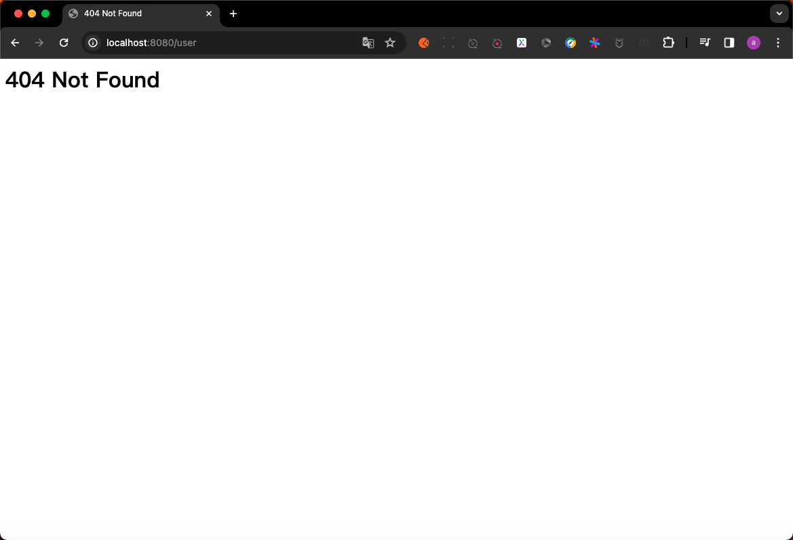

# 07. Middleware-错误页面

本节课工程结构如下:

```
(base) yanglei@yuanhong 05-errPage % tree ./
./
├── context.go
├── context_test.go
├── go.mod
├── go.sum
├── handleFunc.go
├── httpServer.go
├── httpServer_test.go
├── matchNode.go
├── middleware.go
├── middleware_test.go
├── middlewares
│   ├── access_log
│   │   ├── accessLog.go
│   │   ├── accessLog_test.go
│   │   └── middlewareBuilder.go
│   ├── open_telemetry
│   │   ├── docker-compose.yaml
│   │   ├── middlewareBuilder.go
│   │   └── middleware_test.go
│   └── prometheus
│       ├── middlewareBuilder.go
│       └── middleware_test.go
├── node.go
├── option.go
├── router.go
├── router_test.go
├── safeContext.go
├── serverInterface.go
└── stringValue.go

4 directories, 25 files
```

## PART1. 需求概述

我们通常有一个需求:如果一个响应返回了404,那么应该显示一个错误页面,停留在这个错误页面几秒钟后,重定向到一个默认页面,比如说重定向到首页

但有一个棘手的问题在于:**不是所有的404都是要重定向的**.比如说你是异步加载数据的RESTful请求,在打开页面之后异步加载用户详情,即便 404了也不应该重定向.因为请求API,404了就是404了,不需要你重定向到某个页面上.你的客户端也不会用你的404页面

目前我们没有设计可路由的中间件,因此没有办法给使用者提供一个入口,该入口用于控制某个路由是否需要重定向到某个页面.

此处我们先实现一个比较粗暴的设计:**当检测到响应码为某个特定值时,篡改响应为某个错误页面**

## PART2. 实现

### 2.1 基本构型

这个都写了N遍了,没什么要解释的

`middleware/err_page/middlewareBuilder.go`:

```go
package err_page

import "web"

// MiddlewareBuilder 错误页面中间件构造器
type MiddlewareBuilder struct {
}

// Build 构造错误页面中间件
func (m *MiddlewareBuilder) Build() web.Middleware {
	return func(next web.HandleFunc) web.HandleFunc {
		return func(ctx *web.Context) {
			next(ctx)
		}
	}
}
```

### 2.2 检测响应码并渲染对应的错误页面

那首先肯定是需要一个map用于记录响应码与其对应错误页面的映射关系:

`middleware/err_page/middlewareBuilder.go`:

```go
package err_page

import "web"

// MiddlewareBuilder 错误页面中间件构造器
type MiddlewareBuilder struct {
	respPages map[int][]byte // respPages 用于存储响应码与其对应的错误页面 其中key为响应码 value为错误页面的内容
}

// Build 构造错误页面中间件
func (m *MiddlewareBuilder) Build() web.Middleware {
	return func(next web.HandleFunc) web.HandleFunc {
		return func(ctx *web.Context) {
			next(ctx)
		}
	}
}
```

接下来的操作就比较简单了,判断响应码是否为需要渲染错误页面的响应码,如果是,则渲染对应的错误页面即可:

`middleware/err_page/middlewareBuilder.go`:

```go
package err_page

import "web"

// MiddlewareBuilder 错误页面中间件构造器
type MiddlewareBuilder struct {
	respPages map[int][]byte // respPages 用于存储响应码与其对应的错误页面 其中key为响应码 value为错误页面的内容
}

// Build 构造错误页面中间件
func (m *MiddlewareBuilder) Build() web.Middleware {
	return func(next web.HandleFunc) web.HandleFunc {
		return func(ctx *web.Context) {
			next(ctx)

			// 判断响应码是否为需要篡改响应的响应码 如果是则篡改响应
			respPage, ok := m.respPages[ctx.RespStatusCode]
			if ok {
				ctx.RespData = respPage
			}
		}
	}
}
```

其实到这里主流程就实现完毕了已经.但还有一些边缘问题,例如:

- 缺少一个用于让框架的使用者注册自己的响应码和错误页面的入口
- 缺少初始化`MiddlewareBuilder`的过程
	- 这里因为`MiddlewareBuilder. respPages`是一个需要初始化的数据类型,因此

### 2.3 注册响应码与错误页面

这2个缺陷实现起来也很简单

`middleware/err_page/middlewareBuilder.go`:

```go
package err_page

import "web"

// MiddlewareBuilder 错误页面中间件构造器
type MiddlewareBuilder struct {
	respPages map[int][]byte // respPages 用于存储响应码与其对应的错误页面 其中key为响应码 value为错误页面的内容
}

// Build 构造错误页面中间件
func (m *MiddlewareBuilder) Build() web.Middleware {
	return func(next web.HandleFunc) web.HandleFunc {
		return func(ctx *web.Context) {
			next(ctx)

			// 判断响应码是否为需要篡改响应的响应码 如果是则篡改响应
			respPage, ok := m.respPages[ctx.RespStatusCode]
			if ok {
				ctx.RespData = respPage
			}
		}
	}
}

// AddCode 添加响应码与其对应的错误页面
func (m *MiddlewareBuilder) AddCode(status int, page []byte) *MiddlewareBuilder {
	if m.respPages == nil {
		m.respPages = make(map[int][]byte)
	}
	m.respPages[status] = page
	
	// Tips: 此处返回 *MiddlewareBuilder 是为了支持链式调用
	return m
}

// NewMiddlewareBuilder 初始化错误页面中间件构造器
func NewMiddlewareBuilder() *MiddlewareBuilder {
	return &MiddlewareBuilder{
		respPages: make(map[int][]byte),
	}
}
```

## PART3. 测试

`middleware/err_page/middleware_test.go`:

```go
package err_page

import (
	"testing"
	"web"
)

// Test_MiddlewareBuilder 测试错误页面中间件构造器
func Test_MiddlewareBuilder(t *testing.T) {
	// 创建中间件构建器
	builder := NewMiddlewareBuilder()
	builder.
		AddCode(404, []byte(`
<html>
	<head>
		<title>404 Not Found</title>
	</head>

	<body>
		<h1>404 Not Found</h1>
	</body>
</html>
`)).
		AddCode(500, []byte(`
<html>
	<head>
		<title>500 Internal Server Error</title>
	</head>

	<body>
		<h1>500 Internal Server Error</h1>
	</body>
</html>
`))

	// 创建中间件Option
	options := web.ServerWithMiddleware(builder.Build())

	// 创建服务器
	server := web.NewHTTPServer(options)

	// 启动服务器
	server.Start(":8080")
}
```

这个测试用例中,我们都不需要注册路由,只需要随便访问一个路由,看是否能渲染我们定义的错误页面即可:



TODO:做完作业考虑如何实现针对指定路由或指定方法的错误页面中间件