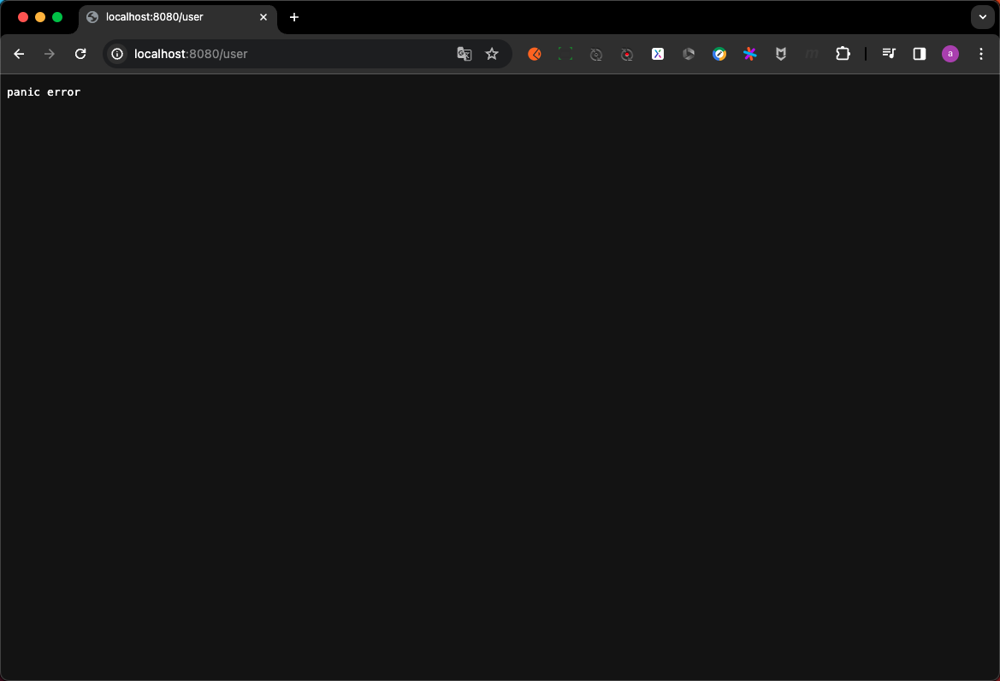

# 20. Middleware-从panic中恢复

本节课工程结构如下:

```
(base) yanglei@yuanhong 06-recoverPanic % tree ./
./
├── context.go
├── context_test.go
├── go.mod
├── go.sum
├── handleFunc.go
├── httpServer.go
├── httpServer_test.go
├── matchNode.go
├── middleware.go
├── middleware_test.go
├── middlewares
│   ├── access_log
│   │   ├── accessLog.go
│   │   ├── accessLog_test.go
│   │   └── middlewareBuilder.go
│   ├── err_page
│   │   ├── middlewareBuilder.go
│   │   └── middleware_test.go
│   ├── open_telemetry
│   │   ├── docker-compose.yaml
│   │   ├── middlewareBuilder.go
│   │   └── middleware_test.go
│   └── prometheus
│       ├── middlewareBuilder.go
│       └── middleware_test.go
├── node.go
├── option.go
├── router.go
├── router_test.go
├── safeContext.go
├── serverInterface.go
└── stringValue.go

5 directories, 27 files
```

## PART1. 需求概述

框架使用者在他们自己的代码中如果不小心触发了一些panic,那么前端会收到一个错误,且同时整个进程也就结束了.正常情况下,即使某个请求触发了panic,也不应该让整个进程都挂了,因为还有其他不会触发panic的路由是可用的.因此我们需要写一个捕获panic的中间件并返回一个固定的错误,确保即使框架使用者触发了panic,整个进程不会宕掉,

## PART2. 实现

### 2.1 基本构型

`middleware/recover_panic/middlewareBuilder.go`:

```go
package recover_panic

import "web"

// MiddlewareBuilder 捕获panic中间件的构建器
type MiddlewareBuilder struct {
	
}

// Build 构建捕获panic中间件
func (m *MiddlewareBuilder) Build() web.Middleware {
	return func(next web.HandleFunc) web.HandleFunc {
		return func(ctx *web.Context) {
			next(ctx)
		}
	}
}
```

### 2.2 捕获panic并篡改响应

`middleware/recover_panic/middlewareBuilder.go`:

```go
package recover_panic

import "web"

// MiddlewareBuilder 捕获panic中间件的构建器
type MiddlewareBuilder struct {
	StatusCode int    // StatusCode 捕获panic时的响应状态码
	Data       []byte // Data 捕获panic时的响应数据
}

// Build 构建捕获panic中间件
func (m *MiddlewareBuilder) Build() web.Middleware {
	return func(next web.HandleFunc) web.HandleFunc {
		return func(ctx *web.Context) {
			// 捕获panic并篡改响应
			defer func() {
				// Tips: 这里的err的类型是ary，而不是error
				if err := recover(); err != nil {
					ctx.RespStatusCode = m.StatusCode
					ctx.RespData = m.Data
				}
			}()
			
			next(ctx)
		}
	}
}
```

### 2.3 捕获panic时记录日志

`middleware/recover_panic/middlewareBuilder.go`:

```go
package recover_panic

import "web"

// MiddlewareBuilder 捕获panic中间件的构建器
type MiddlewareBuilder struct {
	StatusCode int                    // StatusCode 捕获panic时的响应状态码
	Data       []byte                 // Data 捕获panic时的响应数据
	LogFunc    func(ctx *web.Context) // LogFunc 捕获panic时的日志记录函数 (记录整个ctx)
	// LogFunc    func(err any)          // LogFunc 捕获panic时的日志记录函数 (记录panic的内容)
	// LogFunc    func(stack string)     // LogFunc 捕获panic时的日志记录函数 (记录调用栈)
}

// Build 构建捕获panic中间件
func (m *MiddlewareBuilder) Build() web.Middleware {
	return func(next web.HandleFunc) web.HandleFunc {
		return func(ctx *web.Context) {
			// 捕获panic 篡改响应 并记录日志
			defer func() {
				// Tips: 这里的err的类型是ary，而不是error
				if err := recover(); err != nil {
					ctx.RespStatusCode = m.StatusCode
					ctx.RespData = m.Data

					// 记录日志
					if m.LogFunc != nil {
						m.LogFunc(ctx)
					}
				}
			}()
			
			next(ctx)
		}
	}
}
```

这里的日志记录函数,不一定非要记录Context,也可以记录panic的内容,或者记录发生panic时的堆栈信息

## PART2. 测试

`middleware/recover_panic/middleware_test.go`:

```go
package recover_panic

import (
	"fmt"
	"testing"
	"web"
)

// Test_MiddlewareBuilder 测试捕获panic中间件构造器
func Test_MiddlewareBuilder(t *testing.T) {
	// 创建捕获panic中间件构造器
	builder := &MiddlewareBuilder{
		StatusCode: 500,
		Data:       []byte("panic error"),
		LogFunc: func(ctx *web.Context) {
			fmt.Printf("panic路径: %s\n", ctx.Req.URL.Path)
		},
	}

	// 构建捕获panic中间件
	option := web.ServerWithMiddleware(builder.Build())

	// 创建web服务器
	server := web.NewHTTPServer(option)

	// 创建HandleFunc
	handleFunc := func(ctx *web.Context) {
		panic("test panic")
	}

	// 注册路由并启动服务器
	server.GET("/user", handleFunc)
	server.Start(":8080")
}
```

运行结果:



```
=== RUN   Test_MiddlewareBuilder
panic路径: /user
```

Beego就是一种侵入式的设计,Beego中的[`RecoverPanic`](https://github.com/beego/beego/blob/develop/server/web/config.go#L65)和[`RecoverFunc`](https://github.com/beego/beego/blob/develop/server/web/config.go#L106)实际上都是和核心逻辑耦合在一起的,并不是一种良构的设计.

而我们的设计,是否使用捕获panic的逻辑与核心逻辑就完全无关了.而且完全没有侵入任何核心逻辑.还是那句话,**无侵入式的设计,才是高明的设计**.