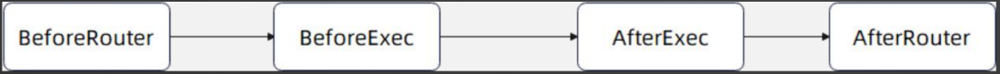
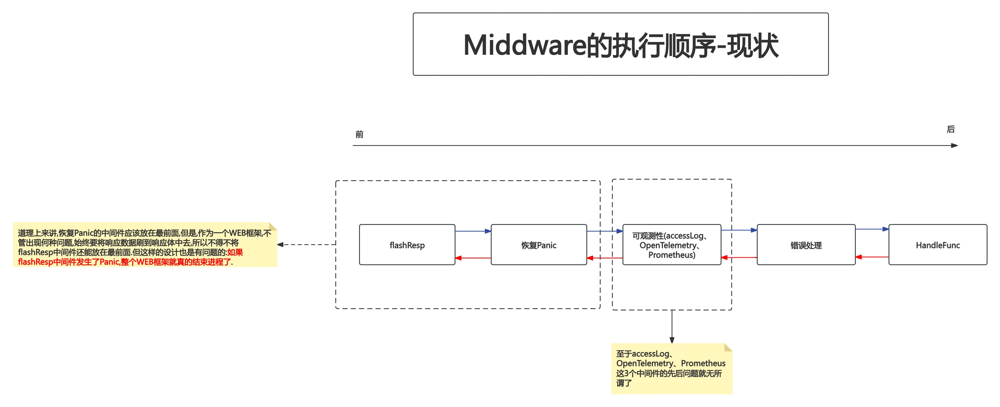
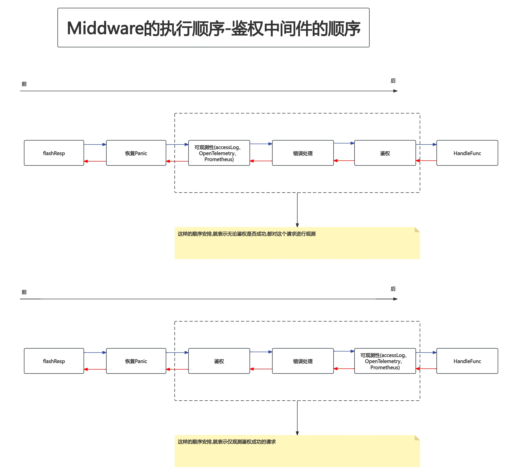
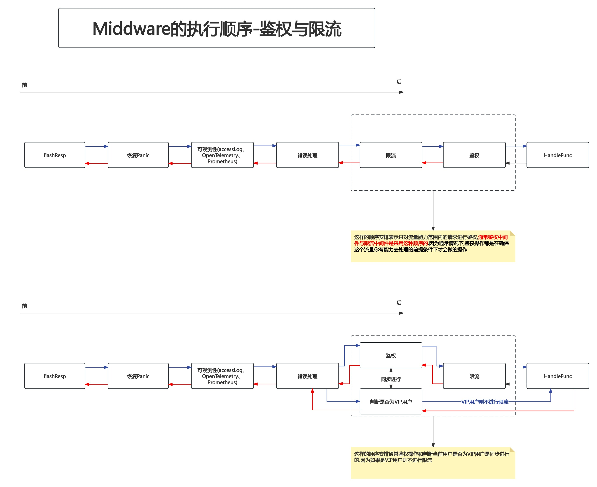
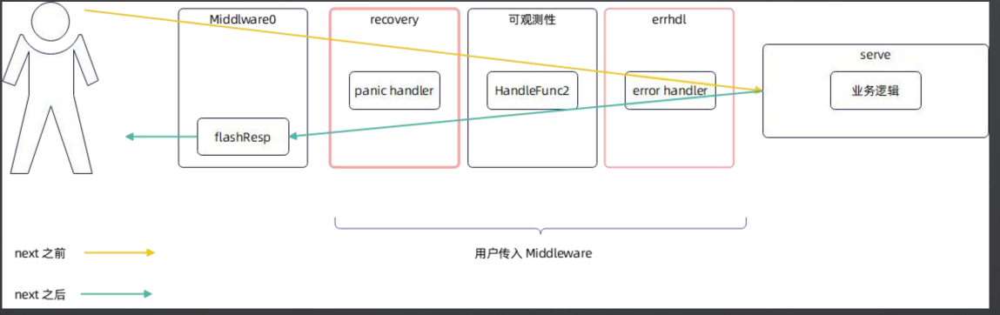

# 09.Middleware总结和面试

## PART1. Filter要不要考虑时机的问题?

例如:**要不要设计类似Beego那种复杂的在不同阶段运行的Filter(就是Middleware)?**

这个问题和我们之前讨论的其它问题都不太一样,是因为用户完全没办法自己支持,只能依赖于框架支持(也就是必须侵入式地修改框架),类似[Beego中定义的各种执行点](https://github.com/beego/beego/blob/master/server/web/router.go#L38)

如果我们的框架要支持这种设计,就需要在`HTTPServer.serve()`方法中根据不同的flag做各种拦截,类似[Beego中根据flag的值做拦截](https://github.com/beego/beego/blob/master/server/web/router.go#L829),形如:

```go
// serve 查找路由树并执行命中的业务逻辑
func (s *HTTPServer) serve(ctx *Context) {
	// 检测并执行 beforeRoute 的filter

	method := ctx.Req.Method
	path := ctx.Req.URL.Path
	targetNode, ok := s.findRoute(method, path)

	// 检测并执行 afterRoute 的filter

	// 没有在路由树中找到对应的路由节点 或 找到了路由节点的处理函数为空(即NPE:none pointer exception 的问题)
	// 则返回404
	if !ok || targetNode.node.HandleFunc == nil {
		ctx.RespStatusCode = http.StatusNotFound
		ctx.RespData = []byte("Not Found")
		return
	}

	// 命中节点则将路径参数名值对设置到上下文中
	ctx.PathParams = targetNode.pathParams

	// 命中节点则将节点的路由设置到上下文中
	ctx.MatchRoute = targetNode.node.route

	// 检测并执行 beforeExecute 的filter

	// 执行路由节点的处理函数
	targetNode.node.HandleFunc(ctx)

	// 检测并执行 afterExecute 的filter
}
```

这里我们没有执行beforeStatic的地方,因为我们后续采用其他的方案支持.

也就是说,如果框架的使用者真的需要这种在不同阶段执行的Filter,那么就**必须侵入式地修改框架的代码,或者我们在实现`HTTPServer.serve()`方法时事先把这个空缺留好**.

那么问题来了,要不要事先把这个空缺留好?

理论上来说是需要考虑的,但是我们可以推迟到用户真正需要的时候再来评估

**因为大多数场景都是不需要考虑这个问题的,已有的设计完全能够满足**



## PART2. Middleware要不要考虑顺序问题?

理论上来说,**每一个Middleware都应该不依赖于其它的Middleware**.

但这只是一个美好的希望,比如在我们已经实现的几个Middleware中,处理Panic的Middleware很显然应该在最外层,也就是紧接着`HTTPServer.flashResp()`的位置上,错误处理应该在可观测性之后.但现状并不是这样的:



TODO: 如果flashResp后边又跟一个Panic呢?

有些设计者可能会认为错误处理应该在可观测性之前,因为他们只关心业务逻辑的执行情况,并不关心框架的错误处理所消耗的时长,如下图示:


这样的顺序也是没问题的.Middleware的执行顺序没有严格的要求,但是**如果前边的Middleware和后边的Middleware是有关联的(例如恢复Panic的Middleware要恢复后边所有Middleware中发生的panic),那么对顺序就有要求了**.当然你要把恢复Panic的Middleware放在最后边也不是不可以,那就意味着你作为框架的设计者,只恢复HandleFunc产生的panic.

又比如,从业务上来看,鉴权应该在很靠前的位置,限流可以在鉴权前面,也可以在鉴权后面,取决于业务



假定此时还有限流中间件,那么限流与鉴权的顺序关系如下:





## PART3. Middleware要不要考虑分路由问题?

前面所有的Middleware都是对所有请求生效的

一个很常见的场景:

我们希望区分不同的路由,进行不同的处理.例如公开页面,用户不需要登录,但是有一些页面,用户就需要登录

**这TM是作业**

## PART4. 面试要点

1. **什么是可观测性?**
	- 也就是logging、metrics和tracing
2. **常用的可观测性的框架有哪些?**
	- 你举例自己公司用的,或者开源的OpenTelemetry、SkyWalking、Prometheus都可以
3. **怎么集成可观测性框架?**
	- 一般都是利用Middleware机制(AOP),不仅仅是Web框架,几乎所有的框架都有类似Middleware的机制
4. **Prometheus的Histogram和Summary?**
	- 见[第2周第17课:Prometheus详解](https://github.com/rayallen20/GoInAction/blob/master/note/%E7%AC%AC2%E5%91%A8-Web%E6%A1%86%E6%9E%B6%E4%B9%8BContext%E4%B8%8EAOP%E6%96%B9%E6%A1%88/PART3.%20Middleware/17.%20Prometheus%E8%AF%A6%E8%A7%A3.md)
5. **全链路追踪(tracing)的几个概念?**
	- 解释一下tracer、tracing和span的概念.主要是span如何构建成树的
6. **tracing是怎么构建的?**
	- 核心在于解释清楚tracing进程内和跨进程的运作,我们将在微服务框架里面看到跨进程是怎么处理的
7. **HTTP应该观测一些什么数据?**
	- 也就是我们OpenTelemetry和Promtheus两个Middleware里面写的那些指标
8. **什么是99线、999线?**
	- 就是响应的比例,99%的响应、99.9%的响应的响应时间在多少ms以内