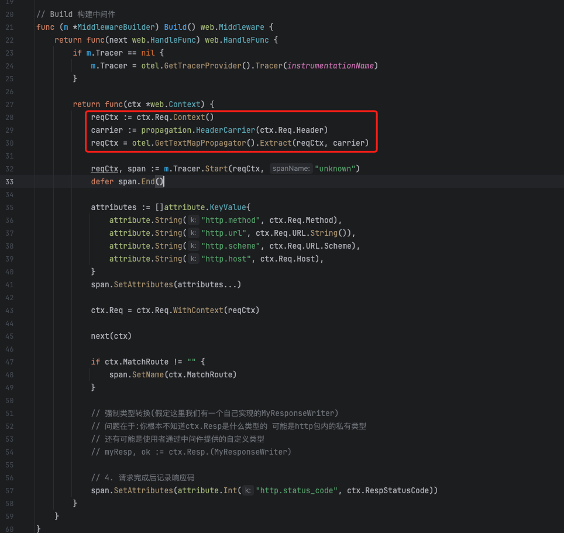
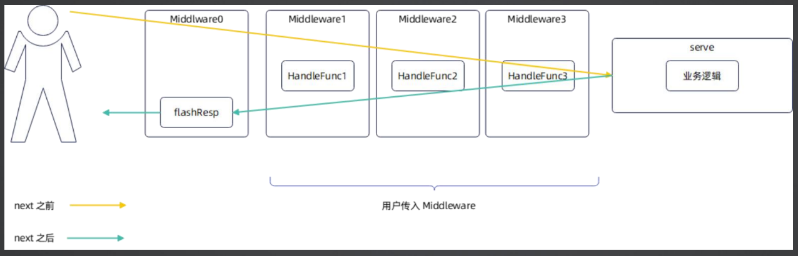

# 7.04 Middleware-OpenTelemetry总结

## PART1. 关联上游

记录span的Context要关联上请求中的span(`Context.Req.Context()`).

**如果你不知道该在span中记录什么标签,那你就去抄Kratos或go-zero或ego中的**

## PART2. 获取响应状态码

这里额外提一点,我们在span中记录的是请求命中的路由,而非请求的路径.这是因为路径中可能携带有多个路径参数,使得整个URL变得较为复杂

另外这里是因为我们无法从`http.ResponseWriter`直接获取响应状态码,只能是通过**将响应数据和响应码分别写入到`Context`的两个成员属性上,在执行完所有对响应码和响应数据的读写操作后(即返回相应之前),将响应数据和响应码刷到响应中**的方式,来获取响应数据和响应码.**相当于缓存了响应数据和响应码.等到所有的中间件都操作完了这份缓存的响应数据和响应码之后,返回响应之前,将它们刷到响应中**

TODO:可能我在AOP那一章节里对于中间件的组装顺序和执行顺序的解释是有误的,这个我需要确认