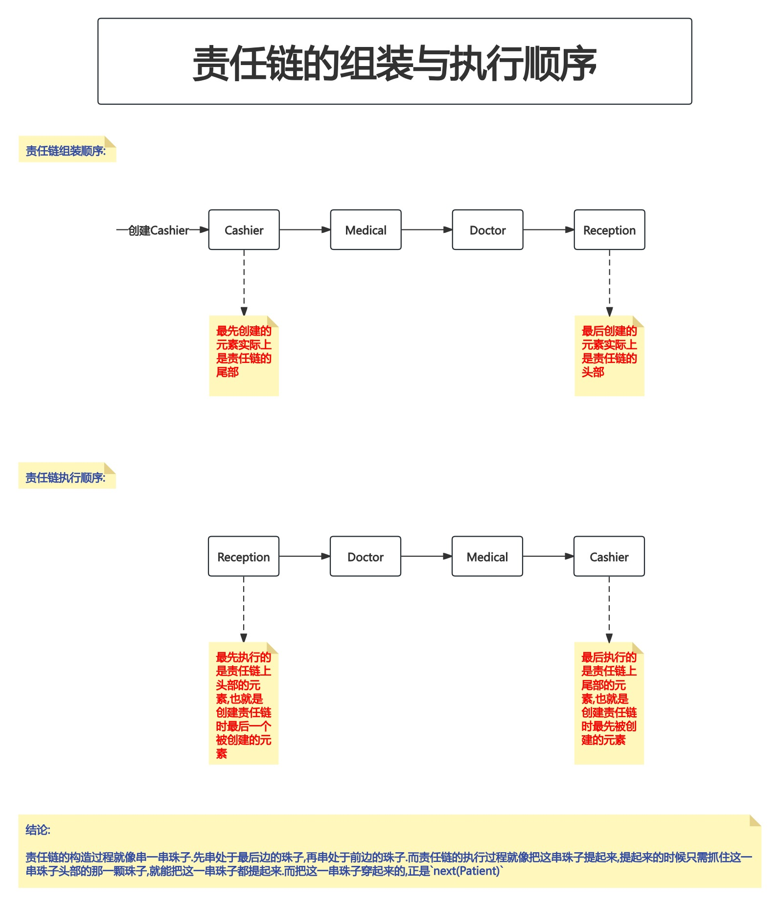
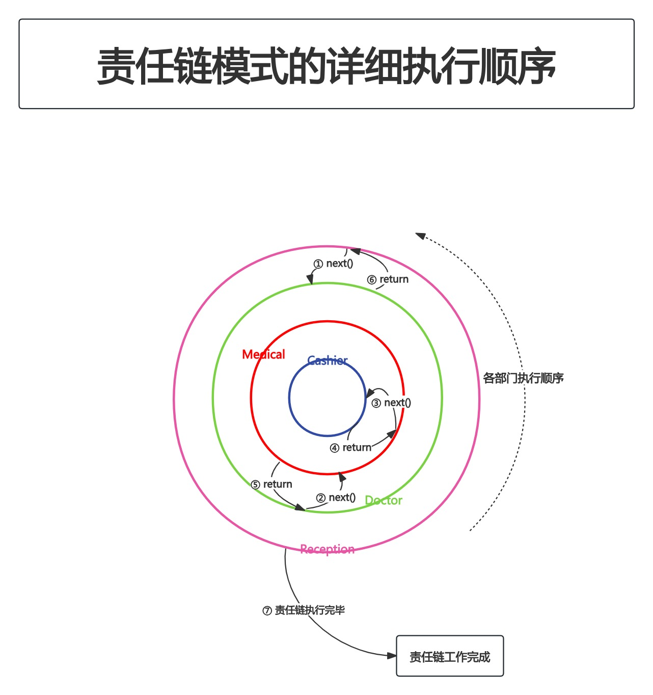

# 附录1. 责任链模式

责任链模式是一种**行为设计模式**,允许你将请求沿着处理者链进行发送,直至其中一个处理者对该请求进行处理.

该模式允许多个对象来对请求进行处理,而无需让发送者类与具体接收者类相耦合.链可在运行时由**遵循标准处理者接口的任意处理者**动态生成.

## PART1. 概念示例

### 1.1 背景故事

让我们来看看一个医院应用的责任链模式例子.医院中会有多个部门,如:

- 前台
- 医生
- 药房
- 收银

病人来访时,他们首先都会去前台,然后是看医生、取药,最后结账.也就是说,病人需要通过一条部门链,**每个部门都在完成其职能后将病人进一步沿着链条输送**.

此模式适用于**有多个候选选项处理相同请求**的情形,适用于**不希望客户端选择接收者**(因为多个对象都可处理请求)的情形,还适用于想**将客户端同接收者解耦**时.客户端只需要链中的首个元素即可.

正如示例中的医院,患者在到达后首先去的就是前台.然后根据患者的当前状态,前台会将其指向链上的下一个处理者.

### 1.2 病人结构体

`pattern/patient.go`:

```go
package pattern

// Patient 病人结构体
type Patient struct {
	Name              string // 姓名
	RegistrationDone  bool   // 是否完成挂号
	DoctorCheckUpDone bool   // 是否完成医生检查
	MedicineDone      bool   // 是否完成取药
	PaymentDone       bool   // 是否完成缴费
}
```

### 1.3 处理者接口

`pattern/department/department.go`:

```go
package department

import "responsibilityChain/pattern"

type Department interface {
	Execute(patient *pattern.Patient) // Execute 用于让病人执行当前部门的处理
	SetNext(department Department)    // SetNext 设置下一个部门
}
```

### 1.4 挂号部门结构体

`pattern/department/reception.go`:

```go
package department

import (
	"fmt"
	"responsibilityChain/pattern"
)

// Reception 挂号部门
type Reception struct {
	next Department // next 挂号部门处理病人完成后,即将处理病人的下一个部门
}

// Execute 本方法用于执行挂号部门处理病人的过程 并调用下一个处理病人部门的执行逻辑
func (r *Reception) Execute(patient *pattern.Patient) {
	if patient.RegistrationDone {
		fmt.Printf("patient registration already done\n")
		if r.next != nil {
			r.next.Execute(patient)
		}
		return
	}

	fmt.Printf("Reception registering patient now\n")
	patient.RegistrationDone = true
	if r.next != nil {
		r.next.Execute(patient)
	}
	return
}

// SetNext 设置下一个处理病人的部门
func (r *Reception) SetNext(department Department) {
	r.next = department
}
```

### 1.5 医生部门结构体

`pattern/department/doctor.go`:

```go
package department

import (
	"fmt"
	"responsibilityChain/pattern"
)

// Doctor 医生部门
type Doctor struct {
	next Department // next 医生部门处理病人完成后,即将处理病人的下一个部门
}

// Execute 本方法用于执行医生部门处理病人的过程 并调用下一个处理病人部门的执行逻辑
func (d *Doctor) Execute(patient *pattern.Patient) {
	if patient.DoctorCheckUpDone {
		fmt.Printf("Doctor checkup already done\n")
		if d.next != nil {
			d.next.Execute(patient)
			return
		}
	}

	fmt.Printf("Doctor checking patient\n")
	patient.DoctorCheckUpDone = true
	if d.next != nil {
		d.next.Execute(patient)
	}
	return
}

// SetNext 设置下一个处理病人的部门
func (d *Doctor) SetNext(next Department) {
	d.next = next
}
```

### 1.6 药房部门结构体

`pattern/department/medical.go`:

```go
package department

import (
	"fmt"
	"responsibilityChain/pattern"
)

// Medical 药房部门
type Medical struct {
	next Department // next 药房部门处理病人完成后,即将处理病人的下一个部门
}

// Execute 本方法用于执行药房部门处理病人的过程 并调用下一个处理病人部门的执行逻辑
func (m *Medical) Execute(patient *pattern.Patient) {
	if patient.MedicineDone {
		fmt.Printf("Medical already given to patient\n")
		if m.next != nil {
			m.next.Execute(patient)
			return
		}
	}

	fmt.Printf("Medical giving to patient\n")
	patient.MedicineDone = true
	if m.next != nil {
		m.next.Execute(patient)
	}

	return
}

// SetNext 设置下一个处理病人的部门
func (m *Medical) SetNext(next Department) {
	m.next = next
}
```

### 1.7 收费部门结构体

`pattern/department/cashier.go`:

```go
package department

import (
	"fmt"
	"responsibilityChain/pattern"
)

// Cashier 收费部门
type Cashier struct {
	next Department // next 收费部门处理病人完成后,即将处理病人的下一个部门
}

// Execute 本方法用于执行收费部门处理病人的过程 并调用下一个处理病人部门的执行逻辑
func (c *Cashier) Execute(patient *pattern.Patient) {
	if patient.PaymentDone {
		fmt.Printf("Payment Done\n")

		if c.next != nil {
			c.next.Execute(patient)
			return
		}
	}

	fmt.Printf("Cashier getting money from patient patient\n")
	patient.PaymentDone = true
	if c.next != nil {
		c.next.Execute(patient)
	}

	return
}

// SetNext 设置下一个处理病人的部门
func (c *Cashier) SetNext(department Department) {
	c.next = department
}
```

### 1.8 客户端调用

`main.go`:

```go
package main

import (
	"responsibilityChain/pattern"
	"responsibilityChain/pattern/department"
)

func main() {
	patient := &pattern.Patient{
		Name: "abc",
	}

	departmentChain := initDepartmentChain()
	departmentChain.Execute(patient)
}

// initDepartmentChain 本函数用于初始化部门链并返回位于链首部的第1个部门
// Tips: 注意部门初始化的顺序和部门处理病人的顺序是相反的
func initDepartmentChain() department.Department {
	// 初始化收费部门
	cashier := &department.Cashier{}

	// 初始化药房部门
	medical := &department.Medical{}
	medical.SetNext(cashier)

	// 初始化医生部门
	doctor := &department.Doctor{}
	doctor.SetNext(medical)

	// 初始化挂号部门
	reception := &department.Reception{}
	reception.SetNext(doctor)

	return reception
}
```

执行结果:

```
Reception registering patient now
Doctor checking patient
Medical giving to patient
Cashier getting money from patient patient
```

需要注意的是,各个部门的初始化的顺序,与其在责任链上的顺序是相反的;初始化的顺序与执行的顺序也是相反的,先初始化的收费部门,但收费部门的`Execute()`方法最后执行

## PART2. 示例相关UML


## PART3. 责任链模式工作流程

### 3.1 责任链的组装与执行顺序



### 3.2 责任链的详细执行顺序



## PART4. 责任链模式的使用场景

1. **如果程序需要使用不同的方式处理不同种类的请求,并且请求类型和顺序预先不确定时,可以使用责任链模式**.责任链模式可以将多个具体的处理者对象连接成一条链,在接收到请求后,责任链模式会询问每个具体的请求者能否对该请求进行处理,因此所有的处理者对象都有机会处理请求
2. **如果必须按顺序执行多个具体的处理者对象,则可以使用责任链模式**.无论以何种顺序将具体的处理者对象连接成一条链,所有请求都会严格按顺序通过链中的具体处理者对象
3. **如果所需的具体处理者对象及其顺序必须在运行时发生改变(或者也可以说必须在运行时才能确定下来),则可以使用责任链模式**.如果在具体的处理者类中存在对成员变量的引用,那么开发者可以动态地插入和删除具体处理者对象或改变其顺序.
	- 说白了就是当需要改变各个元素在责任链上的顺序时,调整每个元素的`next`成员属性,使该成员属性引用不同的具体处理者对象即可

## PART5. 责任链模式的优缺点

### 5.1 优点

1. 开发者可以控制请求处理的顺序
2. 符合单一职责原则(SRP,Single Responsibility Principle).开发者可以对发起操作的类和执行操作的类进行解耦(发起操作和执行操作是2个不同的职责)
3. 符合开闭原则(开放扩展,闭合修改).开发者可以在**不更改现有代码的情况下**,在程序中添加处理者对象
4. 提高对象分配职责的灵活性.通过更改链中的成员或更改其顺序,允许动态添加或删除处理者对象.增加新的处理者类时很方便
5. 责任链模式可以简化对象,使得对象不需要知道链的结构

### 5.2 责任链模式的缺点

1. 责任链模式的请求不保证一定能被收到,部分请求可能未被处理
	- 责任链模式不保证请求一定到达链首部的第1个处理者对象
2. 系统的性能会受到影响,而且在代码调试不方便时可能会造成循环调用.例如:
	- 如果某个处理者对象未能成功调用下一个处理者的处理方法,那么请求可能会被丢弃
	- 如果一个处理者对象调用了不正确的处理者的处理方法,那么可能损害责任链的结构
3. 在调试时,不容易观察操作特性
4. 责任链模式有时会增加维护成本,因为不同的处理程序中可能会出现重复的代码