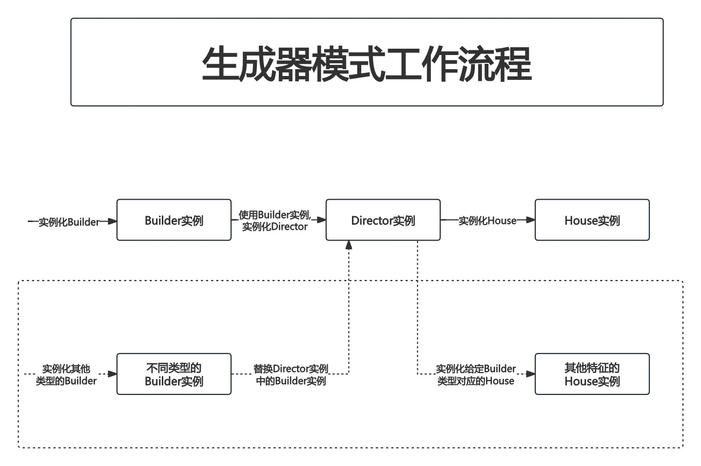

# 附录2. 生成器模式

生成器模式是一种**创建型设计模式**,使你能够**分步骤创建复杂对象**.

与其他创建型模式不同,**生成器模式不要求产品拥有通用接口**.这使得**用相同的创建过程生成不同的产品**成为可能.

## PART1. 概念示例

当所需产品较为复杂且需要多个步骤才能完成时,可以使用生成器模式.在这种情况下,**使用多个构造方法比仅仅使用一个复杂可怕的构造函数更简单**.但分多个步骤进行构建的策略也有其问题.分为多个步骤进行构建的潜在问题在于:构建不完整的和不稳定的产品可能会被暴露给客户端.生成器模式能够在产品完成构建之前使其处于私密状态.

### 1.1 背景故事

现有2种房屋:

- 冰屋
- 普通房屋

这两种房屋的建造步骤都是相同的(例如先装窗户、再装门,最后装地板).该如何组织这个建造过程?

### 1.2 房屋结构体

房屋结构体实际上就是我们完成所有建造步骤后,最终对外提供的产品

`pattern/house.go`:

```go
package pattern

// House 房屋结构体 即最终对外提供的产品
type House struct {
	windowType string // windowType 窗户类型
	doorType   string // doorType 门的类型
	floor      int    // floor 房屋楼层数
}

// GetWindowType 本方法用于获取房屋的窗户类型
func (h House) GetWindowType() string {
	return h.windowType
}

// GetDoorType 本方法用于获取房屋的门的类型
func (h House) GetDoorType() string {
	return h.doorType
}

// GetFloor 本方法用于获取房屋的楼层数
func (h House) GetFloor() int {
	return h.floor
}
```

### 1.3 生成器接口

接口定义行为.本例中的生成器接口定义了创建一个房屋所必须经历的过程,也就是创建一个房屋的行为

`pattern/iBuilder.go`

```go
package pattern

// IBuilder 生成器接口 本接口用于定义创建房屋的必要过程
type IBuilder interface {
	setWindowType()  // setWindowType 本方法用于设置窗户类型
	setDoorType()    // setDoorType 本方法用于设置门的类型
	setFloor()       // setFloor 本方法用于设置房屋楼层数
	getHouse() House // getHouse 本方法用于创建并返回房屋
}
```

### 1.4 普通房屋生成器

`pattern/normalBuilder.go`:

```go
package pattern

// NormalBuilder 普通房屋生成器
type NormalBuilder struct {
	windowType string // windowType 普通房屋的窗户类型
	doorType   string // doorType 普通房屋的门的类型
	floor      int    // floor 普通房屋的房屋楼层数
}

// newNormalBuilder NormalBuilder 的构造函数
func newNormalBuilder() *NormalBuilder {
	return &NormalBuilder{}
}

// setWindowType 本方法用于设置普通房屋的窗户类型
func (b *NormalBuilder) setWindowType() {
	b.windowType = "木窗户"
}

// setDoorType 本方法用于设置普通房屋的门类型
func (b *NormalBuilder) setDoorType() {
	b.doorType = "木门"
}

// setFloor 本方法用于设置普通房屋的楼层数
func (b *NormalBuilder) setFloor() {
	b.floor = 2
}

// getHouse 本方法用于创建普通房屋
func (b *NormalBuilder) getHouse() House {
	return House{
		windowType: b.windowType,
		doorType:   b.doorType,
		floor:      b.floor,
	}
}
```

### 1.5 冰屋生成器

`pattern/iglooBuilder.go`:

```go
package pattern

// IglooBuilder 冰屋生成器
type IglooBuilder struct {
	windowType string // windowType 冰屋的窗户类型
	doorType   string // doorType 冰屋的门的类型
	floor      int    // floor 冰屋的房屋楼层数
}

// newIglooBuilder IglooBuilder 的构造函数
func newIglooBuilder() *IglooBuilder {
	return &IglooBuilder{}
}

// setWindowType 本方法用于设置冰屋的窗户类型
func (b *IglooBuilder) setWindowType() {
	b.windowType = "雪窗户"
}

// setDoorType 本方法用于设置冰屋的门类型
func (b *IglooBuilder) setDoorType() {
	b.doorType = "雪门"
}

// setFloor 本方法用于设置冰屋的楼层数
func (b *IglooBuilder) setFloor() {
	b.floor = 1
}

// getHouse 本方法用于创建冰屋
func (b *IglooBuilder) getHouse() House {
	return House{
		windowType: b.windowType,
		doorType:   b.doorType,
		floor:      b.floor,
	}
}
```

### 1.6 管理者结构体

以上两个具体的生成器类仅仅定义了建造一个房屋(无论是普通房屋还是冰屋)的每个具体过程,但还缺少一个角色,该角色用于**编排这些过程的执行顺序**.在本例中,可以理解为:无论是建造一个冰屋还是普通房屋,其建造顺序应该是固定的:

- step1. 造窗户
- step2. 造门
- step3. 确定楼层数

而管理者结构体的职责就是确定这些过程的执行顺序,并在这些过程都按顺序执行完毕后,返回被创建出的产品

`pattern/director.go`:

```go
package pattern

// Director 管理者结构体 本结构体用于编排生成器的生成过程 并最终生成产品
// 本结构体的存在使得客户端不必关心生成器的生成过程
type Director struct {
	builder IBuilder // builder 生成器接口的实现
}

// NewDirector Director 的构造函数
func NewDirector(builder IBuilder) *Director {
	return &Director{
		builder: builder,
	}
}

// SetBuilder 本方法用于为管理者结构体设置具体生成器
// 本方法存在的意义在于可以在运行时动态的改变管理者实例中的生成器实例
func (d *Director) SetBuilder(builder IBuilder) {
	d.builder = builder
}

// BuildHouse 本方法用于编排具体生成器的生成过程 并最终生成产品
func (d *Director) BuildHouse() House {
	d.builder.setWindowType()
	d.builder.setDoorType()
	d.builder.setFloor()
	return d.builder.getHouse()
}
```

### 1.7 提供对外暴露的创建具体生成器的方法

`pattern/IBuilder.go`:

```go
package pattern

// IBuilder 生成器接口 本接口用于定义创建房屋的必要过程
type IBuilder interface {
	setWindowType()  // setWindowType 本方法用于设置窗户类型
	setDoorType()    // setDoorType 本方法用于设置门的类型
	setFloor()       // setFloor 本方法用于设置房屋楼层数
	getHouse() House // getHouse 本方法用于创建并返回房屋
}

// GetBuilder 本函数用于根据给定的生成器类型 创建具体生成器
func GetBuilder(builderType string) IBuilder {
	switch builderType {
	case "normal":
		return newNormalBuilder()
	case "igloo":
		return newIglooBuilder()
	default:
		return nil
	}
}
```

### 1.8 客户端创建房屋

`main.go`:

```go
package main

import (
	"builder/pattern"
	"fmt"
)

func main() {
	// 普通房屋生成器实例
	normalBuilder := pattern.GetBuilder("normal")
	// 冰屋生成器实例
	iglooBuilder := pattern.GetBuilder("igloo")

	// 管理者实例
	director := pattern.NewDirector(normalBuilder)
	// 生成普通房屋
	normalHouse := director.BuildHouse()

	fmt.Printf("普通房屋的窗户类型: %s\n", normalHouse.GetWindowType())
	fmt.Printf("普通房屋的门的类型: %s\n", normalHouse.GetDoorType())
	fmt.Printf("普通房屋的楼层数: %d\n", normalHouse.GetFloor())

	// 重置管理者实例中的生成器实例
	director.SetBuilder(iglooBuilder)
	// 生成冰屋
	iglooHouse := director.BuildHouse()

	fmt.Printf("冰屋的窗户类型: %s\n", iglooHouse.GetWindowType())
	fmt.Printf("冰屋的门的类型: %s\n", iglooHouse.GetDoorType())
	fmt.Printf("冰屋的楼层数: %d\n", iglooHouse.GetFloor())
}
```

执行结果:

```
普通房屋的窗户类型: 木窗户
普通房屋的门的类型: 木门
普通房屋的楼层数: 2
冰屋的窗户类型: 雪窗户
冰屋的门的类型: 雪门
冰屋的楼层数: 1
```

## PART2. 示例相关UML


## PART3. 生成器模式工作流程



## PART4. 生成器模式使用场景

- 当开发者希望创建不同形式的产品时,可以使用生成器模式
- 如果开发者需要创建各种形式的产品,且这些产品的制造过程相似,且产品之间的差别不大(例如本例中的冰屋和普通房屋),可以使用生成器模式
- 如果需要使用构造函数,且构造函数中的参数很多时,可以使用生成器模式
- 当需要构建同一个对象的不同表示时,可以使用生成器模式.换言之,当需要创建具有不同特征的同一类对象时,可使用生成器模式

## PART5. 生成器模式的优缺点

### 5.1 优点

- 在生成器模式中,产品内部组成的细节对客户端不可见,将产品的**创建过程**和**产品自身**解耦,使**相同的创建过程可以创建不同的产品对象**
- 在生成器模式中,每个具体生成器都相对独立,因此可以十分方便地**替换具体生成器**或**增加新的具体生成器**,**且无须修改原有类库的代码(无侵入式的修改才是高明的修改)**,系统扩展方便,符合开闭原则(Open/Closed Principle,OCP),设计灵活性和代码可读性较高
- 生成器模式可以**将复杂产品的创建步骤分解在不同的方法中**,使创建过程更清晰,更易于使用程序控制创建过程

### 5.2 缺点

- 使用生成器模式创建的产品**组成部分都类似**,如果不同产品之间的差异很大(如很多组成部分都不相同),则不适合使用生成器模式,因此其使用范围有限
- 在生成器模式中,需要为不同类型的产品创建单独的具体生成器,因此代码量较大.如果系统比较大,则会增加系统的理解难度和运行成本