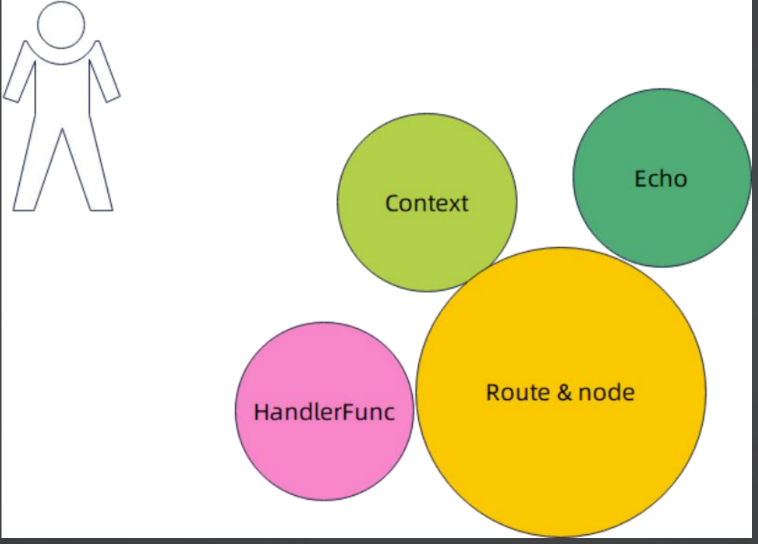

# 5. Web框架概览-Echo框架分析

## PART1. 基本使用

```GO
package echo

import (
	"github.com/labstack/echo/v4"
	"github.com/labstack/echo/v4/middleware"
	"net/http"
	"testing"
)

func TestHelloWorld(t *testing.T) {
	// Echo instance
	e := echo.New()

	// Middleware
	e.Use(middleware.Logger())
	e.Use(middleware.Recover())

	// Routes
	e.GET("/", hello)

	// Start server
	e.Logger.Fatal(e.Start(":8084"))
}

// Handle
func hello(c echo.Context) error {
	return c.String(http.StatusOK, "Hello, World!")
}
```

## PART2. 结构体`echo.Echo`

从上述示例的`e.Start(":8084")`可以看出,`echo.Echo`结构体(即`echo.New()`的返回值)类似于Beego的HttpServer和GIN的Engine:

- 注册路由:暴露了注册路由的方法,但`echo.Echo`本身并不是路由树的载体(`echo.Echo`只是组合了`echo.Router`)
- 生命周期管理:如`Echo.Start()`/`Echo.Shutdown()`等方法

```GO
// Echo is the top-level framework instance.
Echo struct {
	filesystem
	common
	startupMutex     sync.RWMutex
	StdLogger        *stdLog.Logger
	colorer          *color.Color
	premiddleware    []MiddlewareFunc
	middleware       []MiddlewareFunc
	maxParam         *int
	router           *Router
	routers          map[string]*Router
	pool             sync.Pool
	Server           *http.Server
	TLSServer        *http.Server
	Listener         net.Listener
	TLSListener      net.Listener
	AutoTLSManager   autocert.Manager
	DisableHTTP2     bool
	Debug            bool
	HideBanner       bool
	HidePort         bool
	HTTPErrorHandler HTTPErrorHandler
	Binder           Binder
	JSONSerializer   JSONSerializer
	Validator        Validator
	Renderer         Renderer
	Logger           Logger
	IPExtractor      IPExtractor
	ListenerNetwork  string
}
```

可以看到在该结构体中,有2个相似的字段:`router`和`routers`:

- `router`:表示路由树
- `routers`:表示根据Host将路由树隔离,可以看做是类似namespace之类的概念,**既是一种组织方式,也是一种隔离机制**

一种观点认为:如果想要做一个类似namespace之类的隔离机制,应该使用一些更轻量级的方式.但如果仅仅是为了实现"根据Host将路由树隔离"的功能,不如创建2个`Echo`实例,而不是使用在1个`Echo`示例中使用一个map通过key来隔离.

## PART3. Route和node

Router:表示路由树,而node表示的是路由树上的节点

### 3.1 Router

```GO
Router struct {
	tree   *node
	routes map[string]*Route
	echo   *Echo
}
```

#### 3.1.1 Route类型

实际上这里的`Route`类型才是真正表示1个路由的:

```GO
// Route contains a handler and information for matching against requests.
Route struct {
	Method string `json:"method"`
	Path   string `json:"path"`
	Name   string `json:"name"`
}
```

`Router.tree`字段表示一棵树的根节点,实际上该字段改名为`root`更加合适.

#### 3.1.2 Router.echo

从上述`echo.Echo`结构体的定义中可以看到它有一个字段名为`router`,其类型为`*Router`;从`Router`结构体的定义中也能够看到它有一个字段名为`echo`,其类型为`*Echo`.很明显的双向引用.

这也是在有些情况下逼不得已的做法.比如GO原生的`sql`包中,`sql.Tx`里边维护了一个`sql.DB`的实例:

```GO
type Tx struct {
	db *DB

	closemu sync.RWMutex

	dc  *driverConn
	txi driver.Tx

	releaseConn func(error)

	done int32

	keepConnOnRollback bool

	stmts struct {
		sync.Mutex
		v []*Stmt
	}

	cancel func()

	ctx context.Context
}
```

### 3.2 node

```GO
node struct {
	kind           kind
	label          byte
	prefix         string
	parent         *node
	staticChildren children
	originalPath   string
	methods        *routeMethods
	paramChild     *node
	anyChild       *node
	paramsCount    int
	// isLeaf indicates that node does not have child routes
	isLeaf bool
	// isHandler indicates that node has at least one handler registered to it
	isHandler bool

	// notFoundHandler is handler registered with RouteNotFound method and is executed for 404 cases
	notFoundHandler *routeMethod
}
```

注意字段`staticChildren`(实际上`children`类型就是`[]*node`)、`paramChild`和`anyChild`:

- `staticChildren`:静态匹配
- `paramChild`:参数路径
- `anyChild`:通配符匹配

**这种设计可以比较容易实现路由优先级和路由冲突检测**

## PART4. Context

Echo中的[Context](https://github.com/labstack/echo/blob/master/context.go#L19)是一个大而全的**接口**,定义了处理请求和响应的各种方法.和Beego、Gin、Iris的Context没有什么区别.

硬要说区别的话,只是在Echo中这个抽象被定义为了一个接口而非结构体.这也就意味着可以为该接口提供不同的实现.当然其实没啥人给它提供不同的实现.

## PART5. 核心抽象



- Route & node:处理路由相关功能
- Echo:类似Beego中的Beego的HttpServer和GIN中的Engine
- Context:处理请求上下文
- HandlerFunc:业务逻辑代码

## PART6. 框架对比

||Beego|GIN|Iris|Echo|
|:-:|:-:|:-:|:-:|:-:|
|代表服务器|HttpServer|Engine|Application|Echo|
|代表路由|ControllerRegister|methodTree|Route|Route|
|上下文|Context|Context|Context|Context|
|处理逻辑|HandlerFunc|HandlerFunc|HandlerFunc|HandlerFunc|

所以实际上我们要造一个Web框架,就是要建立我们自己的这几个抽象.

## PART7. WEB框架面试题

实际上,面整体Web框架的还是比较少的.大多数时候,面试都是聊具体的某个Web框架.且如果你打的是一些高端局,也不会问你怎么用,最多最多是问你怎么实现.

### 7.1 Web框架拿来做什么?

处理HTTP请求,为用户提供便捷API,为用户提供无侵入式的插件机制,提供如上传下载等默认功能.

### 7.2 为什么都已经有了http包,还要开发Web框架?

- 高级路由功能
	- 参数匹配
	- 正则匹配
	- 通配符匹配
	- 这些功能shi 原生的net/http包不支持的
- 封装HTTP上下文以提供简单API
- 封装Server以提供生命周期控制
- 设计插件机制以提供无侵入式解决方案

### 7.3 Web框架的核心?

- 路由树
- 上下文Context
- Server


