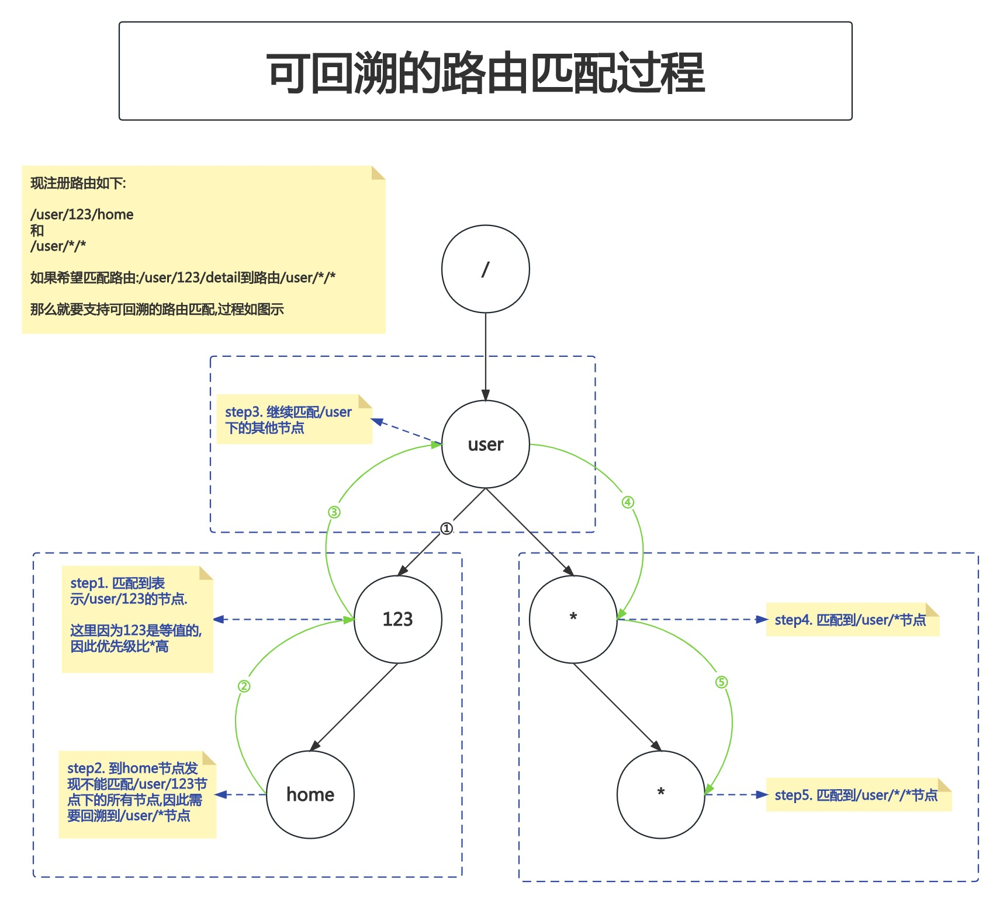

# 13. 路由树-通配符匹配之路由注册

本节课工程结构如下:

```
(base) yanglei@yuanhong 11-embeddingRouterIntoServer % tree ./
./
├── context.go
├── handleFunc.go
├── httpServer.go
├── httpServer_test.go
├── node.go
├── router.go
├── router_test.go
└── serverInterface.go

0 directories, 8 files
```

## PART1. 学习路线


## PART2. 通配符匹配的定义与设计

### 2.1 通配符匹配的定义

通配符匹配:是指用`*`表达匹配任何路径

### 2.2 通配符匹配的设计

这里就要考虑定义中所说的**任何路径**.

#### Question1:若用户输入的URI为`/a/b/c`,能否命中`/a/*`?

这个问题本质上是我们作为设计者,要考虑**通配符`*`在路由中的语义,是只能代表1段路由,还是可以代表多段路由?**

这里我们选择**让通配符`*`只能表达1段路由**.

我们假定通配符`*`表达多段路由.那么从框架使用者的视角上来看,路由`/a/*`和`/a/*/*`就很让人困惑:当路由为`/a/b/c`时,究竟匹配到了哪个路由?

从框架设计者的视角上来看,就干脆不要给使用者做出这种不良实践的机会.

#### Question2:若注册了2个路由:`/user/123/home`和`/user/*/*`,那么用户输入路径`/user/123/detail`时,能否命中路由`/user/*/*`?

这个问题本质上是我们作为设计者,要考虑我们的**路由匹配过程是否可回溯?**

可回溯的匹配过程如下图示:



简单理解就是:当发现`/user/123/home`不能匹配`/user/123/detail`时,要回溯到`/user/*`节点进行进一步查找的过程.

可以做,但这是一个**投入大产出低的特性**.

这里我们选择不支持这种路由,有2个原因:

1. 可回溯的特性会使得你的代码变得非常复杂
2. 从框架设计者的角度上来讲,通过不提供这种匹配方式的做法,限制框架的使用者不能定义形如`/user/*/*`的路由.
	- `/user/*/*`不好的地方在于:当使用者A读使用者B的代码时,他一定是要非常清晰的了解一个前提:**当路由`/user/123/detail`不能匹配到`/user/123/home`时,则能够匹配到`/user/*/*`**.这样的代码可读性本身就不高,因此通过不提供支持回溯匹配过程的方式,限制使用者不要去写这种模糊的代码
	- 更进一步的,框架的使用者本身也不应该同时注册`/user/123/home`和`/user/*/*`这两个路由

## PART3. 实现通配符节点的创建

### 3.1 修改`Node`的结构

`node.go`:

```go
// node 路由树的节点
type node struct {
	// path 当前节点的路径
	path string

	// children 子路由路径到子节点的映射
	children map[string]*node
	
	// wildcardChild 通配符子节点
	wildcardChild *node

	// HandleFunc 路由对应的业务逻辑
	HandleFunc
}
```

由于通配符节点的逻辑是需要特殊处理的(不管在注册路由还是查找路由时),因此需要为`node`结构体单独定义表示其通配符子节点的成员属性.

### 3.2 定义测试用例

此处还是在`router_test.go`中新建一个函数用于测试通配符匹配:

```go
// TestRouter_wildcard 测试通配符路由的注册与查找
func TestRouter_wildcard(t *testing.T) {
	// step1. 构造路由树
	testRoutes := []TestNode{
		// 普通节点的通配符子节点测试用例
		{
			method: http.MethodGet,
			path:   "/order/*",
		},
	}

	r := newRouter()
	mockHandleFunc := func(ctx *Context) {}

	for _, testRoute := range testRoutes {
		r.addRoute(testRoute.method, testRoute.path, mockHandleFunc)
	}

	// step2. 验证路由树 断言二者是否相等
	wantRouter := &router{
		trees: map[string]*node{
			http.MethodGet: {
				path: "/",
				children: map[string]*node{
					"order": {
						path:     "order",
						children: nil,
						wildcardChild: &node{
							path:          "*",
							children:      nil,
							wildcardChild: nil,
							HandleFunc:    mockHandleFunc,
						},
						HandleFunc: nil,
					},
				},
				wildcardChild: nil,
				HandleFunc:    nil,
			},
		},
	}

	msg, ok := wantRouter.equal(&r)
	assert.True(t, ok, msg)
}
```

现在运行这个测试用例,结果是不符合预期的:

```
/usr/local/go/bin/go tool test2json -t /private/var/folders/9x/kkdcw3dx7js8frvbxh8gns580000gn/T/dlvLauncher.sh /Users/yanglei/Applications/GoLand.app/Contents/plugins/go-plugin/lib/dlv/mac/dlv --listen=127.0.0.1:57140 --headless=true --api-version=2 --check-go-version=false --only-same-user=false exec /Users/yanglei/Library/Caches/JetBrains/GoLand2023.2/tmp/GoLand/___TestRouter_wildcard_in_server_12_matchWildcard.test -- -test.v -test.paniconexit0 -test.run ^\QTestRouter_wildcard\E$
=== RUN   TestRouter_wildcard
    router_test.go:426: 
        	Error Trace:	/Users/yanglei/Desktop/GO实战训练营/GoInAction/code/week1/server/12-matchWildcard/router_test.go:426
        	Error:      	Should be true
        	Test:       	TestRouter_wildcard
        	Messages:   	GET-两个节点的子节点数量不相等,源节点的子节点数量为 0,目标节点的子节点数量为 1
--- FAIL: TestRouter_wildcard (0.00s)

FAIL
```

很明显,按我们现在的逻辑,`/order/*`中,通配符`*`成为了`order`节点的子节点,而我们预期中通配符`*`应该是`order`节点的通配符子节点(也就是`wildcardChild`字段值).


注:这里还是看他TDD的思路,是用测试用例告诉自己"哪里不符合预期".

很明显,在查找子节点的操作中出问题了.不应该把`*`放在子节点集合里,而是应该放在`wildcardChild`字段上.

### 3.3 修改查找子节点的逻辑

`node.go`:

```go
// childOrCreate 本方法用于在节点上获取给定的子节点,如果给定的子节点不存在则创建
func (n *node) childOrCreate(segment string) *node {
	// 若路径为通配符 则查找当前节点的通配符子节点 或创建一个当前节点的通配符子节点 并返回
	if segment == "*" {
		if n.wildcardChild == nil {
			n.wildcardChild = &node{
				path: segment,
			}
		}
		return n.wildcardChild
	}

	// 如果当前节点的子节点映射为空 则创建一个子节点映射
	if n.children == nil {
		n.children = map[string]*node{}
	}

	res, ok := n.children[segment]
	// 如果没有找到子节点,则创建一个子节点
	// 否则返回找到的子节点
	if !ok {
		res = &node{
			path: segment,
		}
		n.children[segment] = res
	}
	return res
}
```

`childOrCreate()`方法中,添加了单独处理通配符子节点的逻辑.注意在`childOrCreate()`方法并不需要单独检测通配符子节点是否重复注册,因为其调用者`router.addRoute()`方法中有这个逻辑,不需要也不应该在`childOrCreate()`方法中检测通配符子节点是否重复注册.

这时候再去跑测试用例,实际上就已经通过了.

### 3.4 修改判断子节点相等的逻辑

在比对完两个节点的子节点映射数量之后,还要比对两个节点的通配符子节点是否相同.

`router_test.go`:

```go
// equal 比较两棵路由树是否相等
// msg: 两棵路由树不相等时的错误信息
// ok: 两棵路由树是否相等
func (n *node) equal(target *node) (msg string, ok bool) {
	// 如果目标节点为nil 则不相等
	if target == nil {
		return fmt.Sprintf("目标节点为nil"), false
	}

	// 如果两个节点的path不相等 则不相等
	if n.path != target.path {
		return fmt.Sprintf("两个节点的path不相等,源节点的path为 %s,目标节点的path为 %s", n.path, target.path), false
	}

	// 若两个节点的子节点数量不相等 则不相等
	nChildrenNum := len(n.children)
	yChildrenNum := len(target.children)
	if nChildrenNum != yChildrenNum {
		return fmt.Sprintf("两个节点的子节点数量不相等,源节点的子节点数量为 %d,目标节点的子节点数量为 %d", nChildrenNum, yChildrenNum), false
	}

	// 若两个节点的通配符子节点不相等 则不相等
	if n.wildcardChild != nil {
		if target.wildcardChild == nil {
			return fmt.Sprintf("目标节点的通配符子节点为空"), false
		}
		_, wildcardIsEqual := n.wildcardChild.equal(target.wildcardChild)
		if !wildcardIsEqual {
			return fmt.Sprintf("两个节点的通配符子节点不相等"), false
		}
	}

	// 若两个节点的handleFunc类型不同 则不相等
	nHandler := reflect.ValueOf(n.HandleFunc)
	yHandler := reflect.ValueOf(target.HandleFunc)
	if nHandler != yHandler {
		return fmt.Sprintf("%s节点的handleFunc不相等,源节点的handleFunc为 %v,目标节点的handleFunc为 %v", n.path, nHandler.Type().String(), yHandler.Type().String()), false
	}

	// 比对两个节点的子节点映射是否相等
	for path, child := range n.children {
		dstChild, ok := target.children[path]
		// 如果源节点的子节点中 存在目标节点没有的子节点 则不相等
		if !ok {
			return fmt.Sprintf("目标节点的子节点中没有path为 %s 的子节点", path), false
		}

		// 比对两个子节点是否相等
		msg, equal := child.equal(dstChild)
		if !equal {
			return msg, false
		}
	}

	return "", true
}
```

添加了比对两个节点的通配符子节点是否相等的逻辑

注:这里我将原来的形参`y`改名为`target`,为了提升可读性.

再跑单测也还是能跑的通的.

### 3.5 添加其他测试用例

#### 3.5.1 根节点的通配符子节点

因为我们的实现中针对根节点有特殊逻辑,所以这里我们单独测试根节点的通配符子节点

`router_test.go`:

```go
// TestRouter_wildcard 测试通配符路由的注册与查找
func TestRouter_wildcard(t *testing.T) {
	// step1. 构造路由树
	testRoutes := []TestNode{
		// 普通节点的通配符子节点测试用例
		{
			method: http.MethodGet,
			path:   "/order/*",
		},
		// 根节点的通配符子节点测试用例
		{
			method: http.MethodGet,
			path:   "/*",
		},
	}

	r := newRouter()
	mockHandleFunc := func(ctx *Context) {}

	for _, testRoute := range testRoutes {
		r.addRoute(testRoute.method, testRoute.path, mockHandleFunc)
	}

	// step2. 验证路由树 断言二者是否相等
	wantRouter := &router{
		trees: map[string]*node{
			http.MethodGet: {
				path: "/",
				children: map[string]*node{
					"order": {
						path:     "order",
						children: nil,
						wildcardChild: &node{
							path:          "*",
							children:      nil,
							wildcardChild: nil,
							HandleFunc:    mockHandleFunc,
						},
						HandleFunc: nil,
					},
				},
				wildcardChild: &node{
					path:          "*",
					children:      nil,
					wildcardChild: nil,
					HandleFunc:    mockHandleFunc,
				},
				HandleFunc: nil,
			},
		},
	}

	msg, ok := wantRouter.equal(&r)
	assert.True(t, ok, msg)
}
```

跑单测能够顺利通过.

#### 3.5.2 通配符子节点的通配符子节点

`router_test.go`:

```go
// TestRouter_wildcard 测试通配符路由的注册与查找
func TestRouter_wildcard(t *testing.T) {
	// step1. 构造路由树
	testRoutes := []TestNode{
		// 普通节点的通配符子节点测试用例
		{
			method: http.MethodGet,
			path:   "/order/*",
		},
		// 根节点的通配符子节点测试用例
		{
			method: http.MethodGet,
			path:   "/*",
		},
		// 通配符子节点的通配符子节点测试用例
		{
			method: http.MethodGet,
			path:   "/*/*",
		},
	}

	r := newRouter()
	mockHandleFunc := func(ctx *Context) {}

	for _, testRoute := range testRoutes {
		r.addRoute(testRoute.method, testRoute.path, mockHandleFunc)
	}

	// step2. 验证路由树 断言二者是否相等
	wantRouter := &router{
		trees: map[string]*node{
			http.MethodGet: {
				path: "/",
				children: map[string]*node{
					"order": {
						path:     "order",
						children: nil,
						wildcardChild: &node{
							path:          "*",
							children:      nil,
							wildcardChild: nil,
							HandleFunc:    mockHandleFunc,
						},
						HandleFunc: nil,
					},
				},
				wildcardChild: &node{
					path:     "*",
					children: nil,
					wildcardChild: &node{
						path:          "*",
						children:      nil,
						wildcardChild: nil,
						HandleFunc:    mockHandleFunc,
					},
					HandleFunc: mockHandleFunc,
				},
				HandleFunc: nil,
			},
		},
	}

	msg, ok := wantRouter.equal(&r)
	assert.True(t, ok, msg)
}
```

#### 3.5.3 通配符子节点的普通子节点

`router_test.go`:

```go
// TestRouter_wildcard 测试通配符路由的注册与查找
func TestRouter_wildcard(t *testing.T) {
	// step1. 构造路由树
	testRoutes := []TestNode{
		// 普通节点的通配符子节点测试用例
		{
			method: http.MethodGet,
			path:   "/order/*",
		},
		// 根节点的通配符子节点测试用例
		{
			method: http.MethodGet,
			path:   "/*",
		},
		// 通配符子节点的通配符子节点测试用例
		{
			method: http.MethodGet,
			path:   "/*/*",
		},
		// 通配符子节点的普通子节点测试用例
		{
			method: http.MethodGet,
			path:   "/*/*/order",
		},
	}

	r := newRouter()
	mockHandleFunc := func(ctx *Context) {}

	for _, testRoute := range testRoutes {
		r.addRoute(testRoute.method, testRoute.path, mockHandleFunc)
	}

	// step2. 验证路由树 断言二者是否相等
	wantRouter := &router{
		trees: map[string]*node{
			http.MethodGet: {
				path: "/",
				children: map[string]*node{
					"order": {
						path:     "order",
						children: nil,
						wildcardChild: &node{
							path:          "*",
							children:      nil,
							wildcardChild: nil,
							HandleFunc:    mockHandleFunc,
						},
						HandleFunc: nil,
					},
				},
				wildcardChild: &node{
					path:     "*",
					children: nil,
					wildcardChild: &node{
						path: "*",
						children: map[string]*node{
							"order": {
								path:          "order",
								children:      nil,
								wildcardChild: nil,
								HandleFunc:    mockHandleFunc,
							},
						},
						wildcardChild: nil,
						HandleFunc:    mockHandleFunc,
					},
					HandleFunc: mockHandleFunc,
				},
				HandleFunc: nil,
			},
		},
	}

	msg, ok := wantRouter.equal(&r)
	assert.True(t, ok, msg)
}
```

#### 3.5.4 通配符子节点的普通子节点的通配符子节点

`router_test.go`:

```go
// TestRouter_wildcard 测试通配符路由的注册与查找
func TestRouter_wildcard(t *testing.T) {
	// step1. 构造路由树
	testRoutes := []TestNode{
		// 普通节点的通配符子节点测试用例
		{
			method: http.MethodGet,
			path:   "/order/*",
		},
		// 根节点的通配符子节点测试用例
		{
			method: http.MethodGet,
			path:   "/*",
		},
		// 通配符子节点的通配符子节点测试用例
		{
			method: http.MethodGet,
			path:   "/*/*",
		},
		// 通配符子节点的普通子节点测试用例
		{
			method: http.MethodGet,
			path:   "/*/*/order",
		},
		// 通配符子节点的普通子节点的通配符子节点
		{
			method: http.MethodGet,
			path:   "/*/*/order/*",
		},
	}

	r := newRouter()
	mockHandleFunc := func(ctx *Context) {}

	for _, testRoute := range testRoutes {
		r.addRoute(testRoute.method, testRoute.path, mockHandleFunc)
	}

	// step2. 验证路由树 断言二者是否相等
	wantRouter := &router{
		trees: map[string]*node{
			http.MethodGet: {
				path: "/",
				children: map[string]*node{
					"order": {
						path:     "order",
						children: nil,
						wildcardChild: &node{
							path:          "*",
							children:      nil,
							wildcardChild: nil,
							HandleFunc:    mockHandleFunc,
						},
						HandleFunc: nil,
					},
				},
				wildcardChild: &node{
					path:     "*",
					children: nil,
					wildcardChild: &node{
						path: "*",
						children: map[string]*node{
							"order": {
								path:     "order",
								children: nil,
								wildcardChild: &node{
									path:          "*",
									children:      nil,
									wildcardChild: nil,
									HandleFunc:    mockHandleFunc,
								},
								HandleFunc: mockHandleFunc,
							},
						},
						wildcardChild: nil,
						HandleFunc:    mockHandleFunc,
					},
					HandleFunc: mockHandleFunc,
				},
				HandleFunc: nil,
			},
		},
	}

	msg, ok := wantRouter.equal(&r)
	assert.True(t, ok, msg)
}
```