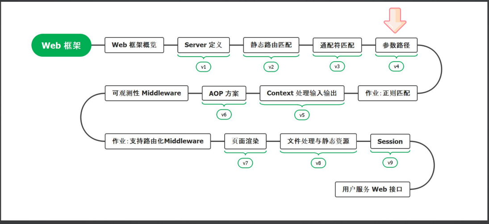
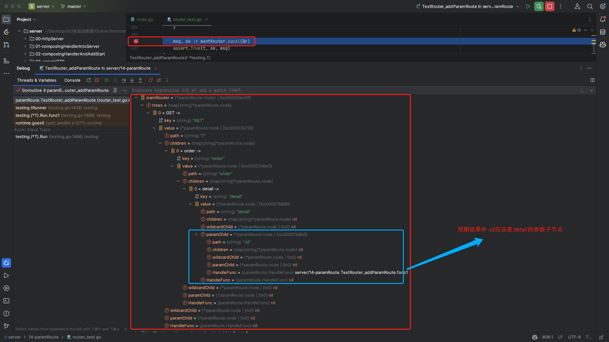

# 15. 路由树-参数路径之基本注册和查找

本节课工程结构如下:

```
(base) yanglei@yuanhong 14-paramRoute % tree ./
./
├── context.go
├── handleFunc.go
├── httpServer.go
├── httpServer_test.go
├── node.go
├── router.go
├── router_test.go
└── serverInterface.go

0 directories, 8 files
```

## PART1. 学习路线



## PART2. 参数路径的定义与设计

### 2.1 参数路径的定义

参数路径:就是指在路径中带上参数,同时这些参数对应的值可以被业务取出来使用.在我们的设计中用`:参数名`的形式表示路由参数

例:`/user/:id`,如果输入路径`/user/123`,则会命中这个路由`/user/:id`,并且在业务函数中可以取到变量`id = 123`.

### 2.2 参数路径的设计

那么问题来了:

- **是否允许同样的参数路径和通配符匹配一起注册?**
	- 例如同时注册`/user/*`和`/user/:id`

**可以,但没必要,用户也不应该设计这种路由**

## PART3. 实现参数路由节点的创建

### 3.1 修改`node`的结构

和实现通配符路由注册的过程相同.由于参数路由节点的逻辑是需要特殊处理的(不管在注册路由还是查找路由时),因此需要为`node`结构体单独定义表示其参数路由子节点的成员属性.

`node.go`:

```go
// node 路由树的节点
type node struct {
	// path 当前节点的路径
	path string

	// children 子路由路径到子节点的映射
	children map[string]*node

	// wildcardChild 通配符子节点
	wildcardChild *node
	
	// paramChild 参数子节点
	paramChild *node

	// HandleFunc 路由对应的业务逻辑
	HandleFunc
}
```

### 3.2 定义测试用例

此处还是在`router_test.go`中新建一个函数用于测试参数路由匹配:

`router_test.go`:

```go
// TestRouter_addParamRoute 测试注册参数路由的结果是否符合预期
func TestRouter_addParamRoute(t *testing.T) {
	// step1. 构造路由树
	testRoutes := []TestNode{
		{
			method: http.MethodGet,
			path:   "/order/detail/:id",
		},
	}

	r := newRouter()
	mockHandleFunc := func(ctx *Context) {}

	for _, testRoute := range testRoutes {
		r.addRoute(testRoute.method, testRoute.path, mockHandleFunc)
	}

	// step2. 验证路由树 断言二者是否相等
	wantRouter := &router{
		trees: map[string]*node{
			http.MethodGet: {
				path: "/",
				children: map[string]*node{
					"order": {
						path: "order",
						children: map[string]*node{
							"detail": {
								path:          "detail",
								children:      nil,
								wildcardChild: nil,
								paramChild: &node{
									path:          ":id",
									children:      nil,
									wildcardChild: nil,
									paramChild:    nil,
									HandleFunc:    mockHandleFunc,
								},
								HandleFunc: nil,
							},
						},
						wildcardChild: nil,
						paramChild:    nil,
						HandleFunc:    nil,
					},
				},
				wildcardChild: nil,
				paramChild:    nil,
				HandleFunc:    nil,
			},
		},
	}

	msg, ok := wantRouter.equal(&r)
	assert.True(t, ok, msg)
}
```

这个时候测试肯定是不通过的.我们断点调试看一下预期和现状的差异:




和实现通配符路由注册的过程相同,先调整创建节点的逻辑

### 3.3 修改创建子节点的逻辑

`node.go`:

```go
// childOrCreate 本方法用于在节点上获取给定的子节点,如果给定的子节点不存在则创建
func (n *node) childOrCreate(segment string) *node {
	// 如果路径为参数 则查找当前节点的参数子节点 或创建一个当前节点的参数子节点 并返回
	if strings.HasPrefix(segment, ":") {
		if n.paramChild == nil {
			n.paramChild = &node{
				path: segment,
			}
		}
		return n.paramChild
	}

	// 若路径为通配符 则查找当前节点的通配符子节点 或创建一个当前节点的通配符子节点 并返回
	if segment == "*" {
		if n.wildcardChild == nil {
			n.wildcardChild = &node{
				path: segment,
			}
		}
		return n.wildcardChild
	}

	// 如果当前节点的子节点映射为空 则创建一个子节点映射
	if n.children == nil {
		n.children = map[string]*node{}
	}

	res, ok := n.children[segment]
	// 如果没有找到子节点,则创建一个子节点
	// 否则返回找到的子节点
	if !ok {
		res = &node{
			path: segment,
		}
		n.children[segment] = res
	}
	return res
}

// childOf 根据给定的path在当前节点的子节点映射中查找对应的子节点(即匹配到了静态路由)
// 若未在子节点映射中找到对应子节点 则尝试返回当前节点的通配符子节点
func (n *node) childOf(path string) (child *node, found bool) {
	// 当前节点的子节点映射为空 则有可能匹配到通配符节点
	if n.children == nil {
		return n.wildcardChild, n.wildcardChild != nil
	}

	// 在子当前节点的节点映射中查找对应的子节点 若未找到同样尝试返回当前节点的通配符子节点
	child, found = n.children[path]
	if !found {
		return n.wildcardChild, n.wildcardChild != nil
	}

	// 找到了对应的子节点 则返回该子节点
	return child, found
}
```

### 3.4 修改判断子节点相等的逻辑

在比对完两个节点的子节点映射数量之后,还要比对两个节点的参数子节点是否相同.

`router_test.go`:

```go
// equal 比较两棵路由树是否相等
// msg: 两棵路由树不相等时的错误信息
// ok: 两棵路由树是否相等
func (n *node) equal(target *node) (msg string, ok bool) {
	// 如果目标节点为nil 则不相等
	if target == nil {
		return fmt.Sprintf("目标节点为nil"), false
	}

	// 如果两个节点的path不相等 则不相等
	if n.path != target.path {
		return fmt.Sprintf("两个节点的path不相等,源节点的path为 %s,目标节点的path为 %s", n.path, target.path), false
	}

	// 若两个节点的子节点数量不相等 则不相等
	nChildrenNum := len(n.children)
	yChildrenNum := len(target.children)
	if nChildrenNum != yChildrenNum {
		return fmt.Sprintf("两个节点的子节点数量不相等,源节点的子节点数量为 %d,目标节点的子节点数量为 %d", nChildrenNum, yChildrenNum), false
	}
	
	// 若两个节点的参数子节点不相等 则不相等
	if n.paramChild != nil {
		if target.paramChild == nil {
			return fmt.Sprintf("目标节点的参数子节点为空"), false
		}
		_, paramIsEqual := n.paramChild.equal(target.paramChild)
		if !paramIsEqual {
			return fmt.Sprintf("两个节点的参数子节点不相等"), false
		}
	}

	// 若两个节点的通配符子节点不相等 则不相等
	if n.wildcardChild != nil {
		if target.wildcardChild == nil {
			return fmt.Sprintf("目标节点的通配符子节点为空"), false
		}
		_, wildcardIsEqual := n.wildcardChild.equal(target.wildcardChild)
		if !wildcardIsEqual {
			return fmt.Sprintf("两个节点的通配符子节点不相等"), false
		}
	}

	// 若两个节点的handleFunc类型不同 则不相等
	nHandler := reflect.ValueOf(n.HandleFunc)
	yHandler := reflect.ValueOf(target.HandleFunc)
	if nHandler != yHandler {
		return fmt.Sprintf("%s节点的handleFunc不相等,源节点的handleFunc为 %v,目标节点的handleFunc为 %v", n.path, nHandler.Type().String(), yHandler.Type().String()), false
	}

	// 比对两个节点的子节点映射是否相等
	for path, child := range n.children {
		dstChild, ok := target.children[path]
		// 如果源节点的子节点中 存在目标节点没有的子节点 则不相等
		if !ok {
			return fmt.Sprintf("目标节点的子节点中没有path为 %s 的子节点", path), false
		}

		// 比对两个子节点是否相等
		msg, equal := child.equal(dstChild)
		if !equal {
			return msg, false
		}
	}

	return "", true
}
```

此时再运行测试用例,即可顺利通过

## PART4. 实现参数路由节点的查找

### 4.1 修改`childOf()`方法

之前的`childOf()`方法是先在当前节点的子节点映射中查找子节点,若未找到则尝试返回当前节点的通配符子节点.

而我们需要的结果是:

- 先在当前节点的子节点映射中查找子节点
- 若未找到则尝试返回当前节点的参数路由子节点
- 若还未找到则尝试返回当前节点的通配符子节点

换言之,我们设计的路由优先级为:**静态路由 > 参数路由 > 通配符路由**

`node.go`:

```go
// childOf 根据给定的path在当前节点的子节点映射中查找对应的子节点(即:匹配到了静态路由)
// 若未在子节点映射中找到对应子节点 则先尝试返回当前节点的参数路由子节点(即:匹配到了参数路由)
// 若参数路由子节点为空 则尝试返回当前节点的通配符子节点(即:匹配到了通配符路由)
// 优先级: 静态路由 > 参数路由 > 通配符路由
func (n *node) childOf(path string) (child *node, found bool) {
	// 当前节点的子节点映射为空 则有可能匹配到 参数路由子节点 或通配符子节点
	// 此处优先查找参数路由子节点 因为参数路由子节点更具体 所以参数路由的优先级高于通配符路由
	if n.children == nil {
		// 如果当前节点的参数子节点不为空 则尝试返回当前节点的参数子节点
		if n.paramChild != nil {
			return n.paramChild, true
		}

		// 如果当前节点的参数子节点为空 则尝试返回当前节点的通配符子节点
		return n.wildcardChild, n.wildcardChild != nil
	}

	// 在子当前节点的节点映射中查找对应的子节点 若未找到同样尝试返回当前节点的参数子节点
	// 若参数子节点为空 则尝试返回当前节点的通配符子节点
	child, found = n.children[path]
	if !found {
		if n.paramChild != nil {
			return n.paramChild, true
		}
		return n.wildcardChild, n.wildcardChild != nil
	}

	// 找到了对应的子节点 则返回该子节点
	return child, found
}
```

**实际上通配符路由不应该和参数路由共存,只是本节课还没实现这个逻辑**.

### 4.2 编写测试用例

`router_test.go`:

```go
// TestRouter_findRoute_param 测试针对参数路由的查找功能
func TestRouter_findRoute_param(t *testing.T) {
	// step1. 构造路由树
	testRoutes := []TestNode{
		{
			method: http.MethodGet,
			path:   "/order/detail/:id",
		},
	}

	r := newRouter()
	mockHandleFunc := func(ctx *Context) {}

	for _, testRoute := range testRoutes {
		r.addRoute(testRoute.method, testRoute.path, mockHandleFunc)
	}

	// step2. 构造测试用例
	testCases := []struct {
		name     string
		method   string
		path     string
		isFound  bool
		wantNode *node
	}{
		// 普通节点的参数路由子节点测试用例
		{
			name:    "order detail id",
			method:  http.MethodGet,
			path:    "/order/detail/123",
			isFound: true,
			wantNode: &node{
				path:          ":id",
				children:      nil,
				wildcardChild: nil,
				paramChild:    nil,
				HandleFunc:    mockHandleFunc,
			},
		},
	}

	for _, testCase := range testCases {
		t.Run(testCase.name, func(t *testing.T) {
			foundNode, found := r.findRoute(testCase.method, testCase.path)
			assert.Equal(t, testCase.isFound, found)

			if !found {
				return
			}

			msg, found := testCase.wantNode.equal(foundNode)
			assert.True(t, found, msg)
		})
	}
}
```

单测顺利通过