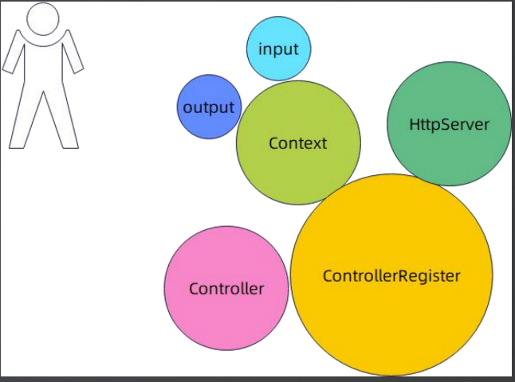

# 2. Web框架概览-Beego框架分析

参考其它Web框架来设计自己的框架.

## PART1. 基本使用

Beego是基于MVC(Model-View-Controller)的,所以它定义了一个核心接口`ControllerInterface`.`ControllerInterface`定义了一个控制器**必须要解决什么问题**.

示例:

定义Controller:

```GO
package beego

import "github.com/beego/beego/v2/server/web"

type UserController struct {
	web.Controller
}

func (c *UserController) GetUser() {
	c.Ctx.WriteString("你好，我是大明")
}

func (c *UserController) CreateUser() {
	u := &User{}
	err := c.Ctx.BindJSON(u)
	if err != nil {
		c.Ctx.WriteString(err.Error())
		return
	}

	_ = c.Ctx.JSONResp(u)
}

type User struct {
	Name string
}
```

可以看到,自定义的Controller是组合了Beego的`web.Controller`的.

使用Controller:

```GO
package beego

import (
	"github.com/beego/beego/v2/server/web"
	"testing"
)

func TestUserController(t *testing.T) {
	web.BConfig.CopyRequestBody = true
	c := &UserController{}
	web.Router("/user", c, "get:GetUser")
	// 监听 8081 端口
	web.Run(":8081")

}
```

注意`web.Router("/user", c, "get:GetUser")`,将uri`/user`映射到了Controller`UserController`的`GetUser()`方法上.`"get:GetUser"`中的`get`要求HTTP动词为GET.

## PART2. 核心抽象

那么问题来了,Beego的核心抽象是什么?

[ControllerInterface](https://github.com/beego/beego/blob/develop/server/web/controller.go#L137)

```GO
// ControllerInterface is an interface to uniform all controller handler.
type ControllerInterface interface {
	Init(ct *context.Context, controllerName, actionName string, app interface{})
	Prepare()
	Get()
	Post()
	Delete()
	Put()
	Head()
	Patch()
	Options()
	Trace()
	Finish()
	Render() error
	XSRFToken() string
	CheckXSRFCookie() bool
	HandlerFunc(fn string) bool
	URLMapping()
}
```

- `Get()`、`Post()`、`Delete()`、`Put()`、`Head()`、`Patch()`、`Options()`定义了如何处理HTTP动词
- `Init()`、`Prepare()`、`Finish()`定义了一个Controller的生命周期.`Prepare()`类似于一个BeforeRequest的过程,`Finish()`类似于一个AfterRequest的过程,本质上二者都是回调
- 实际上刚刚示例中的`web.Contrller`就是接口`ControllerInterface`的默认实现.自定义的Controller只需组合`web.Contrller`即可

注意示例中的如下2行代码:

```GO
web.Router("/user", c, "get:GetUser")
web.Run(":8081")
```

这说明用户虽然被要求组合`web.Contrller`,但路由注册和服务器启动是通过另一套机制来完成的.换言之,**Beego框架中的路由注册与Controller的组合是无关的**.Controller仅仅用于帮助组织业务代码.

## PART3. HttpServer和ControllerRegister

`ControllerInterface`可以看做核心接口,因为它直接体现了Beego的设计初衷:MVC模式.同时它也是用户核心接入点.

但是如果从功能特性上来说,[HttpServer](https://github.com/beego/beego/blob/develop/server/web/server.go#L50)和[ControllerRegister](https://github.com/beego/beego/blob/develop/server/web/server.go#L50)才是核心

- `HttpServer`:代表一个"服务器",大多数时候它就是一个进程.
	- 当然你也可以做成1个进程监听多个端口的形式,但是端口与端口之间是资源隔离的

- `ControllerRegister`:注册路由、路由匹配、执行业务代码都是通过它来完成的

## PART4. Context抽象

和之前的内容相比,其他抽象更侧重于用户友好性.[Context](https://github.com/beego/beego/blob/develop/server/web/context/context.go#L72)抽象代表的是整个请求执行过程的上下文,用户操作请求和响应是通过Ctx来达成的.

实际上在Beego默认实现的Controller中也有这个[Ctx](https://github.com/beego/beego/blob/develop/server/web/controller.go#L109).一般情况下这个`Ctx`代表了整个请求过程的上下文.

```GO
// Context Http request context struct including BeegoInput, BeegoOutput, http.Request and http.ResponseWriter.
// BeegoInput and BeegoOutput provides an api to operate request and response more easily.
type Context struct {
	Input          *BeegoInput
	Output         *BeegoOutput
	Request        *http.Request
	ResponseWriter *Response
	_xsrfToken     string
}
```

Beego对Context进行了一个细分,分为`Input`和`Output`.`Request`字段是请求的副本,而`ResponseWriter`字段则是对响应的一个封装.

也有人认为`Input`应该包含`Request`,`Output`应该包含`ResponseWriter`,这样的设计会更清晰.

## PART5. 核心抽象总结



- `ControllerRegister`:最为基础,它解决了**路由注册**和**路由匹配**这个基础问题
- `Context`和`Controller`:为用户提供了丰富API,用于辅助构建系统
	- 当然,硬要说的话,没有这二者也不是不行.只是用户需要手动和`http.Request`和`http.ResponseWriter`交互,这二者也只是对`http.Request`和`http.ResponseWriter`的封装
- `HttpServer`:作为服务器抽象,用于管理应用生命周期和资源隔离单位

## 附录:1个进程监听2个端口的方法

```GO
package beego

import (
	"github.com/beego/beego/v2/server/web"
	"testing"
)

func TestUserController(t *testing.T) {
	go func() {
		s := web.NewHttpSever()
		s.Run(":8082")
	}()
	web.BConfig.CopyRequestBody = true
	c := &UserController{}
	web.Router("/user", c, "get:GetUser")
	// 监听 8081 端口
	web.Run(":8081")
}
```

此时访问`localhost:8082/user`是无法得到响应的.只有访问`localhost:8081/user`能够得到响应.

1个进程监听2个端口的使用场景:实时更新配置.例如同一个进程内,端口8081可以修改8082的内存