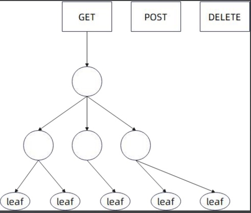
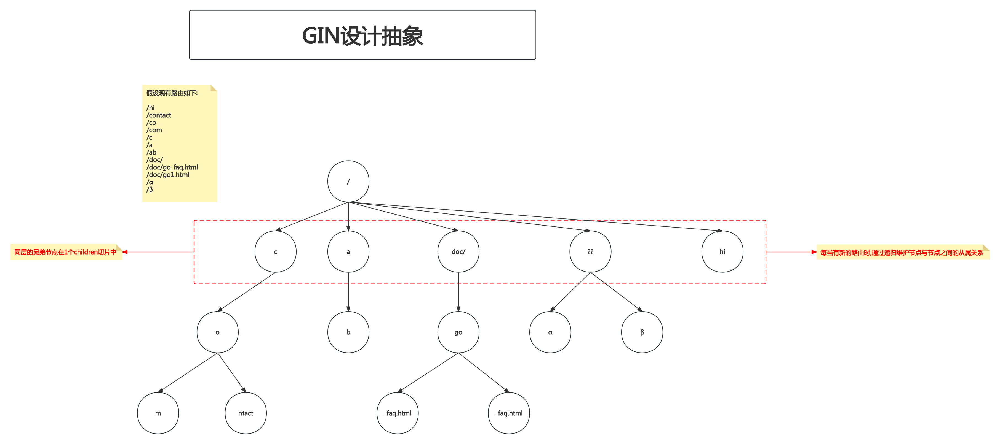

# 7. 路由树-Beego&GIN&Echo实现与设计总结

## PART1. 学习路线


我们分成以下步骤来实现一颗路由树:

- 全静态匹配
- 支持通配符匹配
- 支持参数路由
- 作业:支持正则匹配

## PART2. Beego的路由树实现

### 2.1 ControllerRegister

在之前的框架概览部分讲到过,Beego的`ControllerRegister`结构体负责路由相关的功能.

`ControllerRegister`:类似于容器,存储了**所有**的路由树.

```go
// ControllerRegister containers registered router rules, controller handlers and filters.
type ControllerRegister struct {
	routers      map[string]*Tree
	enablePolicy bool
	enableFilter bool
	policies     map[string]*Tree
	filters      [FinishRouter + 1][]*FilterRouter
	pool         sync.Pool

	// the filter created by FilterChain
	chainRoot *FilterRouter

	// keep registered chain and build it when serve http
	filterChains []filterChainConfig

	cfg *Config
}
```

`ControllerRegister.routers`即为路由树.可以看到其类型为`map[string]*Tree`,其中的key表示HTTP动词.也就是说,Beego的路由树是**按照HTTP动词来组织的**,每个HTTP动词对应一棵路由树.因此说`ControllerRegister`存储了**所有**的路由树.

### 2.2 Tree

`Tree`:它代表的就是路由树,在Beego中,一棵路由树可以被看做由子树组成.`Tree`实际上是一种多叉树的数据结构.

```go
// Tree has three elements: FixRouter/wildcard/leaves
// fixRouter stores Fixed Router
// wildcard stores params
// leaves store the endpoint information
type Tree struct {
	// prefix set for static router
	prefix string
	// search fix route first
	fixrouters []*Tree
	// if set, failure to match fixrouters search then search wildcard
	wildcard *Tree
	// if set, failure to match wildcard search
	leaves []*leafInfo
}
```

其中:

- `fixrouters`:静态路由
- `wildcard`:通配符路由
- `leaves`:叶子节点

### 2.3 leafInfo

Beego的路由树中区分了叶子节点和非叶子节点,但可能实际意义并不大.`leafInfo`结构体表示了叶子节点:

```go
type leafInfo struct {
	// names of wildcards that lead to this leaf. eg, ["id" "name"] for the wildcard ":id" and ":name"
	wildcards []string

	// if the leaf is regexp
	regexps *regexp.Regexp

	runObject interface{}
}
```

### 2.4 Beego设计抽象

如下图示,Beego的树定义,并没有采用children式的定义,而是采用**递归式的定义,即:一棵树由根节点+子树组成**.也就是说实际上`ControllerRegister.routers`实际上是路由森林而非路由树



## PART3. GIN的路由树实现

### 3.1 methodTrees

在之前的框架概览部分讲到过,GIN的路由树功能本质上是依赖于`Engine`结构体的`trees`字段的

```go
type Engine struct {
	// some other fields
	trees            methodTrees
	// some other fields
}
```

methodTrees的定义:

```go
type methodTrees []methodTree
```

`methodTrees`类型是`methodTree`的切片.实际上GIN的路由树也是**按照HTTP动词来组织的**,每个HTTP动词对应一棵路由树.只是相比于Beego使用了`map[string]*Tree`的方式存储路由森林,GIN使用了`[]methodTree`,也就是切片的方式来存储路由森林,而实际上这个切片中元素的数量只是和HTTP动词的数量(9个)相等.该切片中的每个元素表示了一棵路由树.

### 3.2 methodTree

```go
type methodTree struct {
	method string
	root   *node
}
```

`methodTree`定义了单棵路由树.树在GIN里边采用的是children的定义方式,即**树由节点构成**.

- `methodTree.method`:HTTP动词
- `methodTree.root`:根节点

### 3.3 node

`node`结构体表示树上的1个节点:

```go
type node struct {
	path      string
	indices   string
	wildChild bool
	nType     nodeType
	priority  uint32
	children  []*node // child nodes, at most 1 :param style node at the end of the array
	handlers  HandlersChain
	fullPath  string
}
```

其中:

- `children`字段表示该节点的子节点
- `nType`:实际上是一个uint8类型,用于标记节点类型
- `wildChild`:标记特殊节点
- `handlers`:责任链

### 3.4 GIN设计抽象

**GIN利用路由的最长公共前缀来构造路由树**.



- 图中的`??`表示特殊字符

所谓的**最长公共前缀**,指的是:

- /
	- c
		- o
			- ntact
			- m
	- a
		- b
	- doc/
		- go(注意`go_faq.html`和`go1.html`的最长公共前缀是`go`而不是`g`,因此基址是`go`)
			- _faq.html
			- 1.html
		- ??(表示路由中的特殊字符)
			- α
			- β
	- hi

这个数据结构也被称为前缀树.

## PART4. Echo的路由树实现

### 4.1 Router

在之前的框架概览部分讲到过,Echo结构体中的`routers`字段表示根据Host将路由树隔离,可以看做是类似namespace之类的概念,既是一种组织方式,也是一种隔离机制;而`router`字段表示路由树

```go
type Echo struct {
	// some other fields
	router           *Router
	routers          map[string]*Router
	// some other fields
}
```

**注意和Beego的HTTP动词不同,`Echo.routers`字段的`map[string]*Router`中,key表示Host**

而`Router`结构体表示路由注册中心,其中维护了路由树(`routes`字段)

```go
Router struct {
	tree   *node
	routes map[string]*Route
	echo   *Echo
}
```

### 4.2 Route

`Route`结构体表示具体的路由:

```go
Route struct {
	Method string `json:"method"`
	Path   string `json:"path"`
	Name   string `json:"name"`
}
```

### 4.3 node

`node`结构体也是常规的树节点设计,内部也采用的是`children`字段来表示子节点的数据

```go
node struct {
	kind           kind
	label          byte
	prefix         string
	parent         *node
	staticChildren children
	originalPath   string
	methods        *routeMethods
	paramChild     *node
	anyChild       *node
	paramsCount    int
	// isLeaf indicates that node does not have child routes
	isLeaf bool
	// isHandler indicates that node has at least one handler registered to it
	isHandler bool

	// notFoundHandler is handler registered with RouteNotFound method and is executed for 404 cases
	notFoundHandler *routeMethod
}
```

与GIN的`node`结构体基本类似,只是相比于GIN,Echo的`node`结构体多维护了一个`parent`字段,即指向父节点的指针.其中:

- `staticChildren`:静态子节点
- `paramChild`:参数子节点
- `anyChild`:任意子节点(通配符匹配)

有一种观点认为:Echo的设计不如GIN的设计,也是因为Echo多引入了一些抽象,但是实际上它们功能都差不多.

**开源,讲究的是一个以简为美;但是工作,讲究刷KPI唬人为要.因此开源要克制,而工作要泛滥**.

当然,我现在连刷KPI的机会都没有~

## PART5. 路由树设计总结

- 归根结底就是设计一颗**多叉树**
- 我们的设计也是**按照HTTP方法来组织路由树**,每个HTTP方法一棵树
- 每个节点维护自己的子节点
- 以下这两种形态的路由树组织,性能差异不大,但是第二种的实现要简单很多

第1种:最长公共前缀树


GIN的路由树不好读懂的原因就在于提取公共前缀.因为每次注册路由时,最长公共前缀都会发生变化.举个不太恰当的例子:

`5 10 15 18`这4个数字的最大公约数为3;而将18换为45,则`5 10 15 45`的最大公约数为5.每当有一个数字被替换或添加,都要重新计算这一组数字的最大公约数.

[GIN中根据最长公共前缀调整路由树结构的实现](https://github.com/gin-gonic/gin/blob/master/tree.go#L165)

[测试用例](https://github.com/gin-gonic/gin/blob/master/tree_test.go#L101)

在[这里](https://github.com/gin-gonic/gin/blob/master/tree_test.go#L121)打一个断点就能看到他实现的树的结构

第2种:按`/`"分层"的树


## 附录

### Beego的路由树

大体上理解,Beego的路由树,是直接将叶子节点append到fixrouters和wildcard上的;而GIN的路由树,是通过递归来维护树的内部节点与内部节点的关系的


也就是说Beego的路由树,实际上只有3层:

- 根节点
- 静态路由&通配符匹配
- 根节点